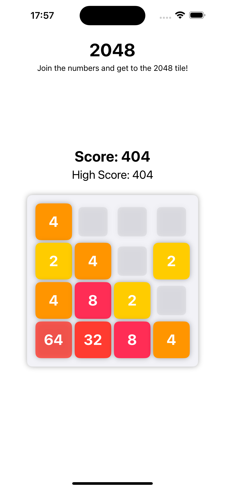
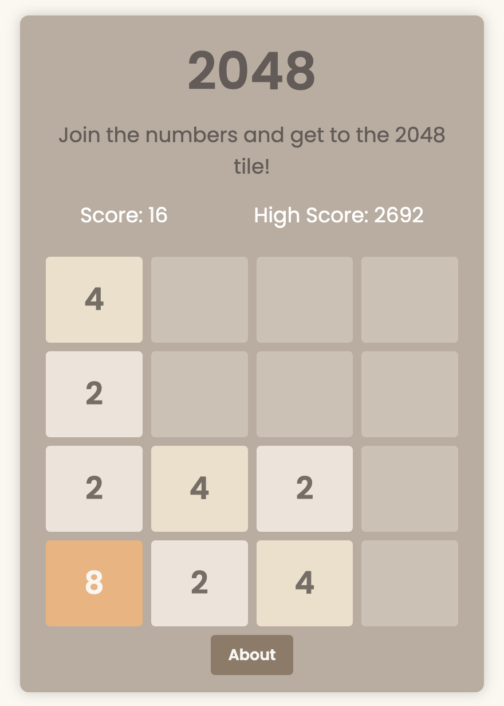
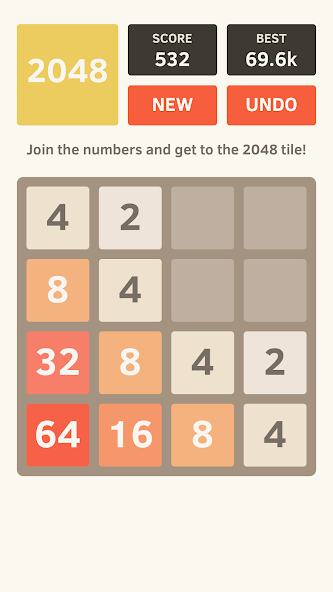

# The 2048 Game

This project consists of three versions of the popular 2048 game: a web application version, a Swift version for iOS, and an Kotlin version for Android. The game's objective is to slide numbered tiles on a grid to combine them and create a tile with the number 2048. Created by [Son Nguyen](https://github.com/hoangsonww) in 2024.

## Table of Contents

- [Swift Version](#swift-version)
- [Web Application Version](#web-application-version)
- [Android Version](#android-version)
- [Contributing](#contributing)
- [License](#license)
- [About the Creator](#creator)

## Swift Version

The Swift version of the 2048 game is designed for iOS devices. It provides a smooth and native experience for iOS users. It can be found in the `Game-2048` subdirectory at [this link](../Game-2048).

## User Interface

### Project Structure

The project structure for the Swift version is as follows:

- `ContentView.swift`: This file contains the main SwiftUI view for the game.
- `GameView.swift`: This file contains the game logic and UI for the game.
- `GameViewModel.swift`: This file contains the view model for the game.
- `Game_2048App.swift`: This file contains the main app struct and entry point for the game.
- `Assets.xcassets/`: This directory contains the image assets used in the game.
- `Info.plist`: This file contains information about the app, such as its name, version, and supported devices.
- `Game_2048.entitlements`: This file contains the app's entitlements, such as its app sandbox and keychain sharing settings.
- `Preview Content/`: This directory contains preview content for the game.
- `Game-2048.xcodeproj`: This is the Xcode project file for the game.
- `LaunchScreen.storyboard`: This file contains the launch screen UI for the game.

### How to Run

To run the Swift version of the game, you need to have Xcode installed on your machine. Open the `.xcodeproj` file in Xcode, select an iOS simulator or a connected iOS device, and then click the Run button.

Requirements:
- Xcode 12.0 or later
- Swift 5.3 or later
- iOS 14.0 or later
- macOS 11.0 or later

---

## Web Application Version

The web application version of the 2048 game is built by simply using HTML, CSS, and JavaScript. It is a simple and responsive game that can be played on any device with a web browser. It can be found in the `Web-Version` subdirectory at [this link](../Web-Version).

### User Interface

### Project Structure

The project structure for the web application version is as follows:

- `index.html`: This is the main HTML file that contains the structure of the web page.
- `style.css`: This file contains all the CSS styles used in the game.
- `script.js`: This is the JavaScript file that contains the game logic.
- `manifest.json`: This file provides information about the web application, such as its name, author, description, and icons.
- `images/`: This directory contains the images used in the game, including the game's icon.

### How to Run

To run the web application version of the game, simply open the `index.html` file in a web browser.

---

## Android Version

The Android version of the 2048 game is designed for Android devices. It provides a smooth and native experience for Android users. It can be found in the `Android-Version` subdirectory at [this link](../Android-Version).

### User Interface

### Project Structure

The project structure for the Android version is as follows:

- `app/src/main/java/com/sonnguyenhoang/game2048/MainActivity.kt`: This file contains the main activity for the game.
- `app/src/main/java/com/sonnguyenhoang/game2048/GameActivity.kt`: This file contains the game logic and UI for the game.
- `app/src/main/res/layout/activity_main.xml`: This file contains the layout for the main activity.
- `app/src/main/res/layout/activity_game.xml`: This file contains the layout for the game activity.
- `app/src/main/res/drawable/`: This directory contains the image assets used in the game.
- `app/src/main/res/values/strings.xml`: This file contains the string resources used in the game.
- `app/src/main/AndroidManifest.xml`: This file contains information about the app, such as its name, version, and supported devices.
- `app/src/main/ic_launcher/`: This directory contains the app's launcher icons.
- `app/src/main/res/values/styles.xml`: This file contains the styles used in the game.
- `app/src/main/res/values/colors.xml`: This file contains the color resources used in the game.
- `app/src/main/res/values/dimens.xml`: This file contains the dimension resources used in the game.

### How to Run

To run the Android version of the game, you need to have Android Studio installed on your machine. Open the `Android-Version` directory in Android Studio, select an Android emulator or a connected Android device, and then click the Run button.

Requirements:
- Android Studio 4.0 or later
- Kotlin 1.3 or later
- Android 5.0 (API level 21) or later
- Gradle 6.1.1 or later

Note that depending on your Android Studio and/or Gradle configuration, you may see different files and directories in your project structure, leading to differing user interfaces that might not look the same as mine. However, the game logic and functionality should remain the same across different configurations.

---

## Contributing

Contributions are welcome! Please feel free to submit a pull request in this repository.

## License

This project is licensed under the terms of the MIT license. See the [LICENSE](../LICENSE) file for more information.

## Creator

This project was created by [Son Nguyen](https://github.com/hoangsonww) in Spring 2024. If you have any questions, you can reach out to me with the contact information provided in my GitHub profile.

--- 

This project is still in development. More features and improvements will be added in the future. Thank you for your interest in this project!
