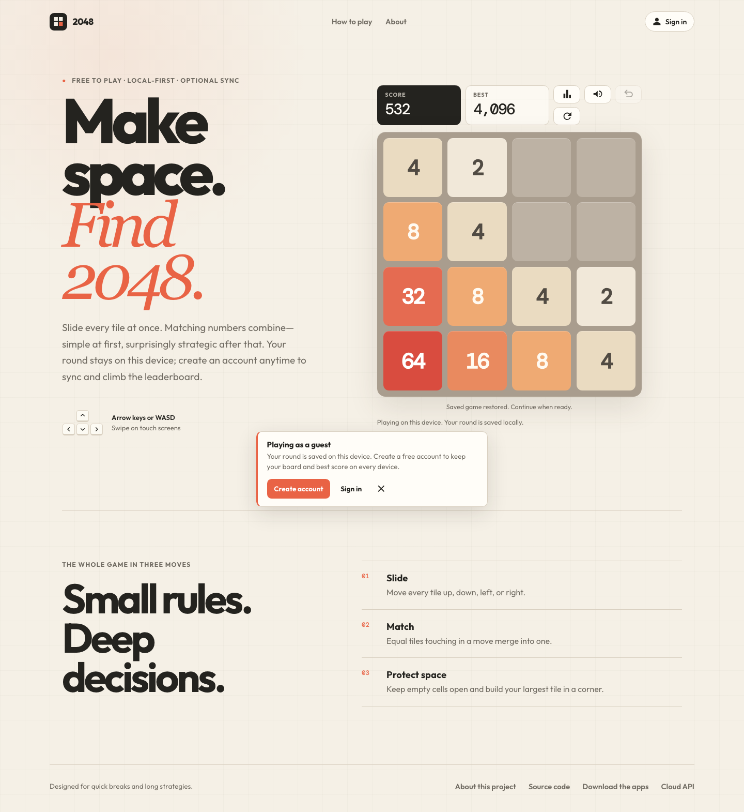
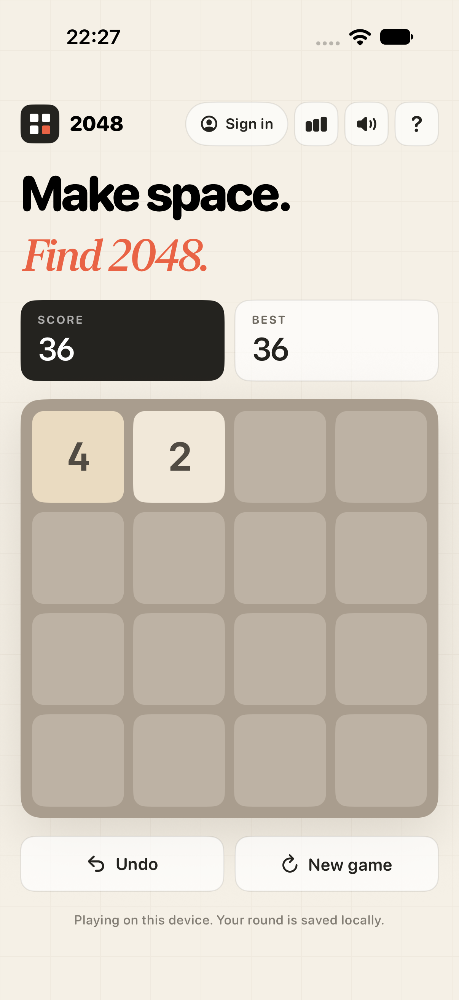
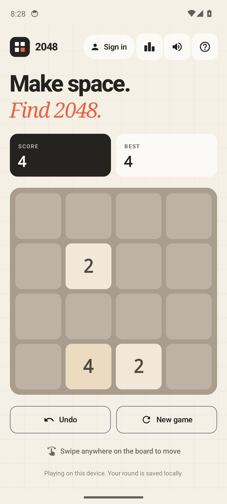

# 2048, Built Three Ways

A polished, accessible, offline-first 2048 puzzle shipped as **three independent native clients** — a dependency-free progressive web app, a SwiftUI iOS app, and a Jetpack Compose Android app. They share no runtime code, yet every one of them is held to the same documented set of behavioral invariants and verified by the same four-job continuous integration pipeline.


**[▶ Play the web version](https://hoangsonww.github.io/2048-Game/)** · [Rules and strategy](https://hoangsonww.github.io/2048-Game/Web-Version/about.html) · [Report an issue](https://github.com/hoangsonww/2048-Game/issues) · [Contributing](CONTRIBUTING.md) · [Security policy](SECURITY.md)

---

## Table of contents

- [Why this project exists](#why-this-project-exists)
- [Screenshots](#screenshots)
- [Feature matrix](#feature-matrix)
- [How to play](#how-to-play)
- [Controls](#controls)
- [Behavioral invariants](#behavioral-invariants)
- [Architecture](#architecture)
- [Repository map](#repository-map)
- [Getting started](#getting-started)
- [Run the web app](#run-the-web-app)
- [Run the iOS app](#run-the-ios-app)
- [Run the Android app](#run-the-android-app)
- [Command reference](#command-reference)
- [Testing and quality gates](#testing-and-quality-gates)
- [Continuous integration](#continuous-integration)
- [Accessibility](#accessibility)
- [Privacy and data handling](#privacy-and-data-handling)
- [Web discoverability and PWA install](#web-discoverability-and-pwa-install)
- [Agent-ready development](#agent-ready-development)
- [Troubleshooting](#troubleshooting)
- [Contributing](#contributing)
- [Security](#security)
- [Citation](#citation)
- [License and credits](#license-and-credits)

---

## Why this project exists

2048 is a small enough game that its rules fit in a paragraph, which makes it an unusually good vehicle for a harder question: **how do you keep three separately written native clients behaving identically, without a shared runtime, a cross-platform framework, or a code generator?**

This repository is the worked answer. There is no React Native layer, no Kotlin Multiplatform module, no WebView wrapper. Each client is idiomatic for its platform — vanilla ES modules on the web, SwiftUI with `@Observable`-style view models on iOS, Compose with a `ViewModel` on Android — and parity is maintained by three deliberate mechanisms instead:

1. **A written invariant contract.** [`AGENTS.md`](../AGENTS.md) and [`docs/architecture.md`](../docs/architecture.md) define the exact rules every client must satisfy, down to edge cases like "an ineffective move must not spawn a tile."
2. **Per-client deterministic rules tests.** Each platform independently proves the same behavior list against its own engine, with randomness injected so results are reproducible.
3. **A CI pipeline that runs all three toolchains on every pull request.** A parity regression in any one client fails the build.

The result is a codebase where you can read one platform's implementation in isolation and still trust it matches the others.

---

## Screenshots

| Web | iOS | Android |
| :---: | :---: | :---: |
|  |  |  |

---

## Feature matrix

| Capability | Web | iOS | Android |
| --- | :---: | :---: | :---: |
| Correct compaction, single-merge, and scoring rules | ✅ | ✅ | ✅ |
| No tile spawn after an ineffective move | ✅ | ✅ | ✅ |
| 90 % `2` / 10 % `4` weighted tile spawning | ✅ | ✅ | ✅ |
| One-step undo (board **and** score) | ✅ | ✅ | ✅ |
| Persistent best score across sessions | ✅ | ✅ | ✅ |
| Automatic session restore on launch | ✅ | ✅ | ✅ |
| Corrupt-save detection and safe discard | ✅ | ✅ | ✅ |
| Restart confirmation while a round is active | ✅ | ✅ | ✅ |
| Win state at 2048 with "keep playing" option | ✅ | ✅ | ✅ |
| Game-over detection on a full board with no merge | ✅ | ✅ | ✅ |
| In-app rules and strategy guide | ✅ | ✅ | ✅ |
| Swipe / drag gesture input | ✅ | ✅ | ✅ |
| Physical keyboard input (arrows + WASD) | ✅ | — | — |
| On-screen direction controls | ✅ | — | — |
| Fullscreen toggle | ✅ | — | — |
| Haptic feedback | — | ✅ | ✅ |
| Reduced-motion support | ✅ | ✅ | ✅ |
| Screen-reader announcements | ✅ | ✅ | ✅ |
| Vector-only iconography | SVG | SF Symbols | Material vectors |
| Installable / distributable | PWA | `.app` | `.apk` |
| Works fully offline | ✅ | ✅ | ✅ |
| Network calls, accounts, analytics, or telemetry | ❌ | ❌ | ❌ |

---

## How to play

Every move slides **all** tiles as far as they can go in one direction. When two tiles bearing the same number collide, they merge into a single tile of twice the value, and that new value is added to your score. After any move that actually changed the board, one new tile appears in a random empty cell — a `2` ninety percent of the time, a `4` the other ten.

The round ends when the board is full **and** no two adjacent tiles match, because at that point no move can change anything. Reaching a `2048` tile triggers the win state, but you are free to dismiss it and keep building toward 4096 and beyond.

Three practical habits carry most beginners a long way:

- **Anchor a corner.** Pick one corner, keep your largest tile there, and avoid any move that would dislodge it.
- **Keep one row or column as a "spine."** Build a descending run along the edge that holds your anchor so merges cascade naturally.
- **Treat the fourth direction as a last resort.** If you anchor bottom-left, moving up is what breaks the structure — spend it only when you have no alternative.

---

## Controls

| Action | Web | iOS | Android |
| --- | --- | --- | --- |
| Move | Arrow keys, `W`/`A`/`S`/`D`, swipe on the board, or the on-screen direction pad | Swipe the board in any direction | Swipe the board in any direction |
| Undo last move | Undo button | Undo button | Undo button |
| New game | New game button (confirms first if a round is in progress) | New game button (confirms first) | New game button (confirms first) |
| Rules and help | About link | Help button | Help button |
| Fullscreen | `F` | — | — |
| Continue past 2048 | "Keep playing" in the win overlay | "Keep playing" | "Keep playing" |

A swipe registers once the gesture travels past a small threshold, so a single drag always produces exactly one move — never a burst.

---

## Behavioral invariants

These are the contract. Every client must satisfy all of them, and each one is covered by at least one automated test per platform.

1. A valid move compacts tiles toward the travel direction, merges each pair of equal neighbors **at most once per move**, adds the merged values to the score, and then spawns exactly one new tile.
2. An ineffective move — one where no tile can slide or merge — changes nothing: no score change, no new tile, and **no undo snapshot**.
3. Undo restores exactly the board and score as they were immediately before the most recent valid move. The snapshot is consumed on use, so undo is strictly one step.
4. Starting a new game preserves the best score and requires explicit confirmation whenever a round is already in progress.
5. Reaching 2048 presents a win state that the player may dismiss to continue playing. A full board with no available merge presents game over.
6. Persisted state is validated on load. Anything structurally invalid — wrong board length, non-power-of-two values, negative scores, malformed JSON — is discarded and replaced with a fresh game rather than crashing or restoring a corrupt board.
7. Randomness is injectable in every client so tests are fully deterministic, while production always uses unbiased platform randomness.

---

## Architecture

Three clients, three runtimes, one contract. There is no backend, no shared library, and no network dependency of any kind at runtime.

| Concern | Web | iOS | Android |
| --- | --- | --- | --- |
| UI layer | `index.html`, `Web-Version/style.css` | `GameView.swift`, `ContentView.swift` | `MainActivity.kt` + Compose theme |
| Rules engine | `Web-Version/game-engine.js` (pure, side-effect free) | `GameViewModel.swift` | `GameViewModel.kt` |
| State orchestration | `Web-Version/script.js` | `GameViewModel.swift` | `GameViewModel.kt` |
| Persistence | `localStorage`, key `game2048-state-v2` | `UserDefaults` | `GameStorage.kt` over `SharedPreferences` |
| Unit tests | Node.js built-in test runner | XCTest | JUnit 4 |
| UI / integration tests | Playwright (Chromium) | XCUITest | Compose UI Test + Espresso |
| Language | JavaScript (ES modules) | Swift 5 | Kotlin 1.9 |

**The move algorithm**, identical in all three: for each row or column taken in travel order, drop the empty cells, walk the remaining values merging adjacent equal pairs exactly once, pad the line back to length four with zeros, and write it back. Compare the resulting board to the original — spawn a tile only if they differ.

**The lifecycle**, identical in all three:

1. Load persisted state and validate it, or build a fresh board with two starting tiles.
2. Accept a direction from keyboard, button, or gesture input.
3. Resolve the move atomically, capturing an undo snapshot first if the move is valid.
4. Persist board, score, best score, and win-continuation flag.
5. Evaluate the win and game-over predicates and present the matching UI.

**Web delivery** is static files served from `/2048-Game/` on GitHub Pages. Canonical URLs, manifest scope, sitemap entries, and crawler discovery links must all keep that base path. The local development server deliberately disables caching so UI edits reload predictably.

Deeper detail lives in [`docs/architecture.md`](../docs/architecture.md).

---

## Repository map

```text
.
├── index.html                          Web entry point, SEO metadata, JSON-LD
├── 404.html                            GitHub Pages fallback page
├── manifest.json                       PWA manifest (icons, shortcuts, scope)
├── robots.txt / sitemap.xml            Crawler directives and canonical URL set
├── llms.txt / llms-full.txt            Machine-readable product documentation
├── humans.txt                          Credits
├── Makefile                            Stable developer command surface
├── CITATION.cff                        Citation metadata
│
├── Web-Version/
│   ├── game-engine.js                  Pure deterministic rules engine
│   ├── script.js                       State, input handling, persistence, DOM
│   ├── style.css                       Shared visual system and responsive layout
│   └── about.html                      Rules and strategy guide
│
├── Game-2048/                          SwiftUI client
│   ├── Game_2048App.swift              App entry point
│   ├── GameView.swift                  Responsive native board and controls
│   ├── GameViewModel.swift             Rules, scoring, undo, persistence
│   ├── ContentView.swift               Root container
│   └── Assets.xcassets                 App icons and colors
├── Game-2048Tests/                     XCTest model tests
├── Game-2048UITests/                   XCUITest interaction and launch tests
├── 2048 Game.xcodeproj                 Xcode project (scheme: Game-2048)
│
├── Android-Version/Game2048/           Jetpack Compose client
│   ├── app/src/main/java/…             MainActivity, GameViewModel, GameStorage, theme
│   ├── app/src/test/java/…             JUnit ViewModel tests
│   ├── app/src/androidTest/java/…      Compose instrumentation tests
│   └── gradle/libs.versions.toml       Version catalog
│
├── tests/
│   ├── web/                            Engine, static-metadata, and browser tests
│   └── tooling/                        Repository-structure tests
├── scripts/                            Bootstrap, doctor, checks, per-platform test runners
├── docs/                               Architecture, testing, and agent-harness guides
├── images/                             App icons, brand mark, share art, screenshots
│
├── .github/
│   ├── workflows/                      CI, dependency review, labeler
│   ├── ISSUE_TEMPLATE/                 Bug and feature forms
│   └── README.md · CONTRIBUTING.md · SECURITY.md · SUPPORT.md · CODE_OF_CONDUCT.md
├── .agents/skills/                     Canonical coding-agent workflows
├── .claude/skills/                     Claude Code adapters
└── .devcontainer/                      Node 22, JDK 17, Android SDK 34 container
```

`output/` is generated locally by the QA and screenshot scripts and is intentionally not versioned — it is fully reproducible with `make test` and `make screenshots-web`.

---

## Getting started

| Target | Requirements | Supported hosts |
| --- | --- | --- |
| Web | Node.js 22+, npm | macOS, Linux, Windows, dev container |
| Web browser tests | The above, plus Chromium via `npx playwright install chromium` | macOS, Linux, dev container |
| iOS | Xcode 15.3+, iOS 17.4+ simulator or device | macOS only |
| Android | Android SDK 34, API 24+ emulator or device. **No JDK setup needed** — Gradle downloads its own JDK 17. | macOS, Linux, Windows, dev container |

**You do not need to configure a JDK for Android.** Gradle 8.13 daemon JVM criteria are committed in `Android-Version/Game2048/gradle/gradle-daemon-jvm.properties`, so the first `./gradlew` invocation downloads a matching Adoptium JDK 17 for your OS and architecture and runs on it — even if your machine's default `java` is a different version, and even if you have no JDK at all. This is the single most common Android onboarding failure, and it is designed out rather than documented around.

Clone and bootstrap:

```bash
git clone https://github.com/hoangsonww/2048-Game.git
cd 2048-Game
make setup     # installs locked npm dependencies and activates Git hooks
make doctor    # reports which platform toolchains this machine can build
make help      # lists every supported workflow
```

`make doctor` is the fastest way to find out what you can run locally. It reports the status of Git, Node, npm, the JDK, ShellCheck, Docker, `xcodebuild`, `xcrun`, `ANDROID_HOME`, and `adb`, so you know up front whether the iOS or Android suites are available before you try them.

To include the Chromium download that the browser tests need, run setup as:

```bash
./scripts/bootstrap.sh --with-browser
```

Plain `make setup` skips it to keep first-run setup light, and prints the one-line command to add it later.

Then run any client with a single command:

```bash
make serve         # web app at http://localhost:8080
make android-run   # build, install, and launch on a device or emulator
make ios-run       # build, install, and launch on a simulator
```

**Dev container.** `.devcontainer/` provisions Node.js 22, JDK 17, Android SDK 34 with build-tools 34.0.0, ShellCheck, GNU Make, the GitHub CLI, and Chromium for Playwright, on top of the Microsoft Java 17 Bookworm base image. Open the repository in VS Code and choose **Reopen in Container**, or use GitHub Codespaces.

It covers the complete web and Android JVM workflows out of the box. **iOS cannot be containerized** — Xcode is macOS-only and its license forbids redistribution, so iOS builds always require a macOS host. That is a platform constraint, not a gap in this setup.

To verify the container yourself:

```bash
make verify-devcontainer               # build the image and check every tool
./scripts/verify-devcontainer.sh --build   # additionally build the Android client inside it
```

The `--build` form uses an isolated `git archive` copy rather than mounting your working tree, so a container build never contends with a host build over the same Gradle output directory.

**Git hooks.** Husky activates during `npm install`: `pre-commit` runs the fast repository checks and `pre-push` runs the full web suite. Contributors who prefer the Python framework can install the equivalent hooks from `.pre-commit-config.yaml` with `pre-commit install --install-hooks`.

---

## Run the web app

```bash
npm install
npm start          # or: make serve
```

Open `http://localhost:8080`. The app is entirely static — no bundler, no transpiler, no production build step, and no third-party runtime dependencies. The only external resource it touches is the Google Fonts stylesheet for the display typeface, and the layout degrades gracefully to system fonts if that request is blocked.

Run the full web suite:

```bash
npx playwright install chromium    # one-time browser download
npm test                           # or: make test-web
```

Capture deterministic UI screenshots across desktop and mobile viewports:

```bash
make screenshots-web
```

Output lands in `output/playwright/` (gitignored) covering gameplay, the restart dialog, win, loss, and the About page at both breakpoints.

---

## Run the iOS app

Requirements: Xcode 15.3 or newer, targeting iOS 17.4+. The app builds for both iPhone and iPad.

The fastest path needs no Xcode UI and no device UDID — one command builds, installs, and launches on an automatically selected simulator:

```bash
make ios-run
```

Other entry points:

```bash
make ios-devices   # list available iPhone simulators
make ios-boot      # boot a simulator and open Simulator.app
make ios-build     # build only
make test-ios      # full model + UI test run with coverage
```

Every one of these resolves a simulator for you. To pin a specific device, set `IOS_SIMULATOR_ID` to a UDID from `make ios-devices`.

To work in Xcode instead:

1. Open `2048 Game.xcodeproj`.
2. Select the **Game-2048** scheme and any iPhone or iPad simulator.
3. Run with `⌘R`. Run the unit and UI tests with `⌘U`.

---

## Run the Android app

Requirements: Android SDK 34 and an API 24 or newer emulator or device. `minSdk` is 24; `compileSdk` and `targetSdk` are 34. **A JDK is not a prerequisite** — Gradle provisions its own.

Build, install, and launch on a connected device or emulator in one command:

```bash
make android-run
```

Other entry points, all from the repository root:

```bash
make android-build          # debug APK
make android-install        # build and install
make android-tasks          # list every available Gradle task
make android-clean          # remove build output
make test-android           # unit tests, lint, and APK assembly
make test-android-device    # adds the Compose suite on a connected device
make gradle ARGS="assembleRelease"   # any other Gradle task
```

Every one of these routes through `scripts/android.sh`, which guarantees a correct JDK before invoking Gradle.

Raw Gradle also works, thanks to the committed daemon JVM criteria:

```bash
cd Android-Version/Game2048
./gradlew assembleDebug
```

The first run downloads a matching JDK 17 (roughly 180 MB, cached in `~/.gradle/jdks/`) and every run after that is fast.

To work in Android Studio instead, open `Android-Version/Game2048`, let the Gradle sync finish, then run the `app` configuration.

The debug APK is written to `Android-Version/Game2048/app/build/outputs/apk/debug/app-debug.apk`. If you only want to *play* the Android app, download the prebuilt APK from the [latest release](https://github.com/hoangsonww/2048-Game/releases/latest) instead — no toolchain required.

---

## Command reference

Every workflow has a stable `make` entry point. Prefer these over ad-hoc commands — they are what CI and the Git hooks call.

| Command | What it does | Requires |
| --- | --- | --- |
| `make help` | Lists all supported workflows | — |
| `make setup` | Installs locked dependencies and activates Git hooks | Node 22+ |
| `make doctor` | Reports which platform toolchains are available | — |
| `make serve` | Serves the web app at `http://localhost:8080` | Node 22+ |
| `make check` | Fast syntax, repository, shell, SEO, and discovery checks | Node 22+ |
| `make test-web` | Complete deterministic and browser web suite | Node 22+, Chromium |
| `make android-build` | Builds the Android debug APK | SDK 34 |
| `make android-install` | Builds and installs on a connected device | SDK 34 + device |
| `make android-run` | Installs and launches on a connected device | SDK 34 + device |
| `make android-tasks` | Lists every available Gradle task | SDK 34 |
| `make android-clean` | Removes Android build output | SDK 34 |
| `make gradle ARGS="…"` | Runs any Gradle task with a correct JDK | SDK 34 |
| `make test-android` | Android unit tests, lint, and debug APK | SDK 34 |
| `make test-android-device` | Adds Compose tests on a connected device | Above + emulator/device |
| `make ios-build` | Builds the iOS app for a simulator | macOS, Xcode |
| `make ios-run` | Builds, installs, and launches on a simulator | macOS, Xcode |
| `make ios-boot` | Boots a simulator and opens Simulator.app | macOS, Xcode |
| `make ios-devices` | Lists available iPhone simulators | macOS, Xcode |
| `make test-ios` | iOS unit and UI tests on an available simulator | macOS, Xcode |
| `make test` | Every suite this host can support | Varies |
| `make screenshots-web` | Deterministic desktop and mobile UI captures | Node 22+, Chromium |
| `make clean-web` | Removes generated coverage and local screenshots | — |

---

## Testing and quality gates

Coverage is layered deliberately: pure rules logic is tested exhaustively and cheaply, while the expensive browser, simulator, and emulator suites focus on real user flows that unit tests cannot reach.

### Web — 21 tests

- **11 deterministic engine, metadata, and asset tests** against `game-engine.js`, covering all four directions, merge ordering and the single-merge rule, scoring, weighted spawning, ineffective moves, undo semantics, win and loss predicates, save validation and corrupt-state rejection, plus manifest, sitemap, `robots.txt`, JSON-LD, and referenced-icon integrity.
- **2 repository-tooling tests** asserting the project structure, required files, and npm script surface stay intact.
- **8 Chromium interaction scenarios** driving the real page: arrow-key play, WASD play, touch swipe, the on-screen direction pad, undo, persistence across reload, restart confirmation, fullscreen, the win overlay, the loss overlay, recovery from a corrupt saved state, and that a board swipe suppresses page scrolling without blocking it anywhere else.

Coverage is **enforced** by `c8` and the build fails below the thresholds: 95 % statements, 95 % lines, 95 % functions, 90 % branches. The engine currently reaches **100 % statements, lines, and functions with 98.5 % branches**.

### iOS — 21 tests

- **12 deterministic model tests** covering every direction, merge ordering, scoring, spawn distribution, restart, undo, persistence round-trips, best-score retention, win and loss detection, and rejection of invalid saved state.
- **9 XCUITest simulator tests** covering the help sheet, swipe gestures, the restart confirmation dialog, accessibility identifiers and labels, end-state recovery flows, launch performance, and that a vertical board swipe reaches the board without moving the screen. The suite reports ten executions because the launch test runs once per appearance mode.

### Android — 16 tests

- **11 deterministic ViewModel tests** proving the same rules and persistence contract as the other two clients.
- **5 Compose instrumentation tests** on an API 34 emulator covering the help sheet, swipe and undo, restart confirmation, and win/loss recovery.

### Static and repository checks

`make check` runs on every commit through Husky and validates JavaScript syntax, JSON well-formedness, repository structure, required SEO and discovery files, `llms.txt` availability, staged-file whitespace, and — when ShellCheck is installed — every shell script in `scripts/` and `.husky/`.

```bash
make check        # fast pre-commit checks
make test-web     # full web suite
make test-ios     # macOS + Xcode
make test-android # JDK 17 + SDK 34
make test         # everything this host supports
```

More detail, including how to diagnose flaky device runs, is in [`docs/testing.md`](../docs/testing.md).

---

## Continuous integration

[Cross-platform CI](workflows/ci.yml) runs on every push to `main`, every pull request, and on manual dispatch. It is split into four independently visible jobs so a failure points straight at the responsible platform:

| Job | Runner | Covers |
| --- | --- | --- |
| **Web** | `ubuntu-latest` | `npm audit`, syntax, repository and SEO validation, ShellCheck, enforced engine coverage, Chromium flows |
| **iOS** | `macos-15` | `build-for-testing`, XCTest model coverage, XCUITest interaction and accessibility flows |
| **Android JVM** | `ubuntu-latest` | ViewModel unit tests, Android lint, debug APK assembly |
| **Android device** | `ubuntu-latest` + KVM | API 34 `pixel_6` emulator running the full Compose instrumentation suite |

Web coverage reports, Xcode `.xcresult` bundles, Android lint and test reports, and the debug APK are uploaded as workflow artifacts — including on failure, which is usually when you need them most.

Supporting automation: **Dependabot** groups monthly npm, Gradle, and GitHub Actions updates; **dependency review** blocks pull requests that introduce known-vulnerable dependencies; and the **labeler** applies path-based platform labels automatically. Issue forms, ownership rules, release-note categories, contribution guidance, support routing, and the security policy all live under `.github/`.

---

## Accessibility

Accessibility is treated as a behavioral requirement, not a finishing touch, and parts of it are covered by automated tests.

- **Keyboard.** The entire web game is playable without a pointer. Arrow keys and WASD move, `F` toggles fullscreen, and every control is reachable by `Tab` with a visible focus indicator.
- **Screen readers.** Moves, merges, score changes, and end states are announced through a live region on web, through accessibility labels and identifiers on iOS, and through Compose semantics on Android. The board itself is exposed as an explicit accessibility container.
- **Motion.** Tile animations respect the platform reduced-motion preference and degrade to instant state changes.
- **Contrast and targets.** Tile and text colors are chosen for readable contrast at every tile value, and interactive targets meet platform minimum sizes.
- **Iconography.** Every control uses real vector artwork — SVG on web, SF Symbols on iOS, Material vectors on Android — centered by geometry rather than by font metrics. ASCII, emoji, and Unicode glyphs are never used as icons, so nothing depends on a font that may not load.
- **Layout.** Compact and large breakpoints are both verified, including safe-area insets on iOS and gesture-navigation insets on Android.

---

## Privacy and data handling

The honest version, which is short: **nothing leaves your device.**

- No accounts, no sign-in, no user identifiers.
- No analytics, telemetry, crash reporting, or advertising SDKs.
- No backend, no API calls, no remote storage.
- Game state lives in `localStorage` on web, `UserDefaults` on iOS, and `SharedPreferences` on Android — all local to the device and removable by clearing site data or deleting the app.
- The only outbound request the web client makes is to Google Fonts for the display typeface, and the app remains fully playable if that request is blocked.

---

## Web discoverability and PWA install

The web client ships production-grade metadata: canonical and `hreflang` links, Open Graph and Twitter card tags with dedicated share artwork, `schema.org` `WebSite` and `VideoGame` JSON-LD structured data, a complete `sitemap.xml`, `robots.txt` advertising that sitemap, and both `llms.txt` and `llms-full.txt` describing the product in a machine-readable form for language models.

The PWA manifest supplies maskable 192 px and 512 px icons, an SVG favicon with an `.ico` fallback, app shortcuts for "new round" and "how to play", standalone display with `window-controls-overlay` override, and a themed splash color. On Chrome or Edge, use **Install app** in the address bar; on iOS Safari, use **Share → Add to Home Screen**. Once installed the game runs full screen and works entirely offline.

---

## Agent-ready development

[`AGENTS.md`](../AGENTS.md) is the shared source of truth for architecture, behavioral invariants, commands, and change discipline. Repository-local skills in `.agents/skills/` provide focused workflows for web, iOS, Android, cross-platform parity, and release readiness, and thin adapters keep Claude Code, GitHub Copilot, Cursor, Gemini CLI, Windsurf, and Codex-compatible harnesses aligned on the same instructions rather than drifting apart.

Skills are task routers, not blanket permission — an agent must still respect the requested scope and preserve unrelated working-tree changes. See [`docs/agent-harness.md`](../docs/agent-harness.md) for the recommended sequence.

---

## Troubleshooting

| Symptom | Cause and fix |
| --- | --- |
| `npm test` fails on the browser step | Chromium is not installed. Run `npx playwright install chromium`. |
| `make test-ios` reports no simulator | No available iPhone runtime. Check `xcrun simctl list devices available`, then pin one with `IOS_SIMULATOR_ID=<udid>`. |
| Gradle cannot find the Android SDK | `ANDROID_HOME` is unset, or `local.properties` is missing. `local.properties` is machine-local and intentionally not committed — Android Studio regenerates it on first sync. |
| `Android Gradle plugin requires Java 17` on a raw `./gradlew` | Your default JDK is older and the daemon JVM criteria were not picked up. Use `make android-build`, which resolves a JDK 17 explicitly, and confirm `Android-Version/Game2048/gradle/gradle-daemon-jvm.properties` is present. |
| First Android build is slow | Gradle is downloading its own JDK 17 (~180 MB) and the Gradle distribution. Both are cached; later builds take seconds. |
| `adb: command not found` | `platform-tools` is not on `PATH`. The `make` targets resolve `adb` from `ANDROID_HOME` automatically — use `make android-run` rather than calling `adb` directly. |
| `connectedDebugAndroidTest` hangs or loses the hierarchy | An emulator/ADB harness failure rather than an app defect. Check `adb logcat`, restart the emulator without wiping data, and rerun the exact failing test before filing a bug. |
| Port 8080 already in use | Another server is bound. Stop it, or run the static server on a different port. |
| The web page looks stale after an edit | The dev server disables caching, but a service-worker-style hard cache in the browser can persist. Hard-reload with `⌘⇧R` / `Ctrl+Shift+R`. |
| ShellCheck steps are skipped locally | ShellCheck is optional locally but required in CI. Install it (`brew install shellcheck`) to catch shell issues before pushing. |

---

## Contributing

Small, focused pull requests are very welcome. Before opening one:

1. Read [`CONTRIBUTING.md`](CONTRIBUTING.md) and [`AGENTS.md`](../AGENTS.md).
2. Keep the game rules consistent across all three clients, or explicitly document an intentional platform difference.
3. Use platform-native vector icons — never text glyphs.
4. Add a test for behavior changes, or include a clear manual verification note describing exactly what you checked.
5. Run `make check` plus the full suite for every platform you touched, and attach screenshots for UI changes.

Issue forms for [bug reports](https://github.com/hoangsonww/2048-Game/issues/new?template=bug_report.yml) and [feature requests](https://github.com/hoangsonww/2048-Game/issues/new?template=feature_request.yml) are available. Participation is governed by the [Code of Conduct](CODE_OF_CONDUCT.md), and [`SUPPORT.md`](SUPPORT.md) explains where to ask questions.

---

## Security

The clients are static, offline, and store no credentials, so the attack surface is small — but reports are still taken seriously. Please review [`SECURITY.md`](SECURITY.md) for the disclosure process, and do not open a public issue for a suspected vulnerability.

---

## Citation

If this project is useful in academic work or you want to reference its cross-platform parity approach, citation metadata is provided in [`CITATION.cff`](../CITATION.cff). GitHub renders a ready-to-copy APA and BibTeX citation from that file via the **Cite this repository** button on the repository sidebar.

---

## License and credits

Released under the [MIT License](../LICENSE).

Created and maintained by [Son Nguyen](https://github.com/hoangsonww). The original 2048 concept is by Gabriele Cirulli; this is an independent implementation and is not affiliated with or endorsed by the original author.
