# 2048 Architecture

This repository ships the same 2048 game three times: as a static web app, as a native SwiftUI iOS app, and as a native Jetpack Compose Android app. **They share no runtime code.** What they share is a behavioural contract, enforced by three independent test suites that assert the same rules.

This document explains why that structure was chosen, what the contract is, and how each client honours it.

New here? Read [The product in one page](#the-product-in-one-page), [Three clients, one contract](#three-clients-one-contract), and [The rules engine](#the-rules-engine). That is enough to follow anything else.

**Structure**

| | |
| --- | --- |
| **Shape** | [Product](#the-product-in-one-page) · [Three clients, one contract](#three-clients-one-contract) · [Repository map](#repository-map) · [Why no shared core](#why-there-is-no-shared-core) |
| **Rules** | [The rules engine](#the-rules-engine) · [Move algorithm](#the-move-algorithm) · [Merge ordering](#merge-ordering-the-rule-everyone-gets-wrong) · [Spawning](#tile-spawning-and-determinism) · [Win and loss](#win-and-loss-predicates) |
| **State** | [State machine](#game-state-machine) · [Undo](#undo) · [Persistence](#persistence-and-corrupt-state) · [Score and best score](#score-and-best-score) |
| **Clients** | [Web](#web-client) · [iOS](#ios-client) · [Android](#android-client) · [Gesture ownership](#gesture-ownership) |
| **Quality** | [Test strategy](#test-strategy) · [Coverage gates](#coverage-gates) · [Determinism](#determinism-as-a-design-constraint) · [Accessibility](#accessibility) |
| **Tooling** | [Command surface](#command-surface) · [Toolchain resolution](#toolchain-resolution) · [CI topology](#ci-topology) · [Invariants](#architectural-invariants) |

---

## The product in one page

2048 is a sliding-tile puzzle on a 4×4 grid. The player swipes; every tile slides as far as it can in that direction; equal neighbours merge into their sum; one new tile appears. Reach 2048 to win. Fill the board with no merge available to lose.

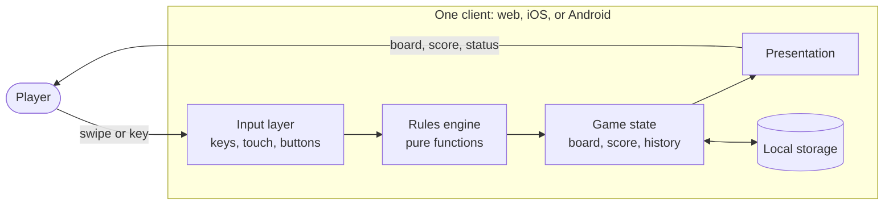

Everything is local. There is no account, no server, no analytics, no network call. The only persistence is the browser's `localStorage`, iOS `UserDefaults`, and Android `SharedPreferences` — each holding one saved round and one best score.

---

## Three clients, one contract

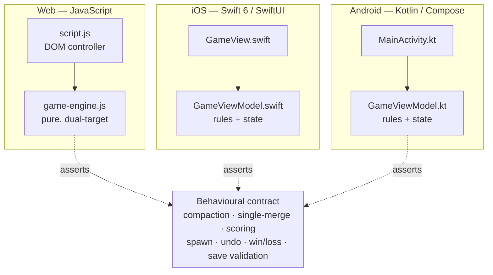

The contract is not a shared library, an interface definition, or a code generator. It is a list of behaviours, written down in this document and in [`docs/testing.md`](docs/testing.md), and independently asserted by a test suite on each platform.

| Contract clause | Web test | iOS test | Android test |
| --- | --- | --- | --- |
| A valid move compacts, merges once, scores, and spawns | ✓ | ✓ | ✓ |
| An ineffective move changes nothing and spawns nothing | ✓ | ✓ | ✓ |
| Undo restores exactly the board and score before the last valid move | ✓ | ✓ | ✓ |
| New game preserves the best score | ✓ | ✓ | ✓ |
| 2048 wins but play continues | ✓ | ✓ | ✓ |
| A full board with no merge is game over | ✓ | ✓ | ✓ |
| Corrupt saved state is discarded safely | ✓ | ✓ | ✓ |

When a rule changes, all three implementations change and all three suites are updated. A change that lands on one platform only is a parity bug, and the [`2048-cross-platform-parity`](.agents/skills/2048-cross-platform-parity/SKILL.md) skill exists to catch exactly that.

### Why there is no shared core

The obvious alternative — one engine compiled to WebAssembly, or a Kotlin Multiplatform module, or a C core with bindings — was rejected. The reasoning:

| Consideration | Why it favours three implementations |
| --- | --- |
| **Size of the shared surface** | The entire rules engine is ~100 lines. A cross-language build system to share 100 lines costs more than it saves, permanently |
| **Onboarding** | A web developer clones this repo and runs `npm test` in seconds. A shared core would mean installing a second toolchain before touching the web app |
| **Idiomatic clients** | Each client uses its platform's natural state primitive — a plain object, `@Published`, `mutableStateOf`. A shared core would force a foreign state model into two of the three |
| **Build independence** | The iOS app builds with no Node. The Android app builds with no Xcode. A broken toolchain on one platform cannot block the other two |
| **The contract is testable anyway** | Three test suites asserting the same behaviour catch divergence just as reliably as a shared binary — and they catch it *per platform*, which is where a bug actually manifests |

The cost is real and is accepted: a rule change is three edits, not one. That is the trade, and it is deliberate.

---

## Repository map

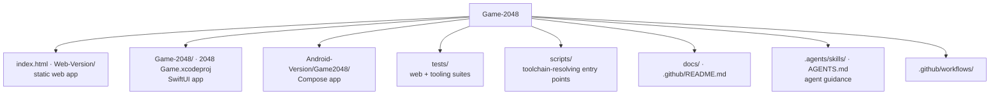

| Path | Holds | Built by |
| --- | --- | --- |
| `index.html`, `Web-Version/` | The static web app: engine, controller, styles | Nothing — it is served as-is |
| `Game-2048/` | SwiftUI views, view model, assets, entitlements | `xcodebuild` via `scripts/ios.sh` |
| `Game-2048Tests/`, `Game-2048UITests/` | XCTest and XCUITest targets | Same |
| `Android-Version/Game2048/` | Compose UI, view model, storage, Gradle build | Gradle via `scripts/android.sh` |
| `tests/web/`, `tests/tooling/` | Node test-runner suites and the fake DOM harness | `node --test` |
| `scripts/` | Every entry point; resolves JDKs, simulators, and `adb` | Invoked by `make` |
| `docs/` | Architecture, testing, and screenshot guides | — |
| `.agents/skills/` | Repository-local agent workflows, mirrored to `.claude/skills/` | — |

There are two `.xcodeproj` directories at the root. **`2048 Game.xcodeproj` is the real one**; `Game-2048.xcodeproj` is a stray with no `project.pbxproj`. Build scripts reference the former explicitly.

---

## The rules engine

Only the web client separates the engine into its own file. On iOS and Android the same logic lives inside the view model — but it is written to be free of view dependencies, which is what lets it be unit-tested without a simulator or emulator.

The web engine is the reference implementation, because it is the one that is genuinely pure:

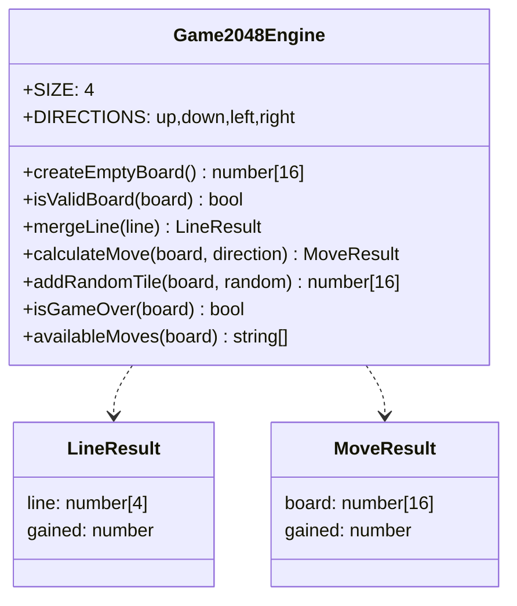

Three properties make it testable and portable:

1. **The board is a flat 16-element array**, not a 2×2 nested structure. Index `row * 4 + column`. Flat storage makes copying, comparing, and validating trivial one-liners.
2. **Every function is side-effect free.** `calculateMove` returns a new board and never touches its input — a property directly asserted by a test, because an engine that mutates its argument silently breaks undo.
3. **Randomness is a parameter**, not a global. `addRandomTile(board, random)` defaults to `Math.random` but accepts any generator, which is what makes every spawn-related test deterministic.

The engine is dual-target by construction:

```javascript
(function exposeGameEngine(root, factory) {
    const engine = factory();
    if (typeof module === "object" && module.exports) module.exports = engine;
    if (root) root.Game2048Engine = engine;
})(typeof globalThis !== "undefined" ? globalThis : this, () => { /* … */ });
```

One file, loadable as a `<script>` in the browser and as a CommonJS module in Node. No bundler, no transpiler, no build step. That is why enforced coverage on the rules is cheap here and why the web suite runs in ~150 ms.

### Validation at the boundary

Every public engine function calls `assertBoard` first and throws a `TypeError` on anything malformed. A tile is valid when it is a non-negative integer that is either zero or a power of two:

```javascript
Number.isInteger(value) && value >= 0 && (value === 0 || (value & (value - 1)) === 0)
```

The `value & (value - 1)` trick is the standard power-of-two check. This matters more than it looks: it is the same predicate that rejects corrupt saved state, so a `localStorage` entry someone hand-edited to contain `3` or `-2` or `"2"` is refused by the same code path that validates a live board.

---

## The move algorithm

Every direction reduces to the same one-dimensional operation. The engine extracts a line, optionally reverses it, merges it toward index 0, reverses back, and writes it home.

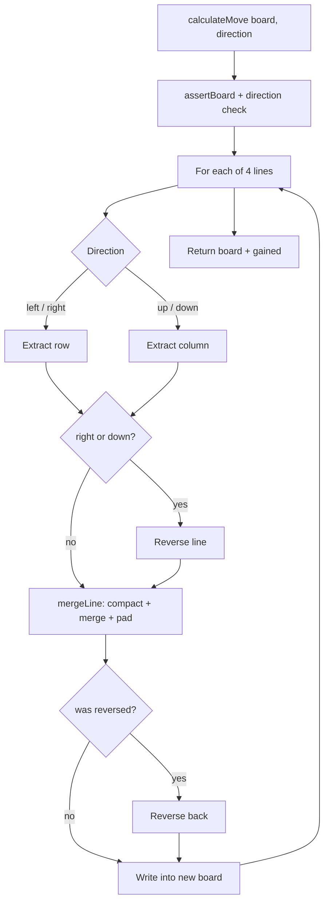

`mergeLine` is the whole game in fifteen lines:

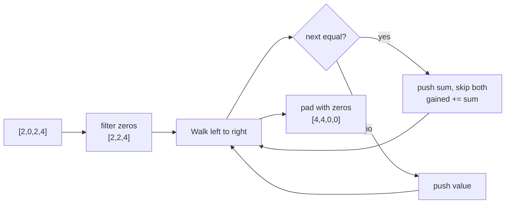

Collapsing four directions into one merge function is the single most important structural decision in the engine. It means merge ordering, the single-merge rule, and scoring are each implemented **once**, so they cannot disagree between directions — a class of bug that plagues naive 2048 implementations.

### Merge ordering: the rule everyone gets wrong

Merging always resolves from the destination edge inward. This is not a stylistic choice; it is observable behaviour that changes the board.

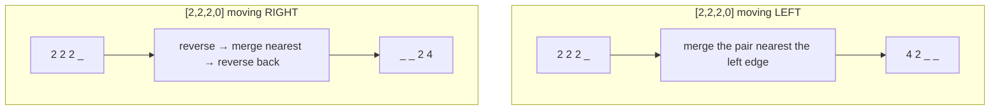

The same three tiles produce `4 2` moving left and `2 4` moving right. Because the engine reverses the line before merging and reverses the result back, this falls out for free — there is no direction-specific branch anywhere.

Two adjacent rules that are constantly confused:

| Rule | Correct | Wrong |
| --- | --- | --- |
| A merged tile cannot merge again this move | `[2,2,4]` → `[4,4]` | `[2,2,4]` → `[8]` |
| Four equal tiles make two pairs, not a chain | `[2,2,2,2]` → `[4,4]` score 8 | `[2,2,2,2]` → `[8]` score 12 |

Both are directly asserted on all three platforms. The first is the most commonly broken rule in 2048 implementations, which is why it has a dedicated test with that fact in the comment.

---

## Tile spawning and determinism

A **valid** move spawns exactly one tile. An **ineffective** move spawns nothing.

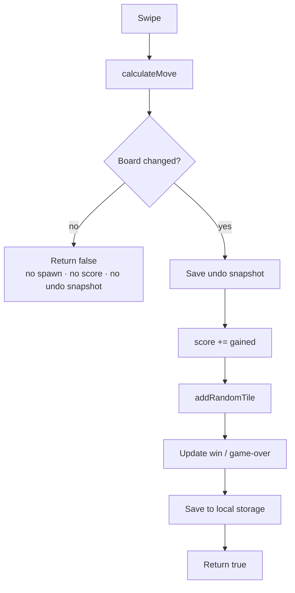

The spawn itself takes two rolls from the generator:

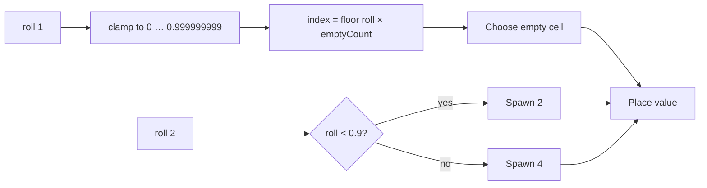

Two details that exist because they were tested:

- **The location roll is clamped.** A generator returning exactly `1.0` would compute an index one past the end of the empty list. Clamping to `0.999999999` makes an out-of-range generator impossible to crash on. iOS and Android clamp the index itself (`min(max(index, 0), count - 1)`) for the same reason, and have a test that feeds them `-5` and `999`.
- **The `< 0.9` boundary is exclusive.** A roll of exactly `0.9` produces a **4**, not a 2. All three platforms have a test asserting both sides of that boundary, because an off-by-one here shifts the game's difficulty in a way no casual play would reveal.

### Determinism as a design constraint

Every client injects its randomness:

| Client | Injection point |
| --- | --- |
| Web | `addRandomTile(board, random)` — a parameter with a default |
| iOS | `GameViewModel(randomIndex:randomUnit:)` — two closures |
| Android | `GameViewModel(randomIndex:randomUnit:)` — two lambdas |

This is the single constraint that makes the whole test strategy possible. Without it, no test could assert a board state after a move, and the suites would be reduced to checking that nothing crashed.

**Consequence for test authors:** because a valid move always spawns, asserting a whole row after a move couples the assertion to wherever the injected generator happened to place the tile. Assert the cells the *merge* produced, plus the score. This is written down in [`docs/testing.md`](docs/testing.md) because it broke three tests during development.

---

## Win and loss predicates

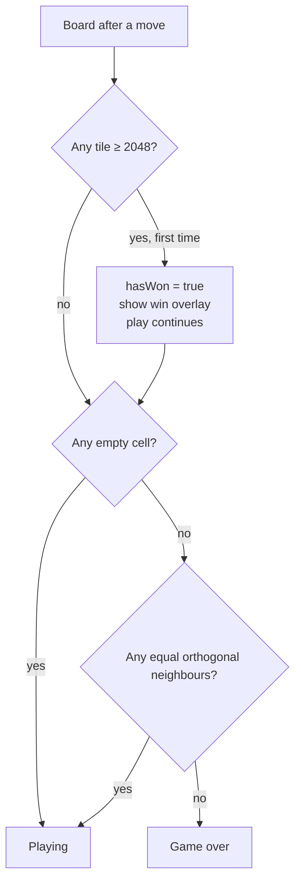

Two properties worth stating explicitly:

- **Winning does not end the game.** Reaching 2048 shows an overlay offering both "new game" and "keep playing". The win state is sticky — it is announced once and does not re-fire on every subsequent move.
- **Game over requires both conditions.** A full board is not enough; a full board *with* an adjacent equal pair is still playable. Each platform has three tests here: a full board with a horizontal pair, one with a vertical pair, and a true checkerboard lock.

`isGameOver` short-circuits on `board.includes(0)` before scanning for pairs, so the common case is one pass.

---

## Game state machine

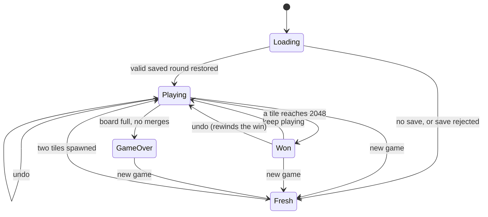

Undo from the `Won` state rewinds `hasWon` too — the snapshot captures the win flag alongside the board and score, so undoing the winning move genuinely un-wins.

### Undo

Undo is exactly one step deep, and that is a deliberate product decision rather than a limitation.

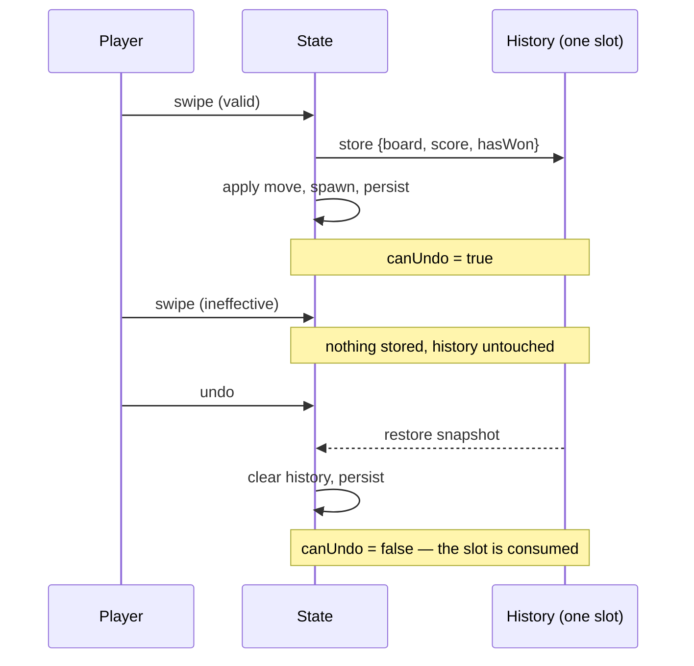

Three rules, all tested on every platform:

1. **An ineffective move creates no snapshot.** Otherwise a blocked swipe would silently consume the player's undo.
2. **The snapshot is consumed.** A second undo is a no-op, not a rewind two moves back.
3. **Undo is persisted.** The undone board is written to storage, so relaunching the app does not resurrect the move.

### Score and best score

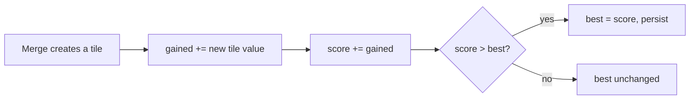

Only **newly created** tiles score. Sliding without merging scores nothing. `[2,2,8,8]` moving left scores 20 — the 4 and the 16, not the tiles that merely moved.

The best score survives a new game and never decreases. There is a subtle trap here that the web implementation handles explicitly: `mergeLine` accumulates into the score as it runs, so a move that turns out to be ineffective must roll that back. All three clients restore the previous score before returning `false`, and all three have a test asserting a blocked swipe does not inflate the total.

---

## Persistence and corrupt state

Each client stores one saved round and one best score under platform-native keys:

| Client | Mechanism | Round key | Best-score key |
| --- | --- | --- | --- |
| Web | `localStorage` | `game2048-state-v2` (JSON) | `highScore` |
| iOS | `UserDefaults` | `savedGridV2`, `savedScoreV2`, `savedHasWonV2` | `highScore` |
| Android | `SharedPreferences` | `saved_grid_v2` (CSV), `saved_score_v2`, `saved_won_v2` | `high_score` |

The keys are intentionally *not* unified — each is idiomatic for its platform, and the saves never travel between clients. The `v2` suffix marks the current layout; an older `v1` entry is simply not read.

Restoring is the one place the app ingests data it did not create, so every client validates before trusting:

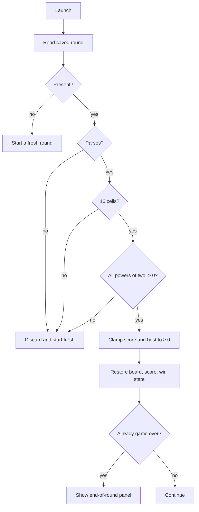

Every rejection path is tested: unparseable JSON, wrong cell count, non-power-of-two values, negative tiles, non-numeric entries, and negative scores. The failure mode is always the same — discard silently and start a fresh round. A corrupt save never crashes, never shows an error, and never produces a board the engine would reject.

Android's CSV format has a subtlety worth knowing: it parses with `mapNotNull(String::toIntOrNull)`, which *drops* unparseable cells rather than failing. A grid of `"2,x,4"` would yield two values, not three. The length check immediately after is what converts that into a clean rejection instead of a short, misaligned board — and there is a test named for exactly that.

---

## Web client

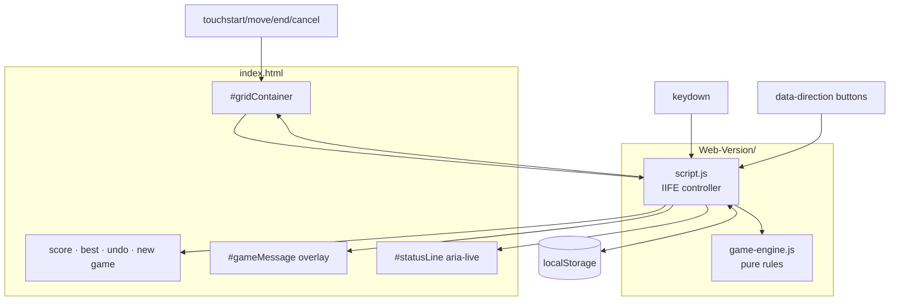

Static files, no bundler, no transpiler, no runtime dependency. `script.js` is an IIFE that reads the document **once** on load and then talks to the page only through the elements it captured.

That property is not incidental — it is what makes the controller unit-testable. `tests/web/helpers/fake-dom.js` provides a hand-written stand-in for the document, so keyboard handling, touch handling, rendering, message states, and persistence are all covered by `node --test` with no browser at all.

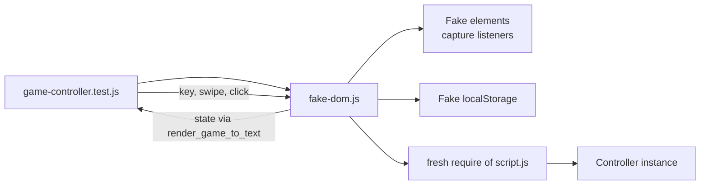

**Keep the controller that way.** A controller that reaches back into `document` mid-flight is one that can only be tested in a real browser.

Rendering is incremental: the 16 cells are built once and then updated in place. A `pop` class is toggled only on tiles whose value actually changed this move, so a re-render does not re-animate a static board.

The controller exposes two hooks for testing and automation:

| Hook | Purpose |
| --- | --- |
| `window.render_game_to_text()` | A JSON dump of board, score, best, undo availability, mode, and available moves |
| `window.advanceTime()` | Forces a re-render without animation |

The Playwright suite drives real input events and reads state back through the first hook. Keep it accurate when the state shape changes, or the browser suite silently loses its assertions.

---

## iOS client

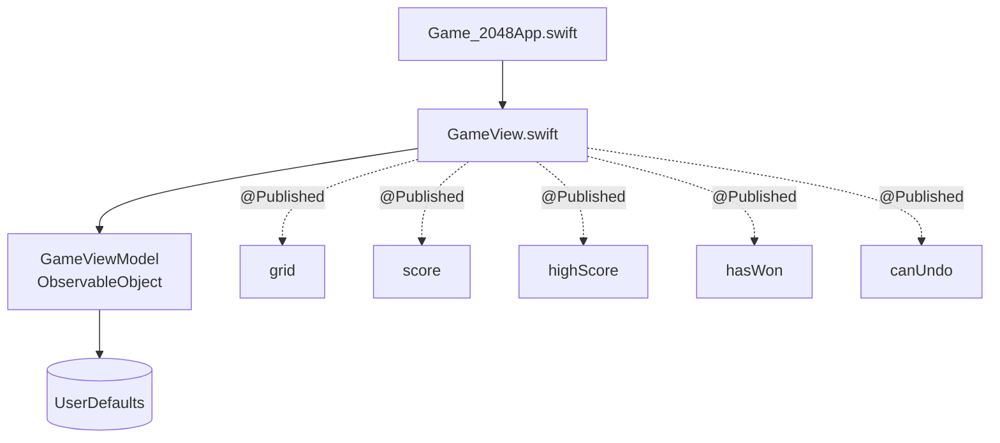

`GameViewModel` is an `ObservableObject` holding both the rules and the state. It takes three injected dependencies, all defaulted:

```swift
init(
    loadSavedGame: Bool = true,
    defaults: UserDefaults = .standard,
    randomIndex: @escaping (Int) -> Int = { Int.random(in: 0..<$0) },
    randomUnit: @escaping () -> Double = { Double.random(in: 0..<1) }
)
```

**`loadSavedGame` is also the write switch.** A view model built with `false` is a throwaway (a SwiftUI preview, or a test that wants a clean board) and deliberately never persists. This surprised a test during development — a "persistence" test built that way saved nothing and proved nothing — so it is called out here and in the test file.

### Layout

`GameView` wraps its content in `ViewThatFits(in: .vertical)`. This is not cosmetic. An earlier version placed the board inside a `ScrollView`, and a `ScrollView`'s pan gesture always wins against a SwiftUI `DragGesture` — so **every vertical swipe scrolled the page instead of moving the board**.

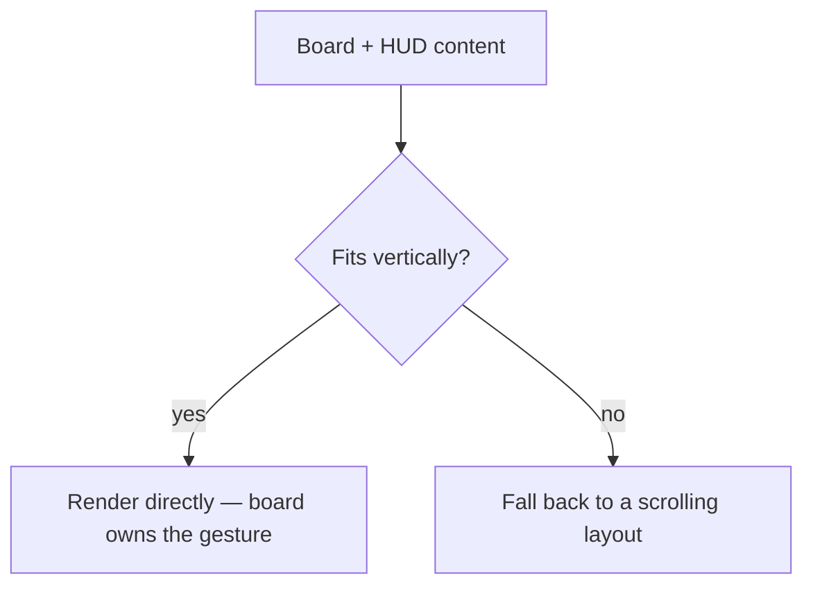

Three changes were tried before the real cause was found, and the sequence is instructive:

| Attempt | Why it was not sufficient |
| --- | --- |
| `.highPriorityGesture` | Cannot beat a UIKit `UIPanGestureRecognizer` — priority is resolved inside UIKit, not SwiftUI. Still in place, and correct; it just was not the problem |
| `.scrollBounceBehavior(.basedOnSize)` | The content genuinely overflowed, so bouncing was not the problem either |
| `ViewThatFits` alone | Still selected the scrolling branch, because the content measured 887 pt in an 874 pt viewport |

The actual fix was trimming spacing so the content fits, which makes `ViewThatFits` select the non-scrolling branch and leaves the board owning its gesture. The board still declares `.highPriorityGesture(DragGesture(minimumDistance: 22))`.

**The lesson worth recording: three attempts producing byte-identical failures means the change is not reaching the behaviour at all.** That is a signal to stop and re-measure, not to try a fourth fix.

---

## Android client

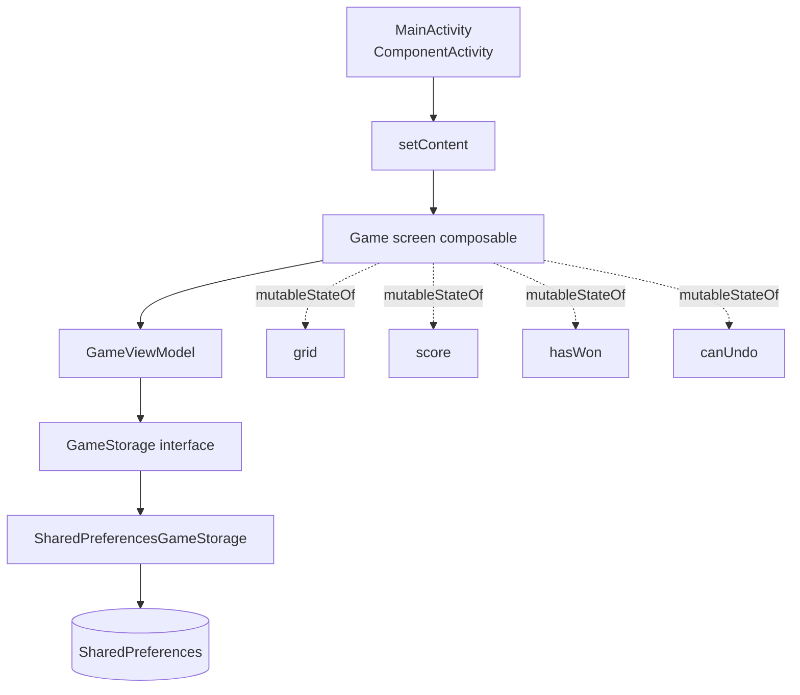

State is Compose `mutableStateOf`, so a write recomposes exactly the readers.

Storage is behind an interface — this is the one place any client abstracts its persistence, and it exists for testability:

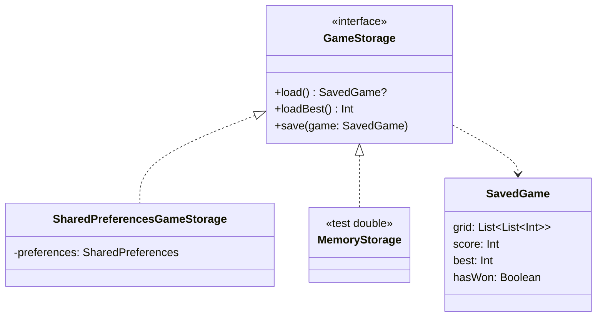

`GameViewModel` takes a nullable `GameStorage`, so the rules suite runs entirely in memory while a separate suite exercises the real `SharedPreferences` serialisation against a hand-written in-memory fake — no Robolectric, no mocking framework, no Android runtime.

---

## Gesture ownership

**A board swipe belongs to the board.** It must never scroll, bounce, or pan the surrounding screen, and every direction must register. Each client enforces this differently because each platform fights back differently.

```mermaid
flowchart TB
    subgraph W[Web]
        W1["board: touch-action: none"] --> W2["non-passive touchmove guard"]
        W2 --> W3["html/body: overscroll-behavior: none"]
        W3 --> W4[touchcancel clears the origin]
    end

    subgraph I[iOS]
        I1["ViewThatFits keeps the board<br/>out of any scrolling container"] --> I2["DragGesture, 22 pt minimum"]
    end

    subgraph A[Android]
        A1[detectDragGestures] --> A2["change.consume() on every pointer change"]
        A2 --> A3[Parent scroll never sees the gesture]
    end
```

Details that each exist because of a real bug:

- **Web — the `touchmove` listener must be non-passive.** A passive listener cannot call `preventDefault`, so registering it passively silently disables the entire guard. There is a test asserting the listener is registered non-passively, because this failure is invisible at review time.
- **Web — `touchcancel` must clear the start point.** A system swipe or an incoming call cancels the gesture; without clearing, the next swipe is measured from a stale origin and moves the wrong way.
- **Web — the guard is scoped to the board.** Page scrolling everywhere else must keep working, and a test asserts `touchmove` outside a board swipe is left alone.
- **Android — consume every pointer change.** Without `change.consume()`, the parent scroll container also processes the drag and the screen moves with the board.
- **iOS — a 22 pt minimum distance** keeps a tap from registering as a micro-swipe.

All three are covered by tests. See [`docs/testing.md`](docs/testing.md#gesture-ownership).

---

## Test strategy

```mermaid
flowchart TB
    UI["Browser / simulator / emulator<br/>real input, real rendering"]
    Unit["Deterministic unit suites<br/>rules, controller, storage"]

    UI --> Unit

    Unit --> W["Web: 65 tests<br/>engine + controller + assets"]
    Unit --> I["iOS: 49 tests<br/>model + persistence + edges"]
    Unit --> A["Android: 42 tests<br/>ViewModel + storage"]

    UI --> WB["Web: 8 Chromium flows"]
    UI --> IU["iOS: 9 XCUITest flows"]
    UI --> AU["Android: 5 Compose tests"]
```

The split is deliberate: **rules go in the deterministic suite on all three platforms, because parity is the point.** User-flow behaviour goes in the platform UI suite, asserting a user-visible outcome rather than re-deriving the rules.

| Platform | Deterministic | UI / integration | Runner |
| --- | --- | --- | --- |
| Web | 65 unit + 2 tooling | 8 Chromium scenarios | `node --test`, Playwright |
| iOS | 49 model tests | 9 XCUITest flows (10 executions) | XCTest |
| Android | 42 JVM tests | 5 Compose instrumentation tests | JUnit 4, Compose UI Test |

The iOS UI suite reports ten executions because the launch test runs once per appearance mode.

### Coverage gates

Every platform enforces a floor, and all three sit far above it.

| Platform | Gate | Current | Enforced by |
| --- | --- | --- | --- |
| Web | 100 % statements / lines / functions, 95 % branches, across all of `Web-Version/` | 100 % lines, 98.75 % branches | `c8`, in `npm run test:unit` |
| iOS | 90 % lines of the `Game-2048.app` target | 99.44 % | `xccov` in `scripts/test-ios.sh` and in CI |
| Android | 90 % lines, 85 % branches of the Kotlin engine and storage | 99.21 % lines, 91.26 % branches | JaCoCo `jacocoCoverageVerification` |

`MainActivity` sits outside the Android gate on purpose: it is Compose and is only reachable on a device, which `make test-android-device` covers. Holding the whole module to a JVM-only threshold would either fail on every machine without an emulator or push the number down to something meaningless.

**Lowering a threshold is never the fix for a failing gate.**

---

## Accessibility

Accessibility is a contract clause, not a polish pass.

| Requirement | Web | iOS | Android |
| --- | --- | --- | --- |
| Icons | SVG | SF Symbols | Material vector |
| Screen-reader board | `role="grid"` / `row` / `gridcell`, per-cell `aria-label` | Accessibility labels on tiles | Content descriptions |
| Live announcements | `#statusLine` with `aria-live` | — | — |
| Keyboard | Arrows, WASD, `F` for fullscreen | — | — |
| Focus | Visible focus, message panel takes focus when shown | — | — |
| Motion | Respects reduced-motion | Respects reduced-motion | Respects reduced-motion |

**Never use ASCII, emoji, or Unicode glyphs as button icons.** Icon artwork is centred by geometry and layout, with an accessible name on the enclosing control.

Every cell carries `aria-label` of either `Tile <value>` or `Empty cell`, asserted by a test — a grid that reads as a wall of unlabelled divs is unusable with a screen reader, and that regression is easy to introduce while optimising rendering.

---

## Command surface

Everything goes through `make`. The targets wrap scripts that resolve toolchains, so a fresh clone works without manual environment setup.

```mermaid
flowchart LR
    Make[make] --> Check[check<br/>syntax · repo · shell · SEO]
    Make --> Serve[serve<br/>localhost:8080]
    Make --> TW[test-web]
    Make --> TI[test-ios]
    Make --> TA[test-android]
    Make --> T[test<br/>everything this host supports]
    Make --> Run[ios-run · android-run]
    Make --> Shots[screenshots-web]

    TW --> Scripts[scripts/*.sh]
    TI --> Scripts
    TA --> Scripts
    Run --> Scripts
```

| Command | Does |
| --- | --- |
| `make help` | Lists every supported workflow |
| `make check` | Fast pre-commit checks — also what the Husky hook runs |
| `make serve` | Serves the web app at `http://localhost:8080` |
| `make test-web` | Syntax, repo validation, unit tests with coverage, tooling tests, Chromium flows |
| `make test-ios` | Unit and UI tests on a resolved simulator, then the coverage gate |
| `make test-android` | Unit tests, coverage gate, lint, debug APK |
| `make test-android-device` | Adds Compose tests on a connected device |
| `make test` | Every suite the current host can run |
| `make ios-run` / `android-run` | Build, install, launch |
| `make screenshots-web` | Deterministic desktop and mobile captures into `output/` |

### Toolchain resolution

**Never call `adb`, `xcrun`, or `./gradlew` bare from a script or Make target.** On a default Android Studio install `adb` is not on `PATH`, and the machine's default `java` is frequently the wrong version.

```mermaid
flowchart TD
    Target[make target] --> Script[scripts/*.sh]
    Script --> Common[scripts/common.sh]

    Common --> JDK["use_java_17<br/>resolve a JDK 17"]
    Common --> ADB["resolve_adb<br/>ANDROID_HOME fallback"]
    Common --> Sim["resolve_ios_simulator<br/>+ boot_ios_simulator"]
    Common --> Guard["require_macos · require_command"]
```

The Android build additionally commits Gradle daemon JVM criteria in `Android-Version/Game2048/gradle/gradle-daemon-jvm.properties`, so **Gradle downloads and runs on a matching Adoptium JDK 17 regardless of the machine's default `java`**. The JVM suite therefore needs only the Android SDK — not a preinstalled JDK. The first invocation pays a one-time download into `~/.gradle/jdks/`.

A dev container covers the web and Android workflows for contributors without a local toolchain; `make verify-devcontainer` builds it and checks every tool. iOS is not covered there — it requires Xcode on a macOS host.

---

## CI topology

```mermaid
flowchart LR
    Push[push / PR / dispatch] --> Web[web · ubuntu]
    Push --> IOS[ios · macos-15]
    Push --> AJ[android-jvm · ubuntu]
    AJ --> AD[android-device · ubuntu]

    Web --> W1[npm audit]
    Web --> W2[syntax · repo · SEO validation]
    Web --> W3[ShellCheck]
    Web --> W4[unit tests + coverage gate]
    Web --> W5[Chromium flows]

    IOS --> I1[build-for-testing]
    IOS --> I2[model tests + coverage]
    IOS --> I3[UI + accessibility flows]
    IOS --> I4[coverage gate via xccov]

    AJ --> A1[unit tests]
    AJ --> A2[JaCoCo gate]
    AJ --> A3[lint]
    AJ --> A4[debug APK]

    AD --> D1[emulator Compose flows]
```

Four independently visible jobs, so a failure points straight at the responsible platform. Coverage reports, `.xcresult` bundles, Android reports, and the debug APK upload as artifacts **including on failure** — which is usually when they are needed.

ShellCheck is optional locally but **required in CI**. Install it (`brew install shellcheck`) to catch shell issues before pushing rather than after.

---

## Architectural invariants

These hold across all three clients. A change that breaks one is a bug regardless of what it enables.

**Rules**

- A valid move compacts tiles, merges equal neighbours **once**, scores the merged values, and spawns exactly one `2` or `4`.
- An ineffective move changes nothing, creates no undo snapshot, spawns no tile, and does not alter the score.
- Merging resolves from the destination edge inward, in every direction.
- Undo restores exactly the board, score, and win state before the most recent valid move, and is exactly one step deep.
- Reaching 2048 presents a win state and allows continued play.
- Game over requires a full board **and** no orthogonal equal pair.

**State**

- New game preserves the best score and requires confirmation when a round is in progress.
- The best score never decreases.
- Corrupt or structurally invalid saved state is discarded safely — never crashes, never partially restores.
- Game state stays on the device. No backend, analytics, accounts, remote storage, or network calls.

**Code**

- Source stays deterministic where tests inject a random tile provider.
- The web engine is side-effect free and does not mutate its inputs.
- The web controller reads the document once and thereafter only through captured elements.
- Rules logic on iOS and Android stays free of view dependencies.
- A board swipe never scrolls, bounces, or pans the surrounding screen.
- Icons are SVG, SF Symbols, or Material vectors — never ASCII, emoji, or Unicode glyphs.
- Generated Xcode identifiers and Gradle wrapper binaries are not hand-edited.
- `local.properties`, signing material, tokens, build output, and local simulator data are never committed.

---

## Further reading

- [`docs/architecture.md`](docs/architecture.md) — per-client implementation detail
- [`docs/testing.md`](docs/testing.md) — suite placement, gates, and diagnosing flaky device runs
- [`.github/README.md`](.github/README.md) — product overview, features, and screenshots
- [`AGENTS.md`](AGENTS.md) — the source of truth for coding agents
- [`.agents/skills/`](.agents/skills/) — per-area workflows, including cross-platform parity
- [`.github/CONTRIBUTING.md`](.github/CONTRIBUTING.md) — contribution and testing requirements
