# 2048 Architecture

This repository ships the same 2048 game three times: as a static web app, as a native SwiftUI iOS app, and as a native Jetpack Compose Android app. **They share no runtime code.** What they share is a behavioural contract, enforced by three independent test suites that assert the same rules. An **optional** Cloud API (`server/`) adds accounts, cross-device sync, and leaderboards without ever gating a move.

This document is the whole-repository picture: why the structure exists, what the contract is, how each client honours it, how local state and the optional cloud layer interact, and how the build, test, and release machinery keep three toolchains honest. Per-client implementation notes live in [`docs/architecture.md`](docs/architecture.md); the HTTP wire contract and deploy details live in [`docs/backend.md`](docs/backend.md). When those disagree with this file on a shared invariant, **this file wins** — then the other docs should be updated.

New here? Read [The product in one page](#the-product-in-one-page), [Three clients, one contract](#three-clients-one-contract), [The rules engine](#the-rules-engine), and [Optional Cloud API](#optional-cloud-api). That is enough to follow anything else.

### How the docs fit together

| Document | Scope | Read when |
| --- | --- | --- |
| **This file** | Cross-cutting architecture: contract, rules, state, cloud posture, CI, invariants | Orienting, reviewing a parity or cloud change, onboarding an agent |
| [`docs/architecture.md`](docs/architecture.md) | Per-client build and UI detail, lifecycle, delivery base paths | Changing one client's state, gestures, or persistence wiring |
| [`docs/backend.md`](docs/backend.md) | Cloud API stack, endpoints, env, deploy | Touching `server/` or a cloud client module |
| [`docs/testing.md`](docs/testing.md) | Suite placement, flaky-device diagnosis, coverage floors | Adding or debugging tests |
| [`docs/releasing.md`](docs/releasing.md) | `VERSION`, Cut release, artifacts | Shipping a version |
| [`docs/privacy.md`](docs/privacy.md) | What is stored where, token placement trade-offs | Auth, sync, or disclosure changes |
| [`AGENTS.md`](AGENTS.md) | Agent operating rules and product invariants | Any automated change in this repo |

**Structure**

| | |
| --- | --- |
| **Shape** | [Product](#the-product-in-one-page) · [System context](#system-context) · [Three clients, one contract](#three-clients-one-contract) · [Why no shared core](#why-there-is-no-shared-core) · [Repository map](#repository-map) · [Decision log](#decision-log) |
| **Rules** | [The rules engine](#the-rules-engine) · [Board representation](#board-representation-and-indexing) · [Move algorithm](#the-move-algorithm) · [Merge ordering](#merge-ordering-the-rule-everyone-gets-wrong) · [A move traced end to end](#a-move-traced-end-to-end) · [Spawning](#tile-spawning-and-determinism) · [Win and loss](#win-and-loss-predicates) · [Complexity](#complexity-and-performance) |
| **State** | [State machine](#game-state-machine) · [Undo](#undo) · [Score](#score-and-best-score) · [Persistence](#persistence-and-corrupt-state) · [Guest and account profiles](#guest-and-account-profiles) · [State shape reference](#state-shape-reference) |
| **Cloud** | [Optional Cloud API](#optional-cloud-api) · [Wire contract](#cloud-wire-contract) · [Sync resolution](#sync-resolution) · [Auth and sessions](#auth-and-sessions) · [Cloud client modules](#cloud-client-modules) · [Sign-in lifecycle](#sign-in-lifecycle) · [Server topology](#server-topology) · [Applying a downloaded save](#applying-a-downloaded-save) |
| **Clients** | [Web](#web-client) · [iOS](#ios-client) · [Android](#android-client) · [Server-driven surfaces](#server-driven-surfaces) · [Input pipeline](#input-pipeline) · [Gesture ownership](#gesture-ownership) · [Rendering](#rendering-pipelines) · [Design tokens](#design-tokens-shared-by-hand) · [Credential entry](#credential-entry) · [Sound](#sound-architecture) · [Motion](#motion-architecture) |
| **Web surface** | [PWA and discovery](#pwa-and-discovery-surface) |
| **Quality** | [Test strategy](#test-strategy) · [Determinism seams](#determinism-seams) · [The fake DOM harness](#the-fake-dom-harness) · [Coverage gates](#coverage-gates) · [Failure modes](#failure-modes-and-how-each-is-caught) · [Accessibility](#accessibility) |
| **Tooling** | [Command surface](#command-surface) · [Toolchain resolution](#toolchain-resolution) · [Build topology](#build-topology) · [Dev container](#dev-container) · [CI topology](#ci-topology) · [Versioning and release](#versioning-and-release) |
| **Reference** | [Extending across three clients](#extending-across-three-clients) · [Security and privacy](#security-and-privacy-posture) · [Invariants](#architectural-invariants) · [Glossary](#glossary) |

---

## The product in one page

2048 is a sliding-tile puzzle on a 4×4 grid. The player swipes; every tile slides as far as it can in that direction; equal neighbours merge into their sum; one new tile appears. Reach 2048 to win. Fill the board with no merge available to lose.

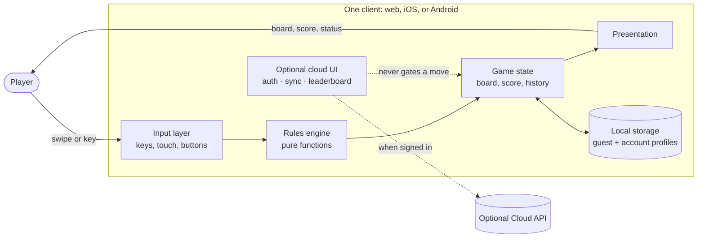

Everything is local-first. The board, score, undo, and best score work with no network. The only required persistence is the browser's `localStorage`, iOS `UserDefaults`, and Android `SharedPreferences` — each holding **two** complete profiles (guest and account) plus best scores. An **optional** Cloud API adds accounts, cross-device sync, and leaderboards; it never gates play. See [Optional Cloud API](#optional-cloud-api), [docs/backend.md](docs/backend.md), and [docs/privacy.md](docs/privacy.md).

### System context

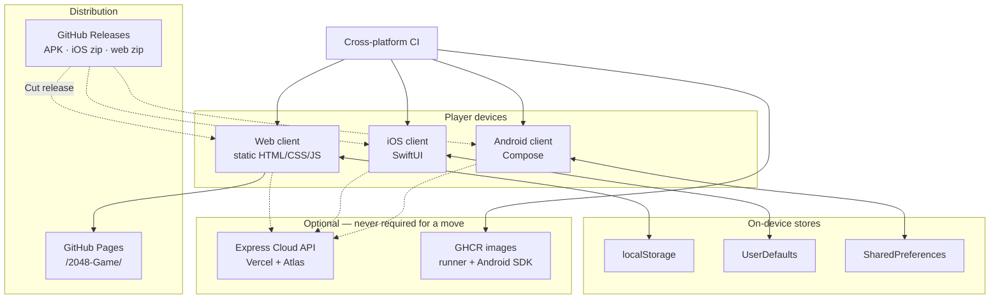

Three independent clients, one behavioural contract, one optional backend, one version number. A contributor can clone and play the web app with only Node; ship Android without installing a JDK by hand; and never open Xcode to change the rules on web or Android.

---

## Three clients, one contract

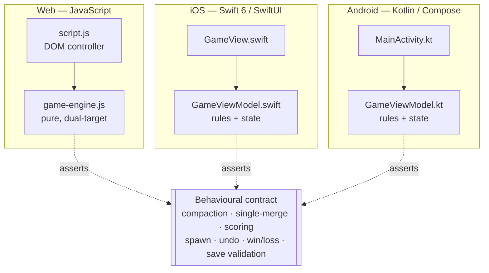

The contract is not a shared library, an interface definition, or a code generator. It is a list of behaviours, written down in this document and in [`docs/testing.md`](docs/testing.md), and independently asserted by a test suite on each platform.

| Contract clause | Web test | iOS test | Android test |
| --- | --- | --- | --- |
| A valid move compacts, merges once, scores, and spawns | ✓ | ✓ | ✓ |
| An ineffective move changes nothing and spawns nothing | ✓ | ✓ | ✓ |
| Undo restores exactly the board and score before the last valid move | ✓ | ✓ | ✓ |
| New game preserves the best score | ✓ | ✓ | ✓ |
| 2048 wins but play continues | ✓ | ✓ | ✓ |
| A full board with no merge is game over | ✓ | ✓ | ✓ |
| Corrupt saved state is discarded safely | ✓ | ✓ | ✓ |

When a rule changes, all three implementations change and all three suites are updated. A change that lands on one platform only is a parity bug, and the [`2048-cross-platform-parity`](.agents/skills/2048-cross-platform-parity/SKILL.md) skill exists to catch exactly that.

### Why there is no shared core

The obvious alternative — one engine compiled to WebAssembly, or a Kotlin Multiplatform module, or a C core with bindings — was rejected. The reasoning:

| Consideration | Why it favours three implementations |
| --- | --- |
| **Size of the shared surface** | The entire rules engine is ~100 lines. A cross-language build system to share 100 lines costs more than it saves, permanently |
| **Onboarding** | A web developer clones this repo and runs `npm test` in seconds. A shared core would mean installing a second toolchain before touching the web app |
| **Idiomatic clients** | Each client uses its platform's natural state primitive — a plain object, `@Published`, `mutableStateOf`. A shared core would force a foreign state model into two of the three |
| **Build independence** | The iOS app builds with no Node. The Android app builds with no Xcode. A broken toolchain on one platform cannot block the other two |
| **The contract is testable anyway** | Three test suites asserting the same behaviour catch divergence just as reliably as a shared binary — and they catch it *per platform*, which is where a bug actually manifests |

The cost is real and is accepted: a rule change is three edits, not one. That is the trade, and it is deliberate.

### Decision log

The decisions that shaped this repository, and what would have to change for each to be revisited.

| # | Decision | Rationale | Would be revisited if |
| --- | --- | --- | --- |
| 1 | Three independent implementations, no shared core | The shared surface is ~100 lines; a cross-language build costs more than it saves, permanently | The rules grew to the point where three implementations genuinely diverged in practice, not just in principle |
| 2 | No framework on the web — no bundler, no transpiler, no runtime dependency | The app is one HTML file, one stylesheet, and two scripts. A build step would add failure modes without removing any | The app needed routing, code splitting, or a component model |
| 3 | Flat 16-element board array rather than nested rows | Copy, compare, and validate become one-liners; the merge function is direction-agnostic | Never — the nested form has no advantage here |
| 4 | Randomness injected as a parameter everywhere | Without it, no test could assert a board after a move | Never; this is load-bearing for the whole test strategy |
| 5 | Rules live in the view model on iOS and Android, not a separate module | A separate module for ~100 lines would add a build target on each platform for no testability gain — the view models are already testable headlessly | The rules grew large enough to warrant their own target |
| 6 | Undo is exactly one step | A single slot is predictable, cheap to persist, and matches the original game | Users asked for deeper history and were willing to pay the persistence complexity |
| 7 | Gradle provisions its own JDK via `gradle-daemon-jvm.properties` | A contributor should not have to install a specific JDK before `make test-android` works | Gradle's toolchain provisioning stopped being reliable |
| 8 | Everything routes through `make` and `scripts/` | `adb` is not on `PATH` after a default Android Studio install, and the default `java` is usually wrong | Never — this is the difference between a clone that works and one that does not |
| 9 | Storage keys are per-platform and idiomatic, not unified | Local saves never leave the device format; the cloud wire format is a separate flat-board contract | Cross-device sync existed — it does now, via the Cloud API, without unifying local keys |
| 10 | Local-first play; optional Cloud API for accounts and sync | An account is an invitation, never a gate; offline play stays complete | Product direction required any change that makes the network mandatory for a move |
| 11 | Guest and account rounds are separate on-device profiles | A pre-sign-in round belongs to whoever was playing, not to whoever signs in next | Product required merging guest progress into accounts (rejected: career stats would lie) |
| 12 | Sync prefers the further round; parks the loser | Last-writer-wins deletes an hour of play when a second phone comes online | A stronger CRDT or explicit player-picked resolution UI is warranted |
| 13 | Auth and round adoption are separate client steps | Only the game knows which board is on screen, so only the game may offer a save | The API started choosing which board to keep (it must not) |
| 14 | `VERSION` is the single human-edited version; Cut release is the only ship path | Manual tagging drifted four version fields at once | A different release host replaced GitHub Releases |
| 15 | Server-driven surfaces are content-only with native fallbacks | Store review is slow; a typo in help copy should not wait days — but rules must stay in code | Payload-carried behaviour became a product requirement (rejected by invariant) |

---

## Repository map

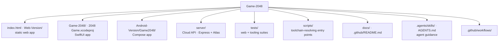

| Path | Holds | Built by |
| --- | --- | --- |
| `index.html`, `Web-Version/` | The static web app: engine, controller, styles, optional `cloud.js` / `account.js` | Nothing — it is served as-is |
| `Game-2048/` | SwiftUI views, view model, `Cloud/`, `SDUI/`, assets, entitlements | `xcodebuild` via `scripts/ios.sh` |
| `Game-2048Tests/`, `Game-2048UITests/` | XCTest and XCUITest targets | Same |
| `Android-Version/Game2048/` | Compose UI, view model, `cloud/` package, `sdui/`, storage, Gradle build | Gradle via `scripts/android.sh` |
| `server/` | Optional Cloud API (auth, saves, scores, leaderboards, OpenAPI) | Node on Vercel / `npm run dev` |
| `tests/web/`, `tests/tooling/` | Node test-runner suites and the fake DOM harness | `node --test` |
| `scripts/` | Every entry point; resolves JDKs, simulators, and `adb` | Invoked by `make` |
| `docs/` | Architecture, backend, privacy, testing, releasing, screenshot guides | — |
| `images/` | Canonical screenshots promoted by screenshot Make targets | `make screenshots-web` / `screenshots-mobile` |
| `VERSION` | The only human-edited version string | Propagated by `scripts/version.sh` |
| `.agents/skills/` | Repository-local agent workflows, mirrored to `.claude/skills/` | — |
| `.github/workflows/` | Cross-platform CI, dependency review, labeler, Cut release, Release | GitHub Actions |

There are two `.xcodeproj` directories at the root. **`2048 Game.xcodeproj` is the real one**; `Game-2048.xcodeproj` is a stray with no `project.pbxproj`. Build scripts reference the former explicitly.

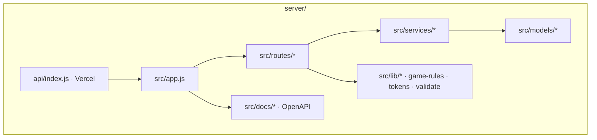

The server validates boards with the same power-of-two rules the clients use (`server/src/lib/game-rules.js`), but it is **not** a shared rules engine for play — clients never call it to resolve a swipe. It stores and reconciles saves; the move still happens on the device.

---

## The rules engine

Only the web client separates the engine into its own file. On iOS and Android the same logic lives inside the view model — but it is written to be free of view dependencies, which is what lets it be unit-tested without a simulator or emulator.

The web engine is the reference implementation, because it is the one that is genuinely pure:

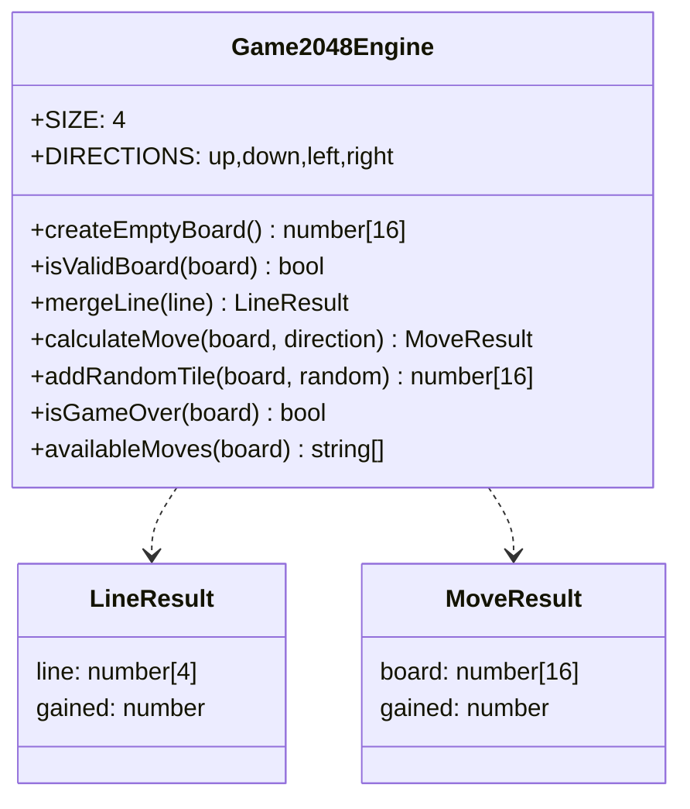

Three properties make it testable and portable:

1. **The board is a flat 16-element array**, not a 2×2 nested structure. Index `row * 4 + column`. Flat storage makes copying, comparing, and validating trivial one-liners.
2. **Every function is side-effect free.** `calculateMove` returns a new board and never touches its input — a property directly asserted by a test, because an engine that mutates its argument silently breaks undo.
3. **Randomness is a parameter**, not a global. `addRandomTile(board, random)` defaults to `Math.random` but accepts any generator, which is what makes every spawn-related test deterministic.

The engine is dual-target by construction:

```javascript
(function exposeGameEngine(root, factory) {
    const engine = factory();
    if (typeof module === "object" && module.exports) module.exports = engine;
    if (root) root.Game2048Engine = engine;
})(typeof globalThis !== "undefined" ? globalThis : this, () => { /* … */ });
```

One file, loadable as a `<script>` in the browser and as a CommonJS module in Node. No bundler, no transpiler, no build step. That is why enforced coverage on the rules is cheap here and why the web suite runs in ~150 ms.

### Validation at the boundary

Every public engine function calls `assertBoard` first and throws a `TypeError` on anything malformed. A tile is valid when it is a non-negative integer that is either zero or a power of two:

```javascript
Number.isInteger(value) && value >= 0 && (value === 0 || (value & (value - 1)) === 0)
```

The `value & (value - 1)` trick is the standard power-of-two check. This matters more than it looks: it is the same predicate that rejects corrupt saved state, so a `localStorage` entry someone hand-edited to contain `3` or `-2` or `"2"` is refused by the same code path that validates a live board.

---

## Board representation and indexing

The web engine stores the board as a **flat 16-element array**. iOS and Android use `[[Int]]` / `List<List<Int>>` — nested rows — because that is what reads naturally in a SwiftUI `ForEach` and a Compose `Column`. The flat form is the interesting one, because it is what makes the direction-agnostic merge possible.

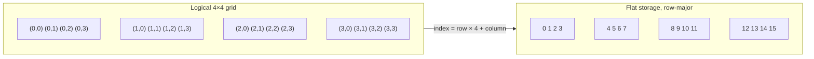

Line extraction is one pair of expressions covering all four directions:

```javascript
const row    = direction === "left" || direction === "right" ? outer : inner;
const column = direction === "left" || direction === "right" ? inner : outer;
```

For a horizontal move, `outer` is the row and `inner` walks the columns. For a vertical move they swap. That is the entire difference between "move left" and "move up" — the merge itself never knows which it is doing.

| Property | Flat array | Nested rows |
| --- | --- | --- |
| Copy | `[...board]` | `grid.map { it.toList() }` |
| Compare | `a.every((v, i) => v === b[i])` | element-wise nested walk |
| Validate | `board.length === 16 && board.every(isTile)` | check outer length, then each inner |
| Count empties | one `filter` | `flatten().filter` |
| Transpose for a vertical move | index arithmetic, no allocation | build a new column list |

Neither form is wrong. The flat array is chosen on the web because the engine is the thing under test and its operations are all whole-board; the nested form is chosen on the clients because the UI iterates rows.

**The conversion happens once, at the persistence boundary.** Android serialises `grid.flatten().joinToString(",")` and restores with `values.chunked(4)`; iOS stores `grid.flatMap { $0 }` and restores by striding. Both are validated for exactly 16 elements before the chunking happens — which is what turns a truncated write into a clean rejection rather than a misaligned board.

---

## A move traced end to end

A single left swipe on a real board, from key press to persisted state.

Starting board, score 40:

```
2  2  4  0
0  4  0  0
8  8  8  8
2  0  0  2
```

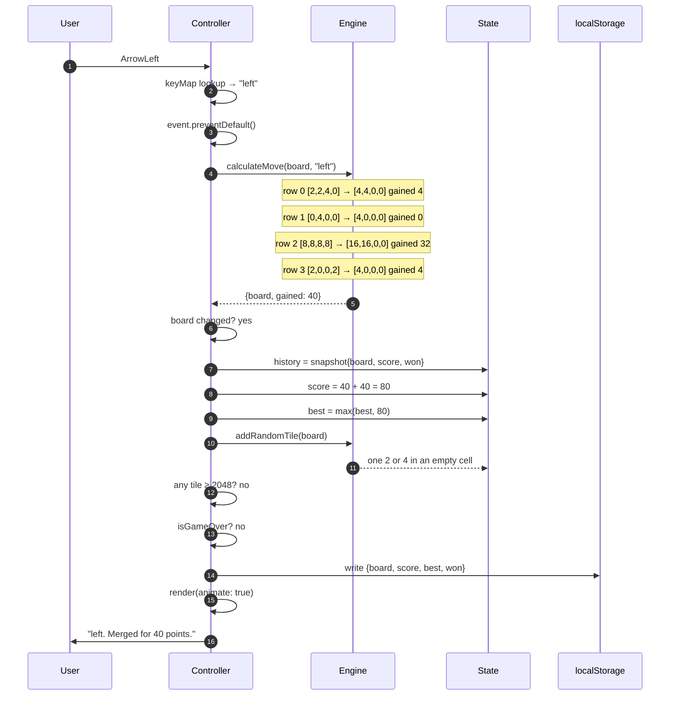

Result, score 80, plus one spawned tile:

```
4  4  0  0
4  0  0  0
16 16 0  0
4  0  0  0
```

Three things this trace makes concrete:

- **Row 2 is the single-merge rule in action.** `[8,8,8,8]` becomes `[16,16]`, not `[32]`. Two independent pairs, scoring 16 + 16 = 32.
- **Row 3 merges across a gap.** `[2,0,0,2]` compacts to `[2,2]` first, then merges. Compaction always precedes merging.
- **The score is the sum of created tiles**, not of tiles that moved: 4 + 32 + 4 = 40.

Now the same board swiped **right** instead:

```
0  0  4  4        ← [2,2,4,0] reversed, merged, reversed back
0  0  0  4
0  0 16 16
0  0  0  4
```

Row 0 becomes `[0,0,4,4]` rather than `[4,4,0,0]` — same merge, mirrored destination. Row 2 is symmetric so it looks the same. This is why the reverse-merge-reverse structure is worth the indirection: the asymmetry is handled once.

---

## Complexity and performance

The board is 16 cells. None of this is performance-critical, and the implementation deliberately favours clarity — but the characteristics are worth stating so nobody "optimises" something that is already trivial.

| Operation | Cost | Notes |
| --- | --- | --- |
| `mergeLine` | O(4) | One compaction pass, one merge pass |
| `calculateMove` | O(16) | Four lines × constant work; allocates one new 16-element board |
| `addRandomTile` | O(16) | One pass to collect empty indices, two generator calls |
| `isGameOver` | O(16), short-circuits | Returns immediately if any cell is empty — the common case is one `includes` |
| `availableMoves` | O(4 × 16) | Runs `calculateMove` per direction. Used by the state dump and by tests, not on the hot path |
| Web render | O(16) | Cells are built once, then updated in place |
| Persist | O(16) | One JSON serialise per valid move |

A full move — calculate, spawn, check status, persist, render — is a few hundred operations on 16 integers. The dominant cost in practice is the `localStorage` write, and even that is negligible at this size.

**Rendering is where the only real decision lives.** The web client does not rebuild the DOM per move; it builds 16 cells once and mutates `textContent`, `dataset.value`, `aria-label`, and a class. Rebuilding would be correct and would also destroy focus, break the CSS transition, and re-trigger every animation. There is a test asserting the same cell objects survive a move for exactly this reason.

---

## The move algorithm

Every direction reduces to the same one-dimensional operation. The engine extracts a line, optionally reverses it, merges it toward index 0, reverses back, and writes it home.

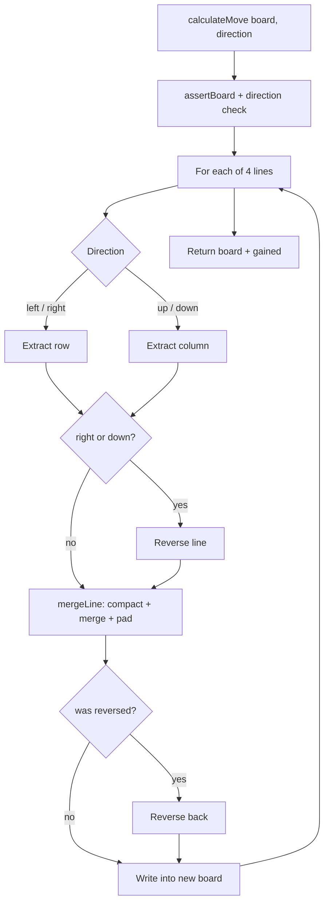

`mergeLine` is the whole game in fifteen lines:

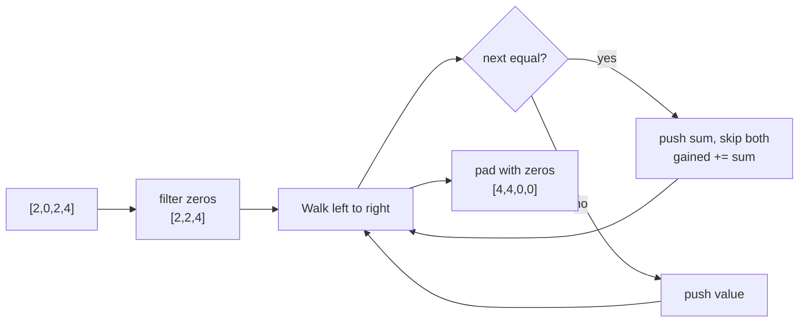

Collapsing four directions into one merge function is the single most important structural decision in the engine. It means merge ordering, the single-merge rule, and scoring are each implemented **once**, so they cannot disagree between directions — a class of bug that plagues naive 2048 implementations.

### Merge ordering: the rule everyone gets wrong

Merging always resolves from the destination edge inward. This is not a stylistic choice; it is observable behaviour that changes the board.

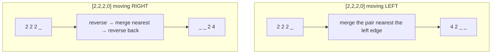

The same three tiles produce `4 2` moving left and `2 4` moving right. Because the engine reverses the line before merging and reverses the result back, this falls out for free — there is no direction-specific branch anywhere.

Two adjacent rules that are constantly confused:

| Rule | Correct | Wrong |
| --- | --- | --- |
| A merged tile cannot merge again this move | `[2,2,4]` → `[4,4]` | `[2,2,4]` → `[8]` |
| Four equal tiles make two pairs, not a chain | `[2,2,2,2]` → `[4,4]` score 8 | `[2,2,2,2]` → `[8]` score 12 |

Both are directly asserted on all three platforms. The first is the most commonly broken rule in 2048 implementations, which is why it has a dedicated test with that fact in the comment.

---

## Tile spawning and determinism

A **valid** move spawns exactly one tile. An **ineffective** move spawns nothing.

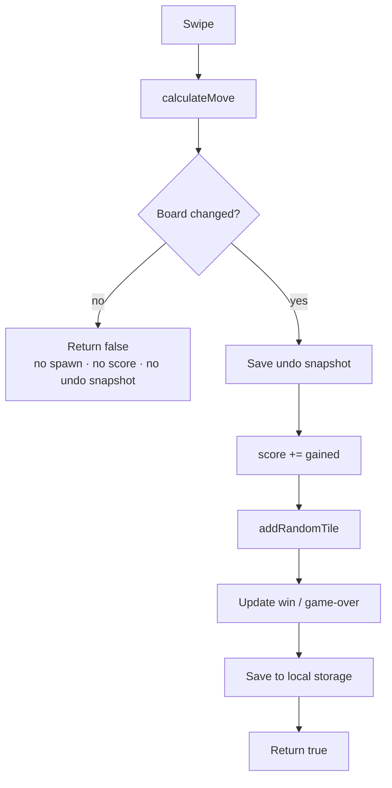

The spawn itself takes two rolls from the generator:

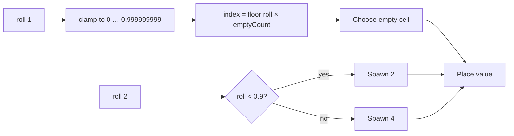

Two details that exist because they were tested:

- **The location roll is clamped.** A generator returning exactly `1.0` would compute an index one past the end of the empty list. Clamping to `0.999999999` makes an out-of-range generator impossible to crash on. iOS and Android clamp the index itself (`min(max(index, 0), count - 1)`) for the same reason, and have a test that feeds them `-5` and `999`.
- **The `< 0.9` boundary is exclusive.** A roll of exactly `0.9` produces a **4**, not a 2. All three platforms have a test asserting both sides of that boundary, because an off-by-one here shifts the game's difficulty in a way no casual play would reveal.

### Determinism as a design constraint

Every client injects its randomness:

| Client | Injection point |
| --- | --- |
| Web | `addRandomTile(board, random)` — a parameter with a default |
| iOS | `GameViewModel(randomIndex:randomUnit:)` — two closures |
| Android | `GameViewModel(randomIndex:randomUnit:)` — two lambdas |

This is the single constraint that makes the whole test strategy possible. Without it, no test could assert a board state after a move, and the suites would be reduced to checking that nothing crashed.

**Consequence for test authors:** because a valid move always spawns, asserting a whole row after a move couples the assertion to wherever the injected generator happened to place the tile. Assert the cells the *merge* produced, plus the score. This is written down in [`docs/testing.md`](docs/testing.md) because it broke three tests during development.

---

## Win and loss predicates

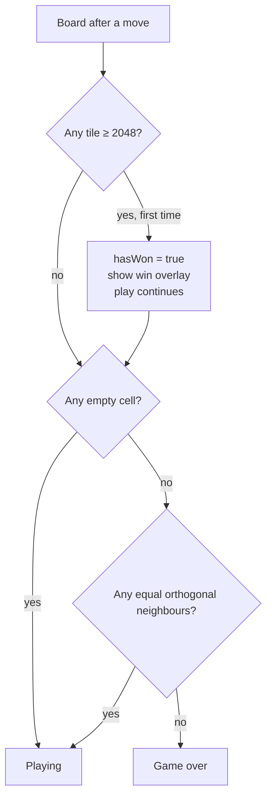

Two properties worth stating explicitly:

- **Winning does not end the game.** Reaching 2048 shows an overlay offering both "new game" and "keep playing". The win state is sticky — it is announced once and does not re-fire on every subsequent move.
- **Game over requires both conditions.** A full board is not enough; a full board *with* an adjacent equal pair is still playable. Each platform has three tests here: a full board with a horizontal pair, one with a vertical pair, and a true checkerboard lock.

`isGameOver` short-circuits on `board.includes(0)` before scanning for pairs, so the common case is one pass.

---

## Game state machine

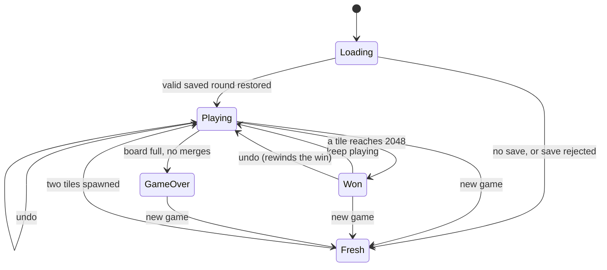

Undo from the `Won` state rewinds `hasWon` too — the snapshot captures the win flag alongside the board and score, so undoing the winning move genuinely un-wins.

### Undo

Undo is exactly one step deep, and that is a deliberate product decision rather than a limitation.

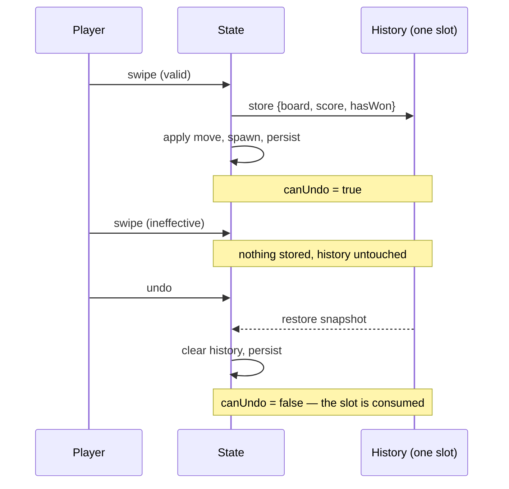

Three rules, all tested on every platform:

1. **An ineffective move creates no snapshot.** Otherwise a blocked swipe would silently consume the player's undo.
2. **The snapshot is consumed.** A second undo is a no-op, not a rewind two moves back.
3. **Undo is persisted.** The undone board is written to storage, so relaunching the app does not resurrect the move.

### Score and best score

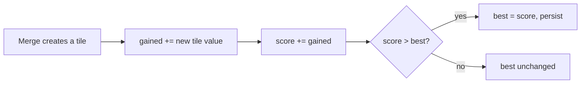

Only **newly created** tiles score. Sliding without merging scores nothing. `[2,2,8,8]` moving left scores 20 — the 4 and the 16, not the tiles that merely moved.

The best score survives a new game and never decreases. There is a subtle trap here that the web implementation handles explicitly: `mergeLine` accumulates into the score as it runs, so a move that turns out to be ineffective must roll that back. All three clients restore the previous score before returning `false`, and all three have a test asserting a blocked swipe does not inflate the total.

---

## Persistence and corrupt state

Each client stores one saved round and one best score **per profile**, under platform-native keys:

| Client | Mechanism | Guest round key | Guest best key | Account round key | Account best key |
| --- | --- | --- | --- | --- | --- |
| Web | `localStorage` | `game2048-state-v2` (JSON) | `highScore` | `game2048-state-account-v1` | `game2048-best-account-v1` |
| iOS | `UserDefaults` | `savedGridV2`, `savedScoreV2`, `savedHasWonV2`, `savedMovesV2` | `highScore` | the same names prefixed `account…V1` | `accountHighScoreV1` |
| Android | `SharedPreferences` | `saved_grid_v2` (CSV), `saved_score_v2`, `saved_won_v2`, `saved_moves_v2` | `high_score` | the same keys prefixed `account_` | `account_high_score` |

The keys are intentionally *not* unified across clients — each is idiomatic for its platform, and the saves never travel between clients. The `v2` suffix marks the current layout; an older `v1` entry is simply not read.

### Guest and account profiles

Two complete, independent rounds live on a device: the one played signed out
and the one played signed in. They never touch.

| Event | What happens |
| --- | --- |
| Signing in with a round in progress | The player is warned first. The guest round is written to its own keys and left alone; the account profile becomes active. |
| Signing in | The device offers the server **nothing** — `sync` is called with a null save, so the account's own round downloads, or the clean board stands. |
| Playing signed in | Only the account keys are written. The guest round and the guest best score are frozen. |
| Signing out | The account keys are cleared and the guest round is restored exactly — board, score, moves, and best score. |
| Career statistics | Read from the account and from nowhere else. No local best score or highest tile is ever merged in. |

The last row is the one that is easy to get wrong and hard to spot. Lifting a
device's local best into an account's career totals produces a brand-new
account advertising "Best 4,312 · 0 rounds · highest tile 128" — figures it
never earned, from a round it never played.

The reason the guest round is *parked* rather than uploaded is that an account
is not a device. Two people can share a browser, and a round played before
anyone signed in belongs to whoever was sitting there, not to whoever signs in
next. Parking it also makes the promise reversible: signing out is not a
destructive act, and a player who signs in to look at a leaderboard gets their
board back untouched.

Restoring is the one place the app ingests data it did not create, so every client validates before trusting:

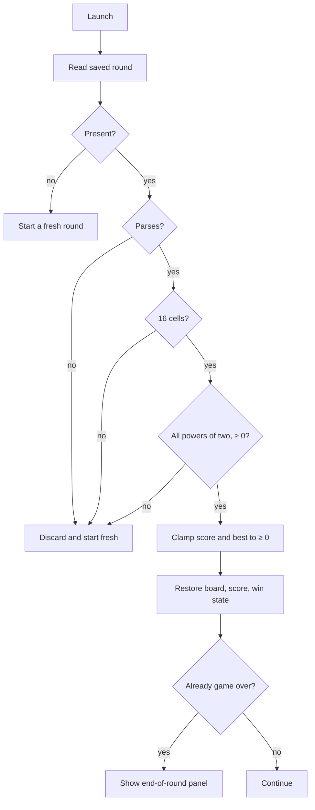

Every rejection path is tested: unparseable JSON, wrong cell count, non-power-of-two values, negative tiles, non-numeric entries, and negative scores. The failure mode is always the same — discard silently and start a fresh round. A corrupt save never crashes, never shows an error, and never produces a board the engine would reject.

Android's CSV format has a subtlety worth knowing: it parses with `mapNotNull(String::toIntOrNull)`, which *drops* unparseable cells rather than failing. A grid of `"2,x,4"` would yield two values, not three. The length check immediately after is what converts that into a clean rejection instead of a short, misaligned board — and there is a test named for exactly that.

### State shape reference

The same conceptual state, expressed three ways. Field-for-field equivalence is what makes the contract checkable.

| Concept | Web (`state` object) | iOS (`GameViewModel`) | Android (`GameViewModel`) |
| --- | --- | --- | --- |
| Board | `board: number[16]` | `@Published var grid: [[Int]]` | `var grid by mutableStateOf` |
| Score | `score: number` | `@Published var score: Int` | `var score by mutableStateOf` |
| Best score | `best: number` | `@Published private(set) var highScore` | `var highScore by mutableStateOf` |
| Win flag | `won: boolean` | `@Published var hasWon: Bool` | `var hasWon by mutableStateOf` |
| Game over | `gameOver: boolean` | derived via `isGameOver()` | derived via `isGameOver()` |
| Undo slot | `history: Snapshot \| null` | `private var previous: Snapshot?` | `private var previous: Snapshot?` |
| Undo availability | `!!state.history` | `@Published private(set) var canUndo` | `var canUndo by mutableStateOf` |
| Touch origin | `touchStart: {x,y} \| null` | gesture-local | gesture-local |

Two deliberate differences:

- **Web keeps `gameOver` in state; the native clients derive it.** On the web the value is also part of the persisted payload's implied contract and is read by `render_game_to_text()`, so caching it avoids recomputing on every state dump. The natives recompute — it is O(16) with a short-circuit.
- **`canUndo` is explicit on the natives, derived on the web.** SwiftUI and Compose both need an observable property to drive a button's `disabled` state; the web reads `!!state.history` directly at render time.

The snapshot stored for undo is the same three fields everywhere: **board, score, win flag**. Not `best` — the best score is monotonic and must survive an undo. Not `gameOver` — it is recomputed from the restored board.

---

## Optional Cloud API

The Cloud API is an **additive** layer. Delete every cloud module and every client still plays a complete local game. The rules engines never import cloud types; a small bridge converts the on-screen round to and from the flat wire format.

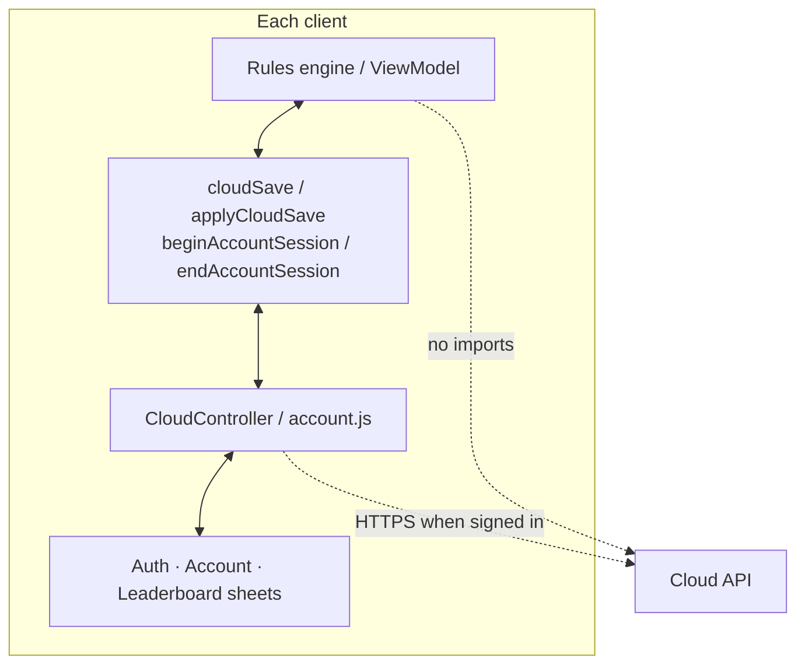

| Layer | Responsibility | Must not |
| --- | --- | --- |
| Rules engine | Local moves, score, undo, win/loss | Know about tokens, HTTP, or usernames |
| Local store | Source of truth for the **active** profile's round | Upload on every keystroke; mix guest and account keys |
| Cloud controller | Auth, sync scheduling, leaderboard fetch, busy/error UI state | Decide which board is "the player's" without asking the game |
| API | Persist rounds, scores, account metadata; reconcile conflicts | Ship game rules, UI, or styling to clients |

Live deployment and OpenAPI: see [docs/backend.md](docs/backend.md). Feature flags (`FEATURE_REGISTRATION`, `FEATURE_CLOUD_SAVES`, `FEATURE_LEADERBOARDS`, …) answer `503` with `feature_disabled` so a surface can be retired without redeploying clients.

### Cloud wire contract

All three clients speak the same JSON shapes. Boards travel as a **flat 16-element row-major array**, even when the native client stores nested rows locally. Conversion happens only at the bridge.

```json
{
  "board": [2, 4, 0, 0, 0, 0, 0, 0, 0, 0, 0, 0, 0, 0, 0, 0],
  "score": 40,
  "bestScore": 1200,
  "won": false,
  "gameOver": false,
  "moves": 12,
  "elapsedSeconds": 90,
  "baseRevision": 3,
  "client": "ios",
  "deviceId": "…"
}
```

`moves` measures how far a round has gone. **Undo must not decrease it** — a number a player can lower by pressing a button is not a progress signal for sync. The server also accepts nested `grid` forms and normalises them (`server/src/services/sync.js`), but clients should send the flat board.

Career statistics from `GET /api/v1/auth/me` are computed on the server from submitted rounds. Clients render them verbatim and **never** lift a local best score or highest tile into them. See [Guest and account profiles](#guest-and-account-profiles).

### Sync resolution

`POST /api/v1/saves/sync` compares the device save with the stored `current` slot. Nothing is silently discarded.

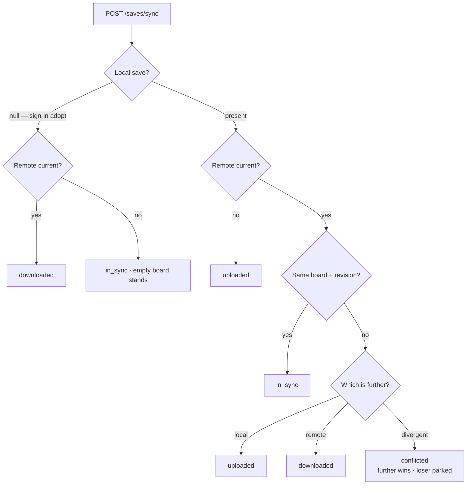

"Further" prefers higher score, then moves, then revision — score first because that is how a player answers "which of these is my real game?" Rule 6 is the load-bearing one: the losing side is preserved in a recoverable `conflict-<timestamp>` slot.

| Resolution | Client action |
| --- | --- |
| `uploaded` | Keep local board; refresh any returned metadata |
| `downloaded` | `applyCloudSave` after validating the payload |
| `in_sync` | No board change |
| `conflicted` | Apply the winning save; surface a note that the other round was parked |

Offline play continues; sync retries on the next signed-in move or explicit "Sync now". In-flight auth, sync, leaderboard, and sign-out show a spinner and disable the control that started them; **the board stays playable**.

### Auth and sessions

```mermaid
sequenceDiagram
    participant UI as Auth sheet
    participant Ctrl as Cloud controller
    participant API as Cloud API
    participant Game as Rules / ViewModel

    UI->>Ctrl: register / login
    Ctrl->>API: credentials
    API-->>Ctrl: access + refresh tokens
    Ctrl->>Game: beginAccountSession(fresh)
    Note over Game: Park guest profile; activate account keys
    Ctrl->>API: sync(null)
    API-->>Ctrl: downloaded or in_sync
    Ctrl->>Game: applyCloudSave if needed
    Note over Game: First upload happens on the first signed-in move
```

- Access tokens are short-lived; refresh tokens are long-lived, **hashed at rest**, rotated on use, and race-safe against concurrent 401 retries.
- `POST /auth/reset-password` is an **interim** recovery path (username + email match). It is feature-flagged, rate-limited, uniform in errors, and revokes every session — including the resetting device, which is why clients fall back to the guest round afterwards. See [Credential entry](#credential-entry) and the security note on the route.
- Authenticating and adopting a round are **separate** steps on every client. `login` / `register` return a session only; the game switches profile, then asks the controller to adopt.

### Cloud client modules

| Client | Modules | Transport seam | Bridge into rules |
| --- | --- | --- | --- |
| Web | `Web-Version/cloud.js`, `account.js` | `fetch` (injectable in tests) | `cloudSave` / `applyCloudSave`, `beginAccountSession` / `endAccountSession` |
| iOS | `Game-2048/Cloud/*` | `CloudAPI` actor over `URLSession`; fake transport in unit tests | `GameViewModel` cloud save / apply + session begin/end |
| Android | `…/cloud/*` | `HttpTransport` / `HttpURLConnection`; fake transport for JVM tests | Same pattern on `GameViewModel` |

Presentation (`CloudViews.swift`, `CloudUi.kt`, web account dialogs) is excluded from numeric coverage gates the same way other SwiftUI/Compose chrome is: cover controllers and API clients with fake transports; cover sheets with UI tests and screenshots.

Removing the cloud layer is a delete of those modules plus header / banner wiring. The board and rules stay.

### Sign-in lifecycle

```mermaid
stateDiagram-v2
    [*] --> Guest: launch, no tokens
    [*] --> Restoring: launch, tokens present
    Restoring --> SignedIn: /auth/me ok
    Restoring --> Guest: tokens rejected
    Guest --> Working: sign in / register
    Working --> SignedIn: session + adopt round
    Working --> Guest: auth failure
    SignedIn --> SignedIn: move → debounced sync
    SignedIn --> SignedIn: sync now / leaderboard
    SignedIn --> Guest: sign out (restore guest profile)
```

| Event | Game | Cloud controller |
| --- | --- | --- |
| Sign in with an active guest round | Warn; on confirm, park guest keys untouched | Authenticate, then `sync(null)` |
| First signed-in move | Persist to account keys | Debounced upload |
| Sign out | `endAccountSession` — restore guest board and best exactly | Revoke refresh where possible; clear tokens |
| Password reset success | Same as sign out (sessions revoked server-side) | Drop to guest; show sign-in again |

### Server topology

```mermaid
flowchart LR
    Client --> Vercel[Vercel serverless<br/>api/index.js]
    Vercel --> App[Express app]
    App --> AuthR[auth.routes]
    App --> SavesR[saves.routes]
    App --> ScoresR[scores.routes]
    App --> LB[leaderboard.routes]
    App --> Meta[meta · health · OpenAPI UI]
    SavesR --> Sync[services/sync]
    Sync --> Atlas[(MongoDB Atlas<br/>game2048)]
    AuthR --> Atlas
```

Stack summary: Express 5, Mongoose 8, JWT access/refresh, Zod validation, Helmet/CORS, in-memory rate limits, OpenAPI 3.1 generated in code. Rate limits are per-instance — enough to stop a runaway client loop, not a distributed DDoS shield.

| Area | Routes (under `/api/v1`) | Notes |
| --- | --- | --- |
| Auth | register, login, refresh, logout, me, reset-password | Reset is interim + feature-flagged |
| Saves | sync, list slots, … | Conflict parking lives here |
| Scores | submit / list | Feeds career stats and leaderboards |
| Leaderboard | period queries | Public; no auth required to read |
| Meta | health, OpenAPI UI | `/docs`, `/redoc`, `/reference`, `/openapi.json` |
| Flagged | social, challenges, events, achievements, … | `503 feature_disabled` when off |

Feature flags: `FEATURE_REGISTRATION`, `FEATURE_LEADERBOARDS`, `FEATURE_CLOUD_SAVES`, `FEATURE_SOCIAL`, `FEATURE_DAILY_CHALLENGE`, `FEATURE_EVENTS`, `FEATURE_PASSWORD_RESET`. Full env and deploy notes: [docs/backend.md](docs/backend.md).

### Applying a downloaded save

```mermaid
sequenceDiagram
    participant API as Cloud API
    participant Ctrl as Cloud controller
    participant Bridge as applyCloudSave
    participant Rules as ViewModel / engine
    participant Store as Active profile keys

    API-->>Ctrl: save payload
    Ctrl->>Bridge: applyCloudSave(payload)
    Bridge->>Bridge: validate 16 cells · powers of two · scores ≥ 0
    alt invalid
        Bridge-->>Ctrl: reject · keep local board
    else valid
        Bridge->>Rules: replace board, score, won, undo snapshot if present
        Rules->>Store: persist active profile
    end
```

A corrupt or hostile cloud payload must fail the same way a corrupt local save does: discard and keep playing. Never partially apply a board.

---

## Input pipeline

Every client accepts more than one input method, and all of them funnel into the same `move(direction)` call.

```mermaid
flowchart TB
    subgraph WebIn[Web]
        WK[keydown] --> WMap[keyMap lookup]
        WT[touchstart → touchend] --> WThr[28 px threshold]
        WB["buttons[data-direction]"] --> WD[dataset.direction]
        WMap --> WMove[move direction]
        WThr --> WMove
        WD --> WMove
    end

    subgraph IOSIn[iOS]
        IG["DragGesture minimumDistance 22"] --> IMove[swipe direction]
        IBtn[on-screen controls] --> IMove
    end

    subgraph DroidIn[Android]
        DG["detectDragGestures + 36 px threshold"] --> DMove[swipe direction]
        DBtn[on-screen controls] --> DMove
    end
```

### Key mapping (web)

| Keys | Direction |
| --- | --- |
| `ArrowUp` `w` `W` | up |
| `ArrowDown` `s` `S` | down |
| `ArrowLeft` `a` `A` | left |
| `ArrowRight` `d` `D` | right |
| `f` `F` | toggle fullscreen |

Both cases of each WASD letter are mapped explicitly rather than lowercasing the key, because `event.key` reports the shifted character and a player with Caps Lock on is still a player. `preventDefault()` fires only for a mapped movement key, so browser shortcuts and text input elsewhere are untouched. **Keys are ignored entirely while the new-game dialog is open** — the dialog owns the keyboard.

### Swipe resolution

All three clients resolve a swipe the same way: take the larger absolute component, then its sign.

```mermaid
flowchart TD
    End[Gesture ends] --> Start{Origin recorded?}
    Start -->|no| Ignore[Ignore]
    Start -->|yes| Delta["dx, dy from origin"]
    Delta --> Thresh{"max abs dx, abs dy ≥ threshold?"}
    Thresh -->|no| Ignore
    Thresh -->|yes| Axis{"abs dx &gt; abs dy?"}
    Axis -->|yes| Horiz{"dx &gt; 0?"}
    Axis -->|no| Vert{"dy &gt; 0?"}
    Horiz -->|yes| R[right]
    Horiz -->|no| L[left]
    Vert -->|yes| D[down]
    Vert -->|no| U[up]
```

The thresholds differ per platform, and that is correct rather than an inconsistency — the units are not the same thing:

| Client | Threshold | Unit |
| --- | --- | --- |
| Web | 28 | CSS pixels |
| iOS | 22 | points (`DragGesture.minimumDistance`) |
| Android | 36 | pixels, from Compose pointer input |

Each is tuned so a deliberate flick registers and an imprecise tap does not. A diagonal swipe resolves to its dominant axis rather than being rejected — asserted by a test, because rejecting diagonals makes the board feel unresponsive to anyone who does not swipe perfectly straight.

---

## Rendering pipelines

Three genuinely different rendering models, held to the same visual result.

```mermaid
flowchart TB
    subgraph W["Web — imperative, incremental"]
        W1[state changes] --> W2["render(animate)"]
        W2 --> W3{16 cells exist?}
        W3 -->|no| W4[build rows + cells once]
        W3 -->|yes| W5[reuse]
        W4 --> W5
        W5 --> W6["per cell: textContent · dataset.value<br/>aria-label · toggle 'pop'"]
        W6 --> W7[score · best · undo disabled]
    end

    subgraph I["iOS — declarative, diffed"]
        I1["@Published mutation"] --> I2[SwiftUI invalidates]
        I2 --> I3[body re-evaluated]
        I3 --> I4[framework diffs the tree]
    end

    subgraph A["Android — declarative, recomposed"]
        A1["mutableStateOf write"] --> A2[snapshot system notifies readers]
        A2 --> A3[only readers recompose]
    end
```

| | Web | iOS | Android |
| --- | --- | --- | --- |
| Model | Imperative DOM mutation | Declarative, framework-diffed | Declarative, snapshot-driven |
| Granularity | Explicit — the code names the 16 cells | Whole `body`, diffed by SwiftUI | Only composables that read the changed state |
| Animation trigger | `pop` class toggled per changed tile | `contentTransition` / implicit animations | `animateColorAsState` + spring scale |
| Cost of a mistake | Rebuilding cells destroys focus and animation | Over-broad `body` re-evaluates more than needed | Reading state too high recomposes too much |

The web's `pop` class is toggled with `Boolean(animate && value && value !== previous)` — it fires only for a cell whose value actually changed on an animated render. A redraw (`advanceTime()`) passes `animate: false`, so nothing re-animates. Both halves of that are tested.

### Design tokens, shared by hand

There is no shared stylesheet, yet the three clients render the same colours. The palette is duplicated deliberately and kept in step by review — and the values are **byte-identical**, not merely similar:

| Token | Web CSS | iOS `Color(red:green:blue:)` | Android `Color(…)` |
| --- | --- | --- | --- |
| Paper | `#f5f0e6` | `0.961, 0.941, 0.902` | `0xFFF5F0E6` |
| Ink | `#24231f` | `0.141, 0.137, 0.122` | `0xFF24231F` |
| Accent | `#e96345` | `0.914, 0.388, 0.271` | `0xFFE96345` |
| Muted | `#6f6a61` | `0.435, 0.416, 0.380` | `0xFF6F6A61` |
| Board | `#a99d8e` | `0.663, 0.616, 0.557` | `0xFFA99D8E` |
| Empty cell | `#bdb2a4` | `0.741, 0.698, 0.643` | `0xFFBDB2A4` |
| Tile ink | `#514b43` | `0.318, 0.294, 0.263` | `0xFF514B43` |

The tile ramp is likewise identical across all three:

| Tile | Colour | | Tile | Colour |
| --- | --- | --- | --- | --- |
| 2 | `#f1e8d9` | | 128 | `#d8ad5b` |
| 4 | `#eadbc1` | | 256 | `#c99a40` |
| 8 | `#efaa73` | | 512 | `#b27a32` |
| 16 | `#e98a5f` | | 1024 | `#735b49` |
| 32 | `#e56b51` | | 2048 | `#24231f` |
| 64 | `#d94c3f` | | 8192+ | `#171714` |

Text flips to white at 8 and above, on every client. The ramp is warm-neutral through 4, heats through the oranges and reds to 64, shifts to gold for the 128–512 band, then goes dark for 1024 and above — so a player reads their progress by temperature, not by reading the number.

**Changing a colour is a three-file edit.** This is the most common parity drift in the repository and the cheapest to catch: the values above are the reference.

### Credential entry

Four rules, identical on all three clients:

| Rule | Why |
| --- | --- |
| A control labeled **Sign in** opens sign-in; an explicit **Create account** action opens registration. | The destination must match the action the player chose. Registration remains one switch away for a new player. |
| Sign-up asks for the password twice; sign-in does not. | A typo at sign-up locks a player out of an account they cannot prove they own. A typo at sign-in is reported by the server on the next keystroke. |
| Every password field has its own reveal control. | A password nobody can read is a password they mistype, and retyping it into a confirmation field they also cannot read does not help. Per-field, so revealing one does not expose the form to whoever is behind them. |
| Closing a form hides every password again. | The next person to open it starts from dots. |

The mismatch is caught on the client before anything is sent: a confirmation
field is a UI affordance, and the server is never told what was typed into it.

Recovery is `POST /auth/reset-password`, and it is **deliberately weak**: a
matching username and email are the whole proof, because there is no mail
infrastructure to build a real token flow on yet. Anyone who knows both can
take the account over. It is gated behind `FEATURE_PASSWORD_RESET`, rate
limited, uniform in its errors so it cannot be used to discover who has an
account, and total — every session on the account is revoked, including the
one on the device doing the resetting, which is why each client drops back to
its guest round afterwards. The security note lives on the endpoint itself in
`server/src/routes/auth.routes.js`; read it before relying on this.

### Sound architecture

Every cue is synthesised at runtime — a few oscillators on web, generated PCM
on both native clients — so there are no audio assets to ship, localise, or
keep in sync across three repositories' worth of build systems. Mute is one
boolean in the platform's own preference store, and it is honoured before any
device is opened.

The design constraint that matters is **promptness under load**. A player
holding an arrow key generates cues far faster than a cue lasts, and the
obvious implementation of each platform's audio API turns that into a queue:

| Client | The trap | What it does instead |
| --- | --- | --- |
| Web | An `AudioContext` built before a user gesture is suspended, and a suspended context's `currentTime` is frozen at zero. Every cue scheduled against it lands on the same instant and they all fire together when it unfreezes. | No context exists until `unlock()` runs inside a real gesture, so it is born running. A cue scheduled while the clock is not running is **dropped**, never queued. |
| iOS | `AVAudioPlayerNode` is a queue: buffers scheduled on one node play strictly one after another. | A ring of eight player nodes, each cue interrupting the node it lands on, so cues overlap instead of lining up. |
| Android | Allocating an `AudioTrack` per cue costs tens of milliseconds and a thread each time, so the backlog grows faster than it drains. | One streaming track and a mixer thread that sums the sounding voices; the blocking `write` is what paces it. |

All three cap the number of simultaneous voices and **drop** the excess. That
is the whole rule: a cue the player cannot hear now is worth less than nothing
if the price is hearing it later, on top of twenty others.

### Motion architecture

| Element | Web | iOS | Android |
| --- | --- | --- | --- |
| Tile value change | `transition: background-color .18s ease, transform .18s ease` | implicit SwiftUI animation | `animateColorAsState` |
| New / merged tile | `@keyframes pop` — `scale(.82)` → `scale(1)` | scale transition | spring, 82% → 100% |
| Score change | — | `.contentTransition(.numericText())` | `AnimatedContent` |
| Overlay | `fade-in .25s ease` | transition | `tween(250)` |

The `.82 → 1` pop is the same figure on all three clients, and the 250 ms overlay fade matches between web and Android. These numbers were aligned on purpose: a tile that pops differently on Android than on the web is a parity bug even though no rule changed.

**Reduced motion is honoured everywhere.** The web collapses every animation and transition to `.01ms` under `prefers-reduced-motion: reduce`; Android swaps its `tween` for `snap()` when animations are disabled. Compose instrumentation tests additionally require animations disabled on the device — enabled animations are the most common cause of intermittent instrumentation failures, and they fail in ways that look like real defects.

---

## Web client

```mermaid
flowchart TB
    subgraph Page[index.html]
        Grid[#gridContainer]
        HUD[score · best · undo · new game]
        Msg[#gameMessage overlay]
        Status[#statusLine aria-live]
    end

    subgraph JS[Web-Version/]
        Engine[game-engine.js<br/>pure rules]
        Ctrl[script.js<br/>IIFE controller]
    end

    LS[(localStorage)]

    Ctrl --> Engine
    Ctrl --> Grid
    Ctrl --> HUD
    Ctrl --> Msg
    Ctrl --> Status
    Ctrl <--> LS

    Keys[keydown] --> Ctrl
    Touch[touchstart/move/end/cancel] --> Grid
    Buttons[data-direction buttons] --> Ctrl
    Grid --> Ctrl
```

Static files, no bundler, no transpiler, no runtime dependency. `script.js` is an IIFE that reads the document **once** on load and then talks to the page only through the elements it captured.

That property is not incidental — it is what makes the controller unit-testable. `tests/web/helpers/fake-dom.js` provides a hand-written stand-in for the document, so keyboard handling, touch handling, rendering, message states, and persistence are all covered by `node --test` with no browser at all.

```mermaid
flowchart LR
    Test[game-controller.test.js] --> Harness[fake-dom.js]
    Harness --> Elements[Fake elements<br/>capture listeners]
    Harness --> Storage[Fake localStorage]
    Harness --> Require["fresh require of script.js"]
    Require --> Controller[Controller instance]
    Test -->|key, swipe, click| Harness
    Harness -->|state via render_game_to_text| Test
```

**Keep the controller that way.** A controller that reaches back into `document` mid-flight is one that can only be tested in a real browser.

Rendering is incremental: the 16 cells are built once and then updated in place. A `pop` class is toggled only on tiles whose value actually changed this move, so a re-render does not re-animate a static board.

### Optional cloud on web

`cloud.js` owns HTTP, token storage, and sync. `account.js` owns the dialogs, guest invite banner, busy states, and the bridge calls into the game controller. Point a local app at a local API with `GAME2048_API_BASE_URL` when running `make serve`.

The account UI follows the same paper/ink/accent tokens as the board. Credential rules are shared — see [Credential entry](#credential-entry). Sync is debounced after signed-in moves so a fast arrow-key run does not open one HTTP request per swipe.

The controller exposes two hooks for testing and automation:

| Hook | Purpose |
| --- | --- |
| `window.render_game_to_text()` | A JSON dump of board, score, best, undo availability, mode, and available moves |
| `window.advanceTime()` | Forces a re-render without animation |

The Playwright suite drives real input events and reads state back through the first hook. Keep it accurate when the state shape changes, or the browser suite silently loses its assertions.

---

## PWA and discovery surface

The web client is an installable progressive web app and is the only client with a public surface to be discovered, so it carries metadata the other two do not need.

```mermaid
flowchart TB
    subgraph Install[Installability]
        Man[manifest.json]
        Man --> Ident["id · start_url · scope"]
        Man --> Disp["display: standalone<br/>display_override"]
        Man --> Theme["theme_color · background_color<br/>#f5f0e6"]
        Man --> Icons[icons]
        Man --> Cuts["shortcuts:<br/>new round · how to play"]
        Man --> Shots[screenshots]
    end

    subgraph Discover[Discoverability]
        Sitemap[sitemap.xml]
        Robots["robots.txt → sitemap directive"]
        LLMs[llms.txt]
        LD["JSON-LD (schema.org)"]
        Canon[canonical URLs]
        NF[404.html]
    end

    Validate[scripts/validate-repository.mjs] --> Man
    Validate --> Sitemap
    Validate --> Robots
    Validate --> LLMs
    Validate --> LD
    Validate --> Canon
```

Every one of those is validated by `make check`, so a broken manifest or a stale sitemap fails before it is committed rather than after it is deployed.

| Artefact | Purpose | Validated for |
| --- | --- | --- |
| `manifest.json` | Installability, icons, shortcuts, theme | Well-formed JSON; every referenced icon exists; screenshot dimensions match the actual PNG |
| `sitemap.xml` | Search indexing | Entries present and canonical |
| `robots.txt` | Crawler directives | Contains a `sitemap:` directive |
| `llms.txt` | Machine-readable project summary for LLM agents | Present and reachable |
| JSON-LD in `index.html` | schema.org structured data | Present |
| `404.html` | GitHub Pages fallback | Present |

The screenshot check is stricter than it looks and exists because of a real drift: the manifest declared `1440x1526` while the PNG on disk was `1440x1566`. The test now reads the actual dimensions out of the **PNG header** rather than trusting either the manifest or a hard-coded constant:

```javascript
const header = fs.readFileSync(file).subarray(16, 24);
const declared = `${header.readUInt32BE(0)}x${header.readUInt32BE(4)}`;
assert.equal(screenshot.sizes, declared, /* … */);
```

That is the general shape of every check in `validate-repository.mjs`: **compare the declaration against the artefact**, never against a second declaration that can drift alongside it.

There is no service worker. The app is static, small, and cached normally by the browser; offline play works from cache without one, and adding one would introduce an update-lifecycle problem the app does not otherwise have.

---

## iOS client

```mermaid
flowchart TB
    App[Game_2048App.swift] --> View[GameView.swift]
    View --> VM[GameViewModel<br/>ObservableObject]
    VM --> UD[(UserDefaults)]

    View -.@Published.-> Grid[grid]
    View -.@Published.-> Score[score]
    View -.@Published.-> Best[highScore]
    View -.@Published.-> Won[hasWon]
    View -.@Published.-> Undo[canUndo]
```

`GameViewModel` is an `ObservableObject` holding both the rules and the state. It takes three injected dependencies, all defaulted:

```swift
init(
    loadSavedGame: Bool = true,
    defaults: UserDefaults = .standard,
    randomIndex: @escaping (Int) -> Int = { Int.random(in: 0..<$0) },
    randomUnit: @escaping () -> Double = { Double.random(in: 0..<1) }
)
```

**`loadSavedGame` is also the write switch.** A view model built with `false` is a throwaway (a SwiftUI preview, or a test that wants a clean board) and deliberately never persists. This surprised a test during development — a "persistence" test built that way saved nothing and proved nothing — so it is called out here and in the test file.

### Layout

`GameView` wraps its content in `ViewThatFits(in: .vertical)`. This is not cosmetic. An earlier version placed the board inside a `ScrollView`, and a `ScrollView`'s pan gesture always wins against a SwiftUI `DragGesture` — so **every vertical swipe scrolled the page instead of moving the board**.

```mermaid
flowchart TD
    Content[Board + HUD content] --> Fits{Fits vertically?}
    Fits -->|yes| Direct[Render directly — board owns the gesture]
    Fits -->|no| Scroll[Fall back to a scrolling layout]
```

Three changes were tried before the real cause was found, and the sequence is instructive:

| Attempt | Why it was not sufficient |
| --- | --- |
| `.highPriorityGesture` | Cannot beat a UIKit `UIPanGestureRecognizer` — priority is resolved inside UIKit, not SwiftUI. Still in place, and correct; it just was not the problem |
| `.scrollBounceBehavior(.basedOnSize)` | The content genuinely overflowed, so bouncing was not the problem either |
| `ViewThatFits` alone | Still selected the scrolling branch, because the content measured 887 pt in an 874 pt viewport |

The actual fix was trimming spacing so the content fits, which makes `ViewThatFits` select the non-scrolling branch and leaves the board owning its gesture. The board still declares `.highPriorityGesture(DragGesture(minimumDistance: 22))`.

**The lesson worth recording: three attempts producing byte-identical failures means the change is not reaching the behaviour at all.** That is a signal to stop and re-measure, not to try a fourth fix.

### Optional cloud on iOS

Cloud code lives under `Game-2048/Cloud/`. New Swift files must be added to the Xcode target — the project has no synchronised groups.

| Type | Role |
| --- | --- |
| `CloudAPI` | Actor wrapping `URLSession`; token refresh; fakeable for unit tests |
| `CloudStore` / `UserDefaultsCloudStore` | Tokens, prompt-dismissed flag |
| `CloudController` | `@MainActor` UI state: phase, activity, user, leaderboard, errors |
| `CloudViews` | Paper-chrome auth, account, leaderboard, and reset sheets |
| `CloudModels` | Wire DTOs shared with the controller |

`CloudController.restore()` re-establishes a stored session on launch but does **not** reconcile the board — the game decides which profile is active first, then asks for adopt. Auth sheets are scrollable paper forms (not Settings `Form` / `List`) so they match the game palette; fields stay leading-aligned, title and subtitle centred.

**Cloud UI must not push the board into a `ScrollView`.** The same gesture-ownership rule applies after the account banner and header controls are present.

---

## Android client

```mermaid
flowchart TB
    Activity[MainActivity<br/>ComponentActivity] --> Compose[setContent]
    Compose --> Screen[Game screen composable]
    Screen --> VM[GameViewModel]
    VM --> Storage[GameStorage interface]
    Storage --> Prefs[SharedPreferencesGameStorage]
    Prefs --> SP[(SharedPreferences)]

    Screen -.mutableStateOf.-> Grid[grid]
    Screen -.mutableStateOf.-> Score[score]
    Screen -.mutableStateOf.-> Won[hasWon]
    Screen -.mutableStateOf.-> Undo[canUndo]
```

State is Compose `mutableStateOf`, so a write recomposes exactly the readers.

Storage is behind an interface — this is the one place any client abstracts its persistence, and it exists for testability:

```mermaid
classDiagram
    class GameStorage {
        <<interface>>
        +load() SavedGame?
        +loadBest() Int
        +save(game: SavedGame)
    }
    class SavedGame {
        grid: List~List~Int~~
        score: Int
        best: Int
        hasWon: Boolean
    }
    class SharedPreferencesGameStorage {
        -preferences: SharedPreferences
    }
    class MemoryStorage {
        <<test double>>
    }
    GameStorage <|.. SharedPreferencesGameStorage
    GameStorage <|.. MemoryStorage
    GameStorage ..> SavedGame
```

`GameViewModel` takes a nullable `GameStorage`, so the rules suite runs entirely in memory while a separate suite exercises the real `SharedPreferences` serialisation against a hand-written in-memory fake — no Robolectric, no mocking framework, no Android runtime.

### Optional cloud on Android

Cloud code lives under `…/cloud/`. Pattern mirrors iOS:

| Type | Role |
| --- | --- |
| `CloudApi` + `HttpTransport` | HTTP; fake transport for JVM unit tests |
| `CloudStorage` | Tokens and preferences |
| `CloudController` | Auth/sync/leaderboard orchestration and UI state |
| `CloudUi` | Compose auth, account, and leaderboard surfaces |
| `CloudModels` | Wire DTOs |

Grid updates remain **immutable** even when applying a downloaded cloud save — produce a new board rather than mutating in place. In-place mutation previously broke Compose recomposition and reverse-direction merges simultaneously.

The board's `detectDragGestures` still **must consume each `PointerInputChange`** after cloud chrome is added; an unconsumed change is delivered to the parent scroll and a board swipe drags the whole screen.

---

## Gesture ownership

**A board swipe belongs to the board.** It must never scroll, bounce, or pan the surrounding screen, and every direction must register. Each client enforces this differently because each platform fights back differently.

```mermaid
flowchart TB
    subgraph W[Web]
        W1["board: touch-action: none"] --> W2["non-passive touchmove guard"]
        W2 --> W3["html/body: overscroll-behavior: none"]
        W3 --> W4[touchcancel clears the origin]
    end

    subgraph I[iOS]
        I1["ViewThatFits keeps the board<br/>out of any scrolling container"] --> I2["DragGesture, 22 pt minimum"]
    end

    subgraph A[Android]
        A1[detectDragGestures] --> A2["change.consume() on every pointer change"]
        A2 --> A3[Parent scroll never sees the gesture]
    end
```

Details that each exist because of a real bug:

- **Web — the `touchmove` listener must be non-passive.** A passive listener cannot call `preventDefault`, so registering it passively silently disables the entire guard. There is a test asserting the listener is registered non-passively, because this failure is invisible at review time.
- **Web — `touchcancel` must clear the start point.** A system swipe or an incoming call cancels the gesture; without clearing, the next swipe is measured from a stale origin and moves the wrong way.
- **Web — the guard is scoped to the board.** Page scrolling everywhere else must keep working, and a test asserts `touchmove` outside a board swipe is left alone.
- **Android — consume every pointer change.** Without `change.consume()`, the parent scroll container also processes the drag and the screen moves with the board.
- **iOS — a 22 pt minimum distance** keeps a tap from registering as a micro-swipe.

All three are covered by tests. See [`docs/testing.md`](docs/testing.md#gesture-ownership).

---

## Test strategy

```mermaid
flowchart TB
    UI["Browser / simulator / emulator<br/>real input, real rendering"]
    Unit["Deterministic unit suites<br/>rules, controller, storage, cloud, sound, SDUI"]

    UI --> Unit

    Unit --> W["Web: engine + controller + cloud + assets"]
    Unit --> I["iOS: model + persistence + cloud + surfaces"]
    Unit --> A["Android: ViewModel + storage + cloud + surfaces"]
    Unit --> S["Cloud API: unit + optional Mongo integration"]

    UI --> WB["Web: Chromium flows"]
    UI --> IU["iOS: XCUITest flows"]
    UI --> AU["Android: Compose instrumentation"]
```

The split is deliberate: **rules go in the deterministic suite on all three platforms, because parity is the point.** User-flow behaviour goes in the platform UI suite, asserting a user-visible outcome rather than re-deriving the rules. Cloud controllers are unit-tested with fake transports; the live API is covered under `server/`, not by device tests.

| Platform | Deterministic | UI / integration | Runner | Notes |
| --- | --- | --- | --- | --- |
| Web | Engine, controller, cloud, sound, metadata, assets (+ tooling) | Chromium scenarios (board + cloud UI) | `node --test`, Playwright | c8 gate on all of `Web-Version/` |
| iOS | Model, persistence, cloud, profiles, surfaces | XCUITest (appearance modes multiply launch) | XCTest | Domain coverage gate; `ScreenshotTests` never merge-gates |
| Android | ViewModel, storage, sound, surfaces, cloud | Compose instrumentation | JUnit 4, Compose UI Test | JaCoCo on engine/storage |
| Cloud API | Route/service unit tests | Integration against real Mongo when `MONGODB_TEST_URI` set | Node, supertest | See [docs/backend.md](docs/backend.md) |

Exact counts drift; [`docs/testing.md`](docs/testing.md) is authoritative for the inventory table. What must not drift is **coverage of the contract clauses** in [Three clients, one contract](#three-clients-one-contract).

Each platform additionally covers the layer above its rules engine:

- **Web** — controller against `fake-dom.js` (keyboard, touch, buttons, render, persistence) without a browser.
- **iOS / Android** — persistence round-trips, spawn clamping, corrupt payloads; SDUI decode/gating/pruning/fallback; byte-identical `help.json`.
- **All three** — cloud fake-transport auth/refresh/sync; guest vs account profile parking and restore; career stats never lifted from local storage; sound drop-not-queue.
- **Server** — sync resolutions, auth refresh races, feature-flag `503`s, board normalisation.

### Determinism seams

Every place a test can pin behaviour that would otherwise be random, timing-dependent, or environmental. **This table is the test strategy.** Without these seams, the suites could only assert that nothing threw.

| Non-determinism | Seam | Injected by |
| --- | --- | --- |
| Tile spawn location | `randomIndex` / first roll of `random()` | Web: `addRandomTile(board, random)`. iOS/Android: constructor closure |
| Tile spawn value (2 vs 4) | `randomUnit` / second roll | Same |
| Persisted state | Storage abstraction | Web: fake `localStorage`. iOS: `UserDefaults(suiteName:)`. Android: `GameStorage` interface |
| Whether persistence happens at all | iOS `loadSavedGame` flag | Constructor |
| The DOM | `tests/web/helpers/fake-dom.js` | Test harness |
| Cloud HTTP | Fake / stub transport | Web injectable `fetch`; iOS/Android test doubles on `CloudAPI` / `HttpTransport` |
| Cloud API clock / Mongo | Test DB + controlled fixtures | `MONGODB_TEST_URI`, server test helpers |
| Simulator / emulator choice | `IOS_SIMULATOR_ID`, `scripts/common.sh` resolution | Environment |
| Coverage floor | `IOS_MINIMUM_COVERAGE` | Environment |
| Compose animation flakiness | System animation scale 0 in instrumentation | CI / local device setup |

The rule that follows from the first two rows: **a valid move always spawns a tile.** Asserting a whole row after a move couples the assertion to where the injected generator put that tile. Assert the cells the merge produced, plus the score. Three tests broke on exactly this during development, which is why it is written down here, in [`docs/testing.md`](docs/testing.md), and in `.github/CONTRIBUTING.md`.

### The fake DOM harness

`tests/web/helpers/fake-dom.js` is the piece that makes 100 % web coverage achievable without a browser in the loop. It is worth understanding before writing a controller test.

```mermaid
flowchart TB
    Call["loadController({ storage, random })"] --> Build[Build fake elements by id]
    Build --> Hidden["gameMessage + messageSecondary start hidden<br/>(they carry 'hidden' in index.html)"]
    Hidden --> Install["run(): install window, document,<br/>localStorage, Math.random"]
    Install --> Fresh["delete require.cache → fresh require"]
    Fresh --> IIFE[script.js IIFE executes]
    IIFE --> Capture[Controller captures elements + registers listeners]
    Capture --> Wrap["Wrap every element.dispatch in run()"]
    Wrap --> Handle[Return handle]

    Handle --> API["key() · swipe() · dispatch()<br/>state() · board() · saved()"]
```

Four design points, each of which was a bug first:

1. **Globals are installed around *every* interaction, not just the load.** The controller keeps talking to `localStorage` and `document` long after it initialises. Restoring them afterwards is what keeps two loaded controllers independent within one test file.
2. **`require.cache` is cleared per load.** The controller is an IIFE; a fresh `require` is the only way to re-run it. Without this, every test would share one controller.
3. **`gameMessage` and `messageSecondary` start hidden**, because they carry the `hidden` attribute in `index.html`. Defaulting them visible made the very first render look like a finished game.
4. **Listener options are recorded**, so a test can assert that `touchmove` was registered *non-passively*. That is not observable any other way, and registering it passively silently disables the entire scroll guard.

The harness is not a general-purpose DOM. It implements what the controller actually calls and nothing more — `querySelectorAll` handles class selectors only, `getElementById` returns from a fixed map. **Keep it that way.** If the controller starts needing something the harness cannot express, that is usually a signal the controller is reaching too far into the page.

### Coverage gates

Every platform enforces a floor, and all three sit far above it.

| Platform | Gate | Enforced by |
| --- | --- | --- |
| Web | 100 % statements / lines / functions, 95 % branches, across all of `Web-Version/` | `c8`, in `npm run test:unit` |
| iOS | 90 % lines of stable app/domain code | `xccov` in `scripts/test-ios.sh` and in CI |
| Android | 90 % lines, 85 % branches of the Kotlin engine and storage | JaCoCo `jacocoCoverageVerification` |

SwiftUI presentation files (`GameView.swift` and `CloudViews.swift`) and Android Compose presentation files (`MainActivity` and `CloudUi`) sit outside their numeric gates on purpose. Their behavior is exercised by simulator and emulator suites, while compiler-generated line counts for declarative UI vary between toolchain versions. Stable domain and controller code remains subject to the hard coverage floors above.

**Lowering a threshold is never the fix for a failing gate.**

### Screenshot and visual parity

Canonical images under `images/` are part of the documentation contract. Regenerate with `make screenshots-web` and `make screenshots-mobile` (promote), or the `*-qa` variants for local-only output. Cloud UI states (`web-cloud-*`, `ios-cloud-*`, `android-cloud-*`) must be refreshed when auth/account/leaderboard chrome changes. UI changes require screenshots of affected states **and** manual visual inspection — automation captures pixels; humans catch "looks wrong".

### Failure modes and how each is caught

The classes of defect this architecture is actually exposed to, and what stands between each one and a user.

| Failure mode | Symptom | Caught by |
| --- | --- | --- |
| Parity drift — a rule changes on one client only | The game behaves differently on Android | Three deterministic suites asserting the same contract; a required CI job per platform |
| Merged tile merges again | `[2,2,4]` → `[8]` | A dedicated test on each platform, named for the rule |
| Merge order flips for a direction | `[2,2,2,0]` right gives `4 2` instead of `2 4` | Direction-specific ordering tests on each platform |
| Ineffective move spawns or scores | The board gains a tile from a blocked swipe | `swipe()` return value asserted `false`, plus board equality |
| Undo consumed by a blocked move | Player loses their undo without moving | `canUndo` asserted false after an ineffective swipe |
| Score leaks on a rejected move | Score creeps up from blocked swipes | Explicit test — `mergeLine` accumulates before the move is validated, so the rollback is load-bearing |
| Corrupt save crashes the app | White screen on launch | Six rejection-path tests per client: unparseable, wrong length, non-power-of-two, negative, non-numeric, negative score |
| Board swipe scrolls the page | Vertical swipes do nothing but move the screen | Gesture-ownership tests on all three; on web, an assertion that `touchmove` is non-passive |
| Stale touch origin after a cancelled gesture | Next swipe moves the wrong way | `touchcancel` test |
| DOM rebuilt per move | Focus lost, animations re-fire | Test asserting the same cell objects survive a move |
| Unlabelled cells | Board unusable with a screen reader | Test asserting every cell has `role` and an `aria-label` |
| Manifest drifts from its assets | Install prompt broken or wrong screenshot | `validate-repository.mjs` reads the PNG header |
| iOS test file not in the target | Test silently never runs | Documented; the count in `docs/testing.md` is the check |
| Toolchain assumption (`adb` on `PATH`, right `java`) | Works on the author's machine only | Every entry point routes through `scripts/`; the dev container proves a clean environment |
| Guest round uploaded on sign-in | Another person's device round becomes "yours" | Profile-separation tests; `sync(null)` on adopt |
| Career stats lifted from local best | New account shows a best it never earned | Explicit assertions that `/me` stats are rendered verbatim |
| Last-writer-wins sync | An hour of play vanishes when a second phone syncs | Server sync unit tests for `conflicted` + parked slot |
| Undo decreases `moves` | Sync thinks the round went backwards | Client + server invariants on monotonic moves |
| Cloud download applied without validation | Impossible board on screen | Same board predicates as local restore before `applyCloudSave` |
| Cue backlog under rapid input | Sounds arrive seconds late in a burst | Drop-not-queue tests / architecture on all three |
| SDUI schema too new / empty | Blank help sheet | Fallback-required tests on both natives |
| Version field drift | Store listing disagrees with `package.json` | `make version` in check + CI + pre-tag |
| Confirm-password field under keyboard in UITest | CI: "no keyboard focus" | Reveal-driven type helper; dismiss prior keyboard |

The entries with no fully automated check — iOS target membership for brand-new files, and parity drift in *newly invented* behaviour not yet mirrored — need human attention in review. Everything else fails a build or a required check.

---

## Build topology

Three build systems, no coordination between them. Each can be broken without blocking the other two.

```mermaid
flowchart TB
    subgraph WebB[Web — no build]
        WSrc["index.html · Web-Version/*"] --> WServe[Served as-is]
        WSrc --> WTest["node --test + c8"]
    end

    subgraph IOSB[iOS — Xcode]
        Proj["2048 Game.xcodeproj"] --> T1[Game-2048]
        Proj --> T2[Game-2048Tests]
        Proj --> T3[Game-2048UITests]
        T1 --> Sim[Simulator build, unsigned]
    end

    subgraph DroidB[Android — Gradle]
        Settings[settings.gradle.kts] --> Foojay["foojay-resolver-convention 0.9.0"]
        Daemon[gradle-daemon-jvm.properties] --> JDK["Adoptium JDK 17, auto-provisioned"]
        Foojay --> JDK
        JDK --> AGP["AGP · compileSdk 34 · minSdk 24"]
        AGP --> APK[Debug APK]
        AGP --> Jacoco[JaCoCo report + gate]
    end
```

| | Web | iOS | Android |
| --- | --- | --- | --- |
| Build system | none | Xcode / `xcodebuild` | Gradle 8.13, Kotlin DSL |
| Targets | — | app, unit tests, UI tests | app module |
| Platform floor | modern evergreen browsers | iOS 17.4 | minSdk 24, compileSdk / targetSdk 34 |
| Language level | ES2020, no transpile | Swift 6 | Kotlin, `jvmTarget` 1.8 |
| Signing | — | none, `CODE_SIGNING_ALLOWED=NO` | none, debug only |
| Toolchain needed | Node 22 | Xcode on macOS | Android SDK only — **no preinstalled JDK** |

Two things worth knowing before touching a build file:

- **The Xcode project has no synchronised file groups.** A new Swift test file must be added to the `Game-2048Tests` target in `project.pbxproj` — four entries: a `PBXBuildFile`, a `PBXFileReference`, a group child, and a `Sources` build-phase entry. A file that is merely on disk compiles never and runs never, silently.
- **There are two `.xcodeproj` directories.** `2048 Game.xcodeproj` is real; `Game-2048.xcodeproj` has no `project.pbxproj` and is a stray. Scripts name the former explicitly, which is why they work.

### The JDK-free Android path

Onboarding a new contributor was the design goal here, and it is worth spelling out because it is unusual:

```mermaid
sequenceDiagram
    participant Dev as Contributor
    participant Make as make test-android
    participant Script as scripts/android.sh
    participant Gradle as Gradle 8.13
    participant Foojay as api.foojay.io

    Dev->>Make: no JDK installed
    Make->>Script: resolve a JDK if one exists
    Note over Script: non-fatal if absent — emits a notice
    Script->>Gradle: ./gradlew testDebugUnitTest
    Gradle->>Gradle: read gradle-daemon-jvm.properties
    Note over Gradle: toolchainVendor=ADOPTIUM<br/>toolchainVersion=17
    Gradle->>Foojay: resolve a matching JDK for this OS + arch
    Foojay-->>Gradle: Adoptium 17
    Gradle->>Gradle: cache in ~/.gradle/jdks/
    Gradle-->>Dev: tests run
```

`gradle-daemon-jvm.properties` pins the vendor and version and carries a per-platform download URL for every OS/architecture pair, so the same committed file works on an Apple-silicon Mac, an x86 Linux CI runner, and Windows. The first invocation pays a one-time ~180 MB download; every one after is cached.

`scripts/android.sh` still tries to resolve a local JDK 17 first, and **must not hard-fail when there is none** — that was a real bug, where `set -e` plus a strict `use_java_17` broke the exact scenario this design exists to support.

### Dev container

`.devcontainer/` provides a Debian image with Java 17, the Android SDK, Node, and ShellCheck for contributors without a local toolchain.

```mermaid
flowchart LR
    DC[".devcontainer/Dockerfile<br/>devcontainers/java:1-17-bookworm"] --> SDK["Android SDK 34<br/>build-tools 34.0.0"]
    DC --> Node[Node + npm]
    DC --> Shell[ShellCheck]
    SDK --> Links["symlink adb · sdkmanager · avdmanager<br/>into /usr/local/bin"]
    Links --> Verify["make verify-devcontainer"]
    Verify --> Report["ok/fail per tool"]
```

The symlinks into `/usr/local/bin` are not redundant. The verification runs through a **login shell**, which sources `/etc/profile` and *resets* `PATH` — discarding anything set via `ENV PATH` in the Dockerfile. Putting the binaries on the default `PATH` is what makes them reachable either way. That is documented in the script itself so nobody "simplifies" it back.

The container covers the web and Android workflows. **iOS is not covered** and cannot be — it needs Xcode on a macOS host.

---

## Accessibility

Accessibility is a contract clause, not a polish pass.

| Requirement | Web | iOS | Android |
| --- | --- | --- | --- |
| Icons | SVG | SF Symbols | Material vector |
| Screen-reader board | `role="grid"` / `row` / `gridcell`, per-cell `aria-label` | Accessibility container on the board; labels on controls | Content descriptions / semantics |
| Live announcements | `#statusLine` with `aria-live` | — | — |
| Keyboard | Arrows, WASD, `F` for fullscreen; dialog traps focus while open | — | — |
| Focus | Visible focus; message panel takes focus when shown | XCUITest identifiers on interactive chrome | Semantics for Compose tests |
| Motion | Respects `prefers-reduced-motion` | Respects reduced motion | Respects animator scale / `snap()` |
| Cloud forms | Labels, mismatch callouts, busy `aria-busy` | Accessibility identifiers on fields / reveal / submit | Content descriptions on auth controls |

**Never use ASCII, emoji, or Unicode glyphs as button icons.** Icon artwork is centred by geometry and layout, with an accessible name on the enclosing control.

Every web cell carries `aria-label` of either `Tile <value>` or `Empty cell`, asserted by a test — a grid that reads as a wall of unlabelled divs is unusable with a screen reader, and that regression is easy to introduce while optimising rendering.

Password reveal controls carry their own accessibility labels ("Show password" / "Hide password") so a screen reader announces state rather than a decorative eye glyph. Closing a form resets every reveal to hidden — the next opener starts from dots.

---

## Command surface

Everything goes through `make`. The targets wrap scripts that resolve toolchains, so a fresh clone works without manual environment setup. Prefer these entry points over inventing one-off `adb` / `xcrun` / `./gradlew` invocations.

```mermaid
flowchart LR
    Make[make] --> Check[check]
    Make --> Serve[serve]
    Make --> TW[test-web]
    Make --> TI[test-ios]
    Make --> TA[test-android]
    Make --> TAD[test-android-device]
    Make --> T[test]
    Make --> Run[ios-run · android-run]
    Make --> Shots[screenshots-web · screenshots-mobile]
    Make --> Ver[version · version-sync]
    Make --> Srv[server-check · server-test]

    TW --> Scripts[scripts/*.sh]
    TI --> Scripts
    TA --> Scripts
    Run --> Scripts
    Shots --> Scripts
```

| Command | Does |
| --- | --- |
| `make help` | Lists every supported workflow |
| `make check` | Fast pre-commit checks — syntax, repo/SEO validation, ShellCheck when installed; also what the Husky hook runs |
| `make serve` | Serves the web app at `http://localhost:8080`. Set `GAME2048_API_BASE_URL` to point it at a local Cloud API |
| `make test-web` | Syntax, repo validation, unit tests with coverage, tooling tests, Chromium flows |
| `make test-ios` | Unit and UI tests on a resolved simulator, then the coverage gate (`ScreenshotTests` skipped) |
| `make test-android` | Unit tests, coverage gate, lint, debug APK |
| `make test-android-device` | Adds Compose tests on a connected device / emulator |
| `make test` | Every suite the current host can run |
| `make ios-run` / `android-run` | Build, install, launch |
| `make ios-build` / `ios-boot` / `ios-devices` | Lower-level iOS helpers |
| `make android-build` / `android-install` / `android-devices` / `android-tasks` / `android-clean` | Lower-level Android helpers |
| `make gradle ARGS="…"` | Any Gradle task with a resolved JDK 17 |
| `make screenshots-web` | Deterministic desktop/mobile game + cloud UI captures, promoted into `images/` |
| `make screenshots-web-qa` | Same captures into `output/playwright/latest/` only |
| `make screenshots-mobile` | Canonical iOS/Android game + cloud UI from a booted sim/emulator → `images/` |
| `make screenshots-mobile-qa` | Same native captures into `output/mobile/` only |
| `make version` | Print `VERSION` and verify every derived client field agrees |
| `make version-sync` | Rewrite derived version fields from `VERSION` |
| `make server-check` / `server-test` | Cloud API OpenAPI validation and unit tests under `server/` |
| `make verify-devcontainer` | Build the dev container and assert every tool is on `PATH` |

### Toolchain resolution

**Never call `adb`, `xcrun`, or `./gradlew` bare from a script or Make target.** On a default Android Studio install `adb` is not on `PATH`, and the machine's default `java` is frequently the wrong version.

```mermaid
flowchart TD
    Target[make target] --> Script[scripts/*.sh]
    Script --> Common[scripts/common.sh]

    Common --> JDK["use_java_17<br/>resolve a JDK 17"]
    Common --> ADB["resolve_adb<br/>ANDROID_HOME fallback"]
    Common --> Sim["resolve_ios_simulator<br/>+ boot_ios_simulator"]
    Common --> Guard["require_macos · require_command"]
```

| Helper | Resolves | Falls back to |
| --- | --- | --- |
| `use_java_17` | A JDK 17 on disk | Notice only — Gradle daemon JVM criteria then provision |
| `resolve_adb` | `adb` on `PATH` | `$ANDROID_HOME/platform-tools/adb`, then common SDK locations |
| `resolve_ios_simulator` | `IOS_SIMULATOR_ID` if set | A booted iPhone, else a preferred available device |
| `boot_ios_simulator` | Boots and waits for the device | — |

The Android build additionally commits Gradle daemon JVM criteria in `Android-Version/Game2048/gradle/gradle-daemon-jvm.properties`, so **Gradle downloads and runs on a matching Adoptium JDK 17 regardless of the machine's default `java`**. The JVM suite therefore needs only the Android SDK — not a preinstalled JDK. The first invocation pays a one-time download into `~/.gradle/jdks/`.

A dev container covers the web and Android workflows for contributors without a local toolchain; `make verify-devcontainer` builds it and checks every tool. iOS is not covered there — it requires Xcode on a macOS host.

Environment knobs worth knowing:

| Variable | Effect |
| --- | --- |
| `GAME2048_API_BASE_URL` | Web (and local serve) Cloud API origin |
| `IOS_SIMULATOR_ID` | Pin the simulator UDID for iOS scripts |
| `IOS_MINIMUM_COVERAGE` | Override the iOS domain coverage floor (default 90) |
| `ANDROID_HOME` / `ANDROID_SDK_ROOT` | SDK root for `adb` and emulator tooling |
| `MONGODB_TEST_URI` | Enables Cloud API integration tests (must end in `_test`) |

---

## CI topology

```mermaid
flowchart TB
    Push[push / PR / workflow_dispatch] --> Conc["concurrency: ci-…<br/>cancel-in-progress"]
    Conc --> Web[web · ubuntu]
    Conc --> IOS[ios · macos-15]
    Conc --> AJ[android-jvm · ubuntu]
    Conc --> DK[docker · ubuntu]
    Conc --> DA[docker-android · ubuntu]
    AJ --> AD[android-device · ubuntu]

    subgraph Required["Required to merge into main"]
        Web
        IOS
        AJ
        AD
    end

    subgraph Advisory["Also runs — not merge gates"]
        DK
        DA
        DR[dependency-review]
        Label[pull request labels]
    end
```

| Job (check name) | Runner | What it proves |
| --- | --- | --- |
| **Web unit, coverage, and browser flows** | `ubuntu-latest` | `npm audit`, syntax, repo/SEO validation, ShellCheck, unit + c8 gate, Playwright Chromium |
| **iOS build, model tests, and UI flows** | `macos-15` | `build-for-testing`, model XCTest + coverage, XCUITest (skips `ScreenshotTests`), xccov domain gate |
| **Android unit, lint, and APK build** | `ubuntu-latest` | JVM unit tests, JaCoCo gate, lint, debug APK |
| **Android emulator UI flows** | `ubuntu-latest` | Compose instrumentation on API 34 (with a second attempt if the emulator is unusable) |
| Docker image build and publish | `ubuntu-latest` | Multi-arch runner image; smoke test; publish to GHCR on branch push only |
| Android builder image | `ubuntu-latest` | SDK image build, login-shell toolchain verify, APK build inside the image; publish on branch push |

**Branch protection on `main`** requires the four bold jobs above, with *strict* status checks (the branch must be up to date) and a pull request before merging. Admins are not exempt. Docker, dependency-review, and labeler are visible but not merge blockers — a red Docker job should still be investigated, but it does not hold the PR.

Concurrency: one run per workflow + ref; newer pushes cancel in-progress runs on the same branch so a flurry of fixes does not queue obsolete work.

Artifacts upload **including on failure**: web coverage, iOS `.xcresult` bundles, Android reports, and the debug APK. That is usually when they are needed.

ShellCheck is optional locally but **required in CI**. Install it (`brew install shellcheck`) to catch shell issues before pushing rather than after.

Companion workflows (not part of Cross-platform CI):

| Workflow | Trigger | Role |
| --- | --- | --- |
| Dependency review | `pull_request` | Flags newly introduced vulnerable or disallowed deps |
| Pull request labels | `pull_request_target` | Applies path-based labels |
| Cut release | `workflow_dispatch` | Bumps `VERSION`, tags, dispatches Release |
| Release | tag / dispatch | Builds and attaches APK, unsigned iOS app, web zip |

Server OpenAPI and unit tests are exercised via `make server-check` / `server-test` and should be run when `server/` changes; they are part of the Cloud API's own quality bar even when not every PR touches that tree.

---

## Versioning and release

`VERSION` at the repository root is the **only** place a human edits the version. Everything else is derived by `scripts/version.sh` and verified by `make version` / CI.

| Derived field | Where |
| --- | --- |
| `package.json` → `version` | Web |
| `versionName` / `versionCode` | `Android-Version/Game2048/app/build.gradle.kts` |
| `MARKETING_VERSION` / `CURRENT_PROJECT_VERSION` | `2048 Game.xcodeproj` (every configuration) |

`versionCode` is `MAJOR * 10000 + MINOR * 100 + PATCH` (so `2.1.3` → `20103`). It stays monotonic as long as minor and patch stay below 100, and there is no second number to forget.

```mermaid
flowchart TD
    Human[Edit VERSION or Cut release] --> Sync[scripts/version.sh]
    Sync --> Pkg[package.json]
    Sync --> And[Gradle versionName/Code]
    Sync --> Xcode[MARKETING_VERSION · CURRENT_PROJECT_VERSION]
    Check[make version / CI / pre-tag] --> Agree{All agree?}
    Agree -->|no| Fail[Fail the build]
    Agree -->|yes| Ship[Cut release → Release workflow]
```

**Do not tag by hand.** The ship path is Actions → **Cut release** → choose `patch` / `minor` / `major`. That workflow:

1. Verifies the tree is internally consistent.
2. Bumps `VERSION`, propagates derived fields, opens the changelog section.
3. Commits, tags `vX.Y.Z`, and pushes.
4. **Dispatches** the Release workflow by name (a tag pushed with `GITHUB_TOKEN` does not start workflows — GitHub suppresses that loop).
5. Waits and confirms a GitHub Release exists with the expected artifacts attached.

| Artifact | Job | Notes |
| --- | --- | --- |
| `2048-vX.Y.Z-debug.apk` | `android-apk` | Installable with unknown sources |
| `2048-vX.Y.Z-ios-unsigned.zip` | `ios-app` | Simulator / self-sign; no App Store profile in-repo |
| `2048-vX.Y.Z-web.zip` | `web-bundle` | Unzip and serve |
| `SHA256SUMS-*.txt` | those jobs | Checksums for the zips |

One job creates the Release; three upload into it. Letting each build job create-if-missing races. A green job is not a release — `verify` inspects attached assets, and Cut release checks again afterwards. Full narrative: [docs/releasing.md](docs/releasing.md).

---

## Extending across three clients

Any behaviour change that touches the rules is three edits and three test edits. This is the workflow.

```mermaid
flowchart TD
    Start[Behaviour change] --> Kind{Touches the rules?}
    Kind -->|no, one platform's UI| Single["Change that client<br/>+ its UI test"]
    Kind -->|yes| Contract[Update the contract in ARCHITECTURE.md and AGENTS.md]
    Kind -->|cloud wire / sync| Backend[Update docs/backend.md + server tests + three clients]

    Contract --> W[Web: engine or controller + test]
    Contract --> I[iOS: GameViewModel + XCTest]
    Contract --> A[Android: GameViewModel + JUnit]

    W --> WT[make test-web]
    I --> IT[make test-ios]
    A --> AT[make test-android]

    WT --> All{All three green?}
    IT --> All
    AT --> All
    All -->|no| Fix[Fix the divergence]
    Fix --> All
    All -->|yes| Docs[Update docs and README counts]
    Docs --> Shots{UI changed?}
    Shots -->|yes| Screens[Capture screenshots, inspect manually]
    Shots -->|no| Done[Done]
    Screens --> Done
```

Worked example — **adding a 4096 tile colour**:

| Step | File |
| --- | --- |
| 1. Web | `Web-Version/style.css` — add `[data-value="4096"]` |
| 2. iOS | `Game-2048/GameView.swift` — add a `case 4096` to `tileColor` |
| 3. Android | `…/ui/theme/Color.kt` — add `Tile4096`, wire it into the tile composable |
| 4. Verify | Compare against the [design-token table](#design-tokens-shared-by-hand); the hex must match exactly |
| 5. Screenshot | `make screenshots-web` (and mobile if native), inspect manually |

No test changes — the ramp is presentation. Contrast that with **changing the spawn probability**, which touches the rules: three engine edits, three boundary tests updated (the exclusive `< 0.9` assertion on each platform), and this document's [spawning section](#tile-spawning-and-determinism).

Worked example — **changing sync conflict priority**:

| Step | Where |
| --- | --- |
| 1. Contract | Update [Sync resolution](#sync-resolution) and [docs/backend.md](docs/backend.md) |
| 2. Server | `server/src/services/sync.js` + unit tests |
| 3. Clients | Only if wire fields or client-side messaging change — often messaging only |
| 4. Verify | `make server-test`; spot-check a conflicted sync on one native client |

Rules of thumb:

- **A rules change with a test on only one platform is incomplete**, even if the other two happen to already pass.
- **Prefer reaching a target board through injected state** over a long scripted move sequence — the test then says what it means.
- **Name the test after the behaviour it protects**, not the function it calls. The name is what a future maintainer reads when it fails at 2 a.m.
- **Confirm the test fails before your fix and passes after.** A test that never failed has proven nothing.
- **Cloud presentation files stay out of coverage gates**; cover controllers with fake transports and sheets with UI tests / screenshots.

The [`2048-cross-platform-parity`](.agents/skills/2048-cross-platform-parity/SKILL.md) skill encodes this workflow for agents.

---

## Security and privacy posture

The threat model is short because the attack surface is small — and keeping it small is itself the design. Local play has no network. Cloud features are opt-in and never sit on the move path.

```mermaid
flowchart LR
    subgraph Device[The player's device]
        App[Game + optional cloud UI]
        Store[(localStorage / UserDefaults / SharedPreferences<br/>guest + account profiles)]
        App <--> Store
    end

    Net((Internet))
    App -.->|only when signed in<br/>auth · sync · leaderboard| API[Cloud API]
    API --> Atlas[(Atlas)]
    App -. "moves never wait" .- Net

    subgraph Supply[Supply chain]
        Dep["Web: c8 · husky · playwright<br/>Server: Express stack"]
        Audit[npm audit in CI]
        Dep --> Audit
    end
```

| Property | Status |
| --- | --- |
| Data collected | Local round + best score always (per profile). With an optional account: profile, cloud saves, scores, session tokens — see [docs/privacy.md](docs/privacy.md) |
| Network calls at runtime | **None required for play.** Optional Cloud API when the player signs in or opens cloud surfaces |
| Runtime dependencies | **Zero** required third-party JS on web for the board. Cloud clients use platform HTTP only (`fetch`, `URLSession`, `HttpURLConnection`) |
| Build dependencies | Web: three devDependencies (`c8`, `husky`, `playwright`). Android: AndroidX and Compose. iOS: Apple SDKs only. Server: Express stack under `server/` |
| Persisted data | Local: guest + account rounds and best scores. Cloud (opt-in): saves, scores, account metadata, hashed refresh tokens |
| Untrusted input | Saved state (local and cloud) and bundled SDUI payloads are fully validated before use |
| Auth secrets | JWT secrets only on the server (env). Clients hold opaque tokens; see privacy doc for Keychain / EncryptedSharedPreferences trade-offs |
| Password reset | Interim username+email check — deliberately weak, feature-flagged; read the route security note before extending |
| Secrets in the repository | None. `.env`, `local.properties`, keystores, signing material, and tokens are gitignored and never committed |
| Signing in CI | None. All CI builds are unsigned |
| Dependency monitoring | `npm audit` on every CI web job. Upgrades are applied manually; no update bot is enabled |
| Injection sinks | Web DOM is built with `createElement` / `textContent` — no `eval`, no dynamic `innerHTML` for game content |

The board path consumes one untrusted input class: saved rounds. Every rejection path is tested. Cloud downloads are validated with the same board predicates before `applyCloudSave`. SDUI payloads are a second untrusted class on the natives (bundled today) — see [Server-driven surfaces](#server-driven-surfaces).

---

## Server-driven surfaces

The **game** is never server-driven. Rules, board, scoring, and undo are code, and no payload can reach them. What *is* describable by data is **content** — the help sheet today — the parts you would otherwise ship a store build to change.

This is a **separate** concern from the [Optional Cloud API](#optional-cloud-api). The Cloud API stores accounts and saves. SDUI describes help (and future) copy. Conflating them is how rules accidentally become data.

This exists because store review is slow. A typo in the help copy should not wait days. It is built now rather than later because the expensive part is not the transport, it is the contract and the fallback semantics, and designing those under release pressure is how a bad contract ships.

**Today the SDUI publisher is the app bundle**, not the Cloud API. The only surface source is shipped JSON (`help.json`); neither native client fetches surfaces over the network. The web client has no SDUI runtime — a static page can be edited and redeployed in seconds, so the store-review problem does not exist there.

```mermaid
flowchart TB
    Source["SurfaceSource<br/>(bundled help.json today)"] --> Resolve[SurfaceResolver]
    Resolve --> Compat{Compatible?}
    Compat -->|"schema too new"| FB[Native fallback]
    Compat -->|"app too old"| FB
    Compat -->|"empty"| FB
    Compat -->|yes| Prune[Prune unrenderable nodes]
    Prune --> Any{Any left?}
    Any -->|no| FB
    Any -->|yes| Render[Render with the app's design system]
    Prune --> Problems[Report problems as diagnostics]
```

### The contract

| Piece | Rule |
| --- | --- |
| `Surface` | A versioned tree of typed nodes, with an optional `minimumAppVersion` gate |
| `SurfaceNode` | `id`, `type`, `properties`, `children`, optional `action` |
| Node types | Open, not an enum — a build that has never heard of a type must still *parse* the payload and skip that node |
| Properties | A closed union of string, number, boolean, list. Never `Any` |
| Actions | **Names**, resolved by the host against a handler map. A payload can ask for `newGame`; it cannot describe how to start one |
| Styling | Owned entirely by the renderer. A payload supplies content and order, never colours, fonts, or spacing |

### Why it cannot break a screen

Every failure mode ends at the app's own hand-written UI:

| Failure | Result |
| --- | --- |
| No payload published | Native fallback |
| Payload will not decode | Native fallback |
| `schemaVersion` newer than the build | Native fallback, whole surface refused |
| `minimumAppVersion` newer than the app | Native fallback, whole surface refused |
| Every node unknown | Native fallback |
| *Some* nodes unknown or missing a required property | Those nodes are pruned; siblings render |
| Action with no registered handler | Renders, control disabled, problem reported |

Deleting every published payload returns both apps to exactly the UI they ship
with — which is what makes the feature additive rather than load-bearing.

### Adding a remote publisher later

One new `SurfaceSource` and one line in the catalog. The renderer, validator,
resolver, and every test stay untouched. The *code* cost is small; the cost that
matters is the rest:

- Android gains an `INTERNET` permission solely for surfaces (it may already have one for the Cloud API — still a disclosure change).
- The privacy disclosure changes.
- A cache and staleness policy becomes necessary.
- The payload becomes an untrusted remote input, not just an untrusted local one.

That is a product decision, not a refactor, which is exactly why the seam exists
and the transport does not. Do **not** route surfaces through the Cloud API's save endpoints — different trust and versioning model.

### Where it lives

| | iOS | Android |
| --- | --- | --- |
| Model + decode | `Game-2048/SDUI/Surface.swift` | `sdui/Surface.kt` |
| Validate + resolve | `Game-2048/SDUI/SurfaceResolver.swift` | `sdui/SurfaceResolver.kt` |
| Render | `Game-2048/SDUI/SurfaceView.swift` | rendered by the Compose help sheet |
| Wiring | `Game-2048/SDUI/SurfaceCatalog.swift` | `sdui/SurfaceCatalog.kt` |
| Payload | `Game-2048/Surfaces/help.json` | `assets/surfaces/help.json` |

Both payloads are byte-identical and a test asserts they stay that way, for the
same reason the [design tokens](#design-tokens-shared-by-hand) are checked: two
clients drifting apart is the failure mode this repository is built to prevent.

---

## Architectural invariants

These hold across all three clients. A change that breaks one is a bug regardless of what it enables.

**Rules**

- A valid move compacts tiles, merges equal neighbours **once**, scores the merged values, and spawns exactly one `2` or `4`.
- An ineffective move changes nothing, creates no undo snapshot, spawns no tile, and does not alter the score.
- Merging resolves from the destination edge inward, in every direction.
- Undo restores exactly the board, score, and win state before the most recent valid move, and is exactly one step deep.
- Reaching 2048 presents a win state and allows continued play.
- Game over requires a full board **and** no orthogonal equal pair.

**State**

- New game preserves the best score and requires confirmation when a round is in progress.
- The best score never decreases.
- Corrupt or structurally invalid saved state is discarded safely — never crashes, never partially restores.
- Game state stays playable on the device. The optional Cloud API never gates a move; see [docs/backend.md](docs/backend.md).
- Guest and account rounds are separate profiles. Signing in parks the guest round; signing out restores it exactly. Career statistics come from the account only.

**Cloud**

- Auth and round adoption are separate steps; the API never chooses which on-screen board to keep.
- Sync never silently discards a divergent round — the further side wins and the other is parked.
- `moves` is monotonic with play progress; undo must not decrease it.
- In-flight cloud work disables its own control and shows a spinner; the board stays interactive.

**Code**

- Source stays deterministic where tests inject a random tile provider.
- The web engine is side-effect free and does not mutate its inputs.
- The web controller reads the document once and thereafter only through captured elements.
- Rules logic on iOS and Android stays free of view dependencies.
- A board swipe never scrolls, bounces, or pans the surrounding screen.
- Icons are SVG, SF Symbols, or Material vectors — never ASCII, emoji, or Unicode glyphs.
- A server-driven surface describes **content only**, never rules, styling, or behaviour.
- Every surface has a native fallback, so no payload can blank or crash a screen.
- Surface actions are names resolved by the host, never code carried in data.
- Sound cues are heard now or dropped — never queued into a delayed burst.
- Generated Xcode identifiers and Gradle wrapper binaries are not hand-edited.
- `local.properties`, signing material, tokens, build output, and local simulator data are never committed.
- `VERSION` is the only human-edited version; release only through Cut release.

---

## Glossary

The vocabulary used consistently across the three clients, the tests, and this document. Using a different word for one of these in code is a review comment.

| Term | Means |
| --- | --- |
| **Board** | The 4×4 playfield. Flat 16-element array on the web (and on the cloud wire), nested rows on the native view models |
| **Tile** | One non-zero cell value. Always zero or a power of two |
| **Cell** | One position on the board, whether or not it holds a tile |
| **Line** | One row or column, extracted for merging. Always length 4 |
| **Compaction** | Removing gaps by sliding tiles toward the destination edge. Always precedes merging |
| **Merge** | Two equal adjacent tiles combining into their sum. Each tile merges at most once per move |
| **Gained** | The score a single move produced — the sum of tiles *created* by merging, not of tiles that moved |
| **Move** | One swipe or key press in a direction |
| **Valid move** | A move that changes the board. Scores, spawns, and creates an undo snapshot |
| **Ineffective move** | A move that changes nothing. Scores nothing, spawns nothing, creates no snapshot, and is not undoable |
| **Spawn** | The single new `2` or `4` placed after a valid move |
| **Snapshot** | The board, score, and win flag captured before a valid move, for undo. Exactly one is retained |
| **Best score** | The highest score achieved across rounds for a profile. Monotonic — survives new games and undo |
| **Win state** | Reaching 2048. Sticky, announced once, and does not end the round |
| **Game over** | A full board with no orthogonal equal pair |
| **Round** | One game from a fresh board to a new game or game over |
| **Profile** | Guest or account — independent on-device storage slots for round + best |
| **Guest round** | The signed-out profile; parked (not uploaded) when someone signs in |
| **Account round** | The signed-in profile; synced when the network is available |
| **Bridge** | `cloudSave` / `applyCloudSave` (+ session begin/end) — the only seam between rules and cloud |
| **Cloud controller** | Auth/sync/leaderboard orchestration and busy/error UI state (`CloudController`, `account.js`) |
| **Wire board** | Flat 16-element row-major array used on the Cloud API |
| **Revision** | Server-side save generation used in sync comparison |
| **Resolution** | Sync outcome: `uploaded`, `downloaded`, `in_sync`, or `conflicted` |
| **Further round** | The save that wins a conflict — higher score, then moves, then revision |
| **Parked conflict** | Losing save retained in a recoverable server slot, never deleted |
| **Surface** | Versioned SDUI content tree (help today); not game rules |
| **Native fallback** | Hand-written UI used when a surface cannot be rendered safely |
| **Determinism seam** | An injection point that lets a test pin otherwise-random behaviour |
| **Parity** | The three clients behaving identically for the same inputs |
| **Contract** | The list of behaviours every client must satisfy — see [Three clients, one contract](#three-clients-one-contract) |
| **Cut release** | The only supported path to bump `VERSION`, tag, and attach artifacts |

## Further reading

- [`docs/architecture.md`](docs/architecture.md) — per-client implementation detail, lifecycle, delivery base paths
- [`docs/backend.md`](docs/backend.md) — Cloud API stack, endpoints, env, deploy, feature flags
- [`docs/privacy.md`](docs/privacy.md) — what is stored where; token placement trade-offs
- [`docs/testing.md`](docs/testing.md) — suite placement, gates, flaky-device diagnosis, profile/sound test notes
- [`docs/releasing.md`](docs/releasing.md) — `VERSION`, Cut release, artifact verification
- [`.github/README.md`](.github/README.md) — product overview, features, and screenshots
- [`AGENTS.md`](AGENTS.md) — the source of truth for coding agents
- [`.agents/skills/`](.agents/skills/) — per-area workflows, including cross-platform parity
- [`.github/CONTRIBUTING.md`](.github/CONTRIBUTING.md) — contribution and testing requirements
- [OpenAPI / live docs](https://game-2048-cloud-api.vercel.app/docs) — runnable API reference when the Cloud API is deployed
