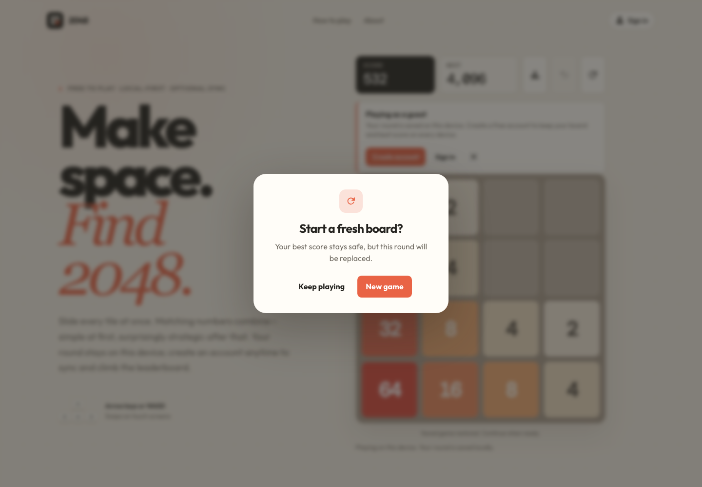
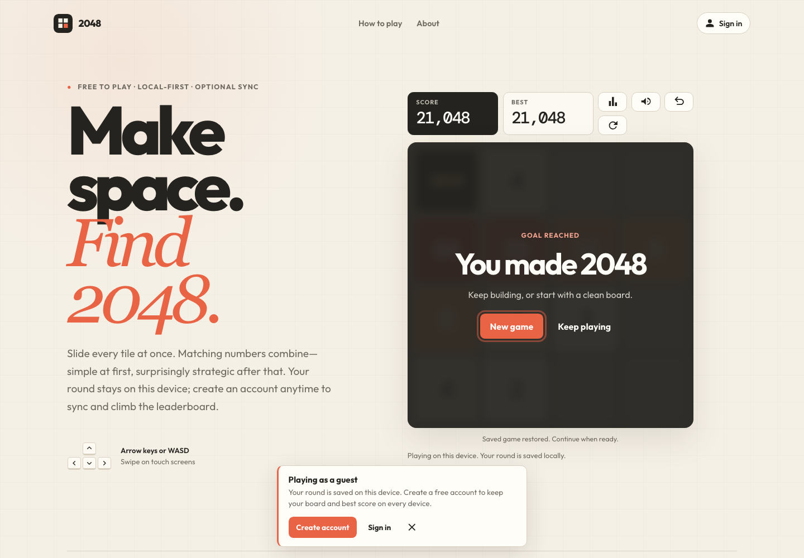
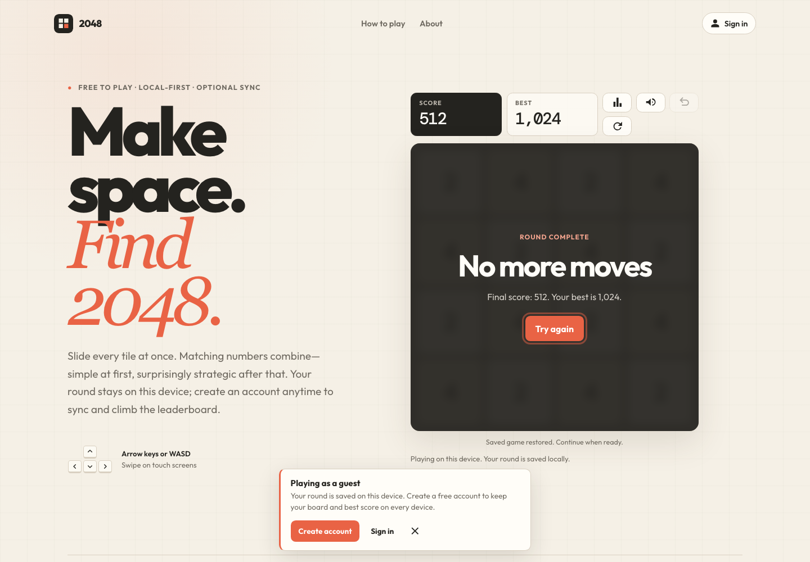
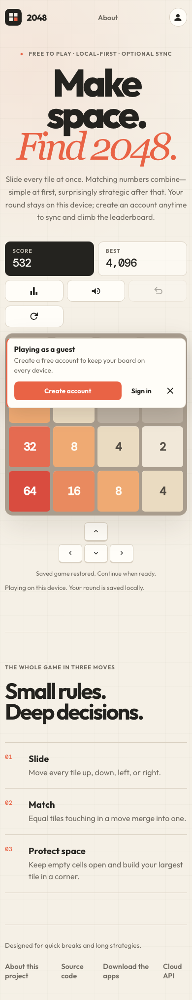
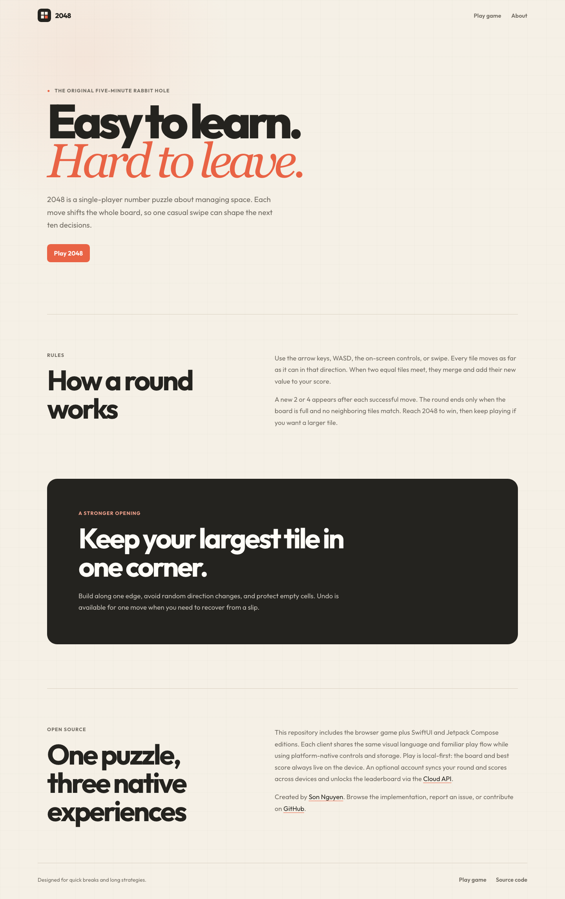

# Testing and quality gates

This document describes what is tested, where, how to run it, and how to tell a real defect from a flaky harness. Read it before changing tests or CI.

## Table of contents

- [Testing philosophy](#testing-philosophy)
- [Test inventory](#test-inventory)
- [Fast checks](#fast-checks)
- [Web](#web)
- [iOS](#ios)
- [Android](#android)
- [Determinism](#determinism)
- [Manual UI review](#manual-ui-review)
- [CI mapping](#ci-mapping)
- [Diagnosing failures](#diagnosing-failures)
- [Adding a test](#adding-a-test)

## Testing philosophy

Coverage is layered by cost. Pure rules logic is tested exhaustively because it is cheap, fast, and where correctness actually lives. The expensive suites — a real browser, a booted simulator, a running emulator — are reserved for the things unit tests genuinely cannot reach: gesture handling, persistence across a real relaunch, dialog behavior, focus, and accessibility semantics.

Two consequences follow, and both are deliberate:

- **A rules bug should be caught by a unit test, not a UI test.** If a rules regression is only detected in Chromium or on an emulator, the unit suite has a gap worth closing.
- **A UI test should assert a user-visible outcome**, not re-derive the rules. Duplicating rules assertions in slow suites buys nothing and triples the maintenance cost of every rules change.

## Test inventory

| Platform | Deterministic tests | UI / integration tests | Runner | Line coverage |
| --- | --- | --- | --- | --- |
| Web | 65 engine, controller, metadata, and asset tests + 2 tooling tests | 8 Chromium scenarios | Node test runner, Playwright | 100 % |
| iOS | 49 model tests | 9 XCUITest flows | XCTest | 99.4 % |
| Android | 42 ViewModel and storage tests | 5 Compose instrumentation tests | JUnit 4, Compose UI Test | 99.2 % (domain) |

The iOS UI suite reports ten executions because the launch test runs once per appearance mode.

All three deterministic suites prove the same behavioral contract from [`architecture.md`](architecture.md): every direction, merge ordering and the single-merge rule, scoring, weighted spawning, ineffective moves, undo semantics, restart, best-score retention, win and loss predicates, and rejection of invalid saved state.

Each platform additionally covers the layer above its rules engine:

- **Web** — the controller (`Web-Version/script.js`) runs against a hand-written DOM in `tests/web/helpers/fake-dom.js`, so keyboard, touch, buttons, rendering, and persistence are unit-tested without a browser.
- **iOS** — persistence round-trips, spawn-index clamping, and corrupt `UserDefaults` payloads.
- **Android** — `SharedPreferencesGameStorage` serialisation against an in-memory `SharedPreferences`.

Every suite enforces its own coverage floor; see the platform sections below.

## Fast checks

Run `make check` before committing. It validates:

- JavaScript syntax across the engine, web script, and all `scripts/*.mjs`
- JSON well-formedness for `manifest.json` and configuration files
- Repository structure and the required npm script surface
- SEO and discovery metadata — canonical URLs, `sitemap.xml` entries, the `robots.txt` sitemap directive, `llms.txt` availability
- Referenced asset existence, including every icon named by the manifest and `index.html`
- Staged-file whitespace, when invoked through Husky
- Every shell script in `scripts/` and `.husky/`, when ShellCheck is installed

ShellCheck is optional locally but **required in CI**. Install it (`brew install shellcheck`, or `apt-get install shellcheck`) to catch shell issues before pushing rather than after.

This is the same command the Husky `pre-commit` hook runs, so a clean `make check` means a clean commit.

## Web

```bash
npx playwright install chromium   # one-time
make test-web                     # or: npm test
```

`make test-web` runs, in order: syntax checks, repository validation, deterministic engine tests with enforced coverage, repository tooling tests, and real Chromium interaction flows.

**Coverage is a hard gate.** `c8` fails the build below 100 % statements, 100 % lines, 100 % functions, or 95 % branches, measured against everything in `Web-Version/`. Both files currently reach 100 % statements, lines, and functions with 98.8 % branches. If you add web code, add the tests that keep it above the line — lowering the thresholds is not the fix.

The controller is an IIFE that reads the document once on load, so `tests/web/helpers/fake-dom.js` stands in for the page: it captures the elements the controller looks up, records the listeners it registers, and lets a test fire a keypress, a swipe, or a click and read the result back. Each `loadController()` call re-requires the module, so tests never share state. The globals it installs are restored around every interaction, which is what keeps two loaded controllers independent.

The eight Chromium scenarios cover arrow-key play, WASD play, touch swipe, the on-screen direction pad, undo, persistence across reload, restart confirmation, fullscreen, the win overlay, the loss overlay, recovery from a corrupt saved state, and that a board swipe suppresses page scrolling without blocking it elsewhere.

Browser tests drive the page through real input events and read state back through `window.render_game_to_text()`. Keep that hook accurate when the state shape changes, or the browser suite silently loses its assertions.

Screenshots:

```bash
make screenshots-web
```

Captures deterministic desktop and mobile views of gameplay, the restart dialog, win, loss, and the About page into `output/playwright/`. That directory is gitignored — it is local verification evidence, fully reproducible on demand, and must not be committed.

## iOS

```bash
make test-ios
```

Requires macOS with Xcode. The script selects an available iPhone simulator automatically; pin a specific device by setting `IOS_SIMULATOR_ID` to a UDID from `xcrun simctl list devices available`.

Model tests and UI tests run as separate targets (`Game-2048Tests` and `Game-2048UITests`) so a UI-harness failure never masks a rules regression. Preserve the `.xcresult` bundle when diagnosing a failure — it carries the failure screenshots, the full test log, and coverage data that the console output does not.

**Coverage is a hard gate.** After the run, `scripts/test-ios.sh` reads the `.xcresult` with `xccov` and fails below 90 % line coverage of the `Game-2048.app` target, which currently sits at 99.4 %. Override the floor with `IOS_MINIMUM_COVERAGE` only to raise it.

New test files must be added to the `Game-2048Tests` target in `2048 Game.xcodeproj` — the project does not use synchronised file groups, so a file that is merely on disk is silently never compiled or run.

XCUITest depends on accessibility identifiers. If a UI test starts failing after a view change, confirm the identifier still exists before assuming the behavior broke.

## Android

```bash
make test-android          # unit tests, lint, debug APK
make test-android-device   # adds Compose tests on a connected device
```

**Coverage is a hard gate.** `make test-android` runs `jacocoCoverageVerification`, which fails below 90 % line or 85 % branch coverage of the Kotlin rules engine and its storage (`GameViewModel`, `GameStorage`, `SavedGame`, `SharedPreferencesGameStorage`). Those currently sit at 99.2 % lines and 91.3 % branches. The HTML report lands in `app/build/reports/jacoco/jacocoTestReport/`.

`MainActivity` is Compose and is deliberately outside that gate: it can only be exercised on a device, which `make test-android-device` does. Holding the whole module to a JVM-only threshold would either fail on every machine without an emulator or push the number down to something meaningless.

The JVM suite needs only the Android SDK 34 — **not a preinstalled JDK.** Gradle 8.13 daemon JVM criteria are committed in `Android-Version/Game2048/gradle/gradle-daemon-jvm.properties`, so Gradle downloads and runs on a matching Adoptium JDK 17 regardless of the machine's default `java`. The first invocation pays a one-time ~180 MB download into `~/.gradle/jdks/`.

`scripts/android.sh` additionally resolves a JDK 17 up front, so both the `make` targets and a raw `./gradlew` work on a machine whose `JAVA_HOME` points at the wrong version.

The instrumentation suite additionally needs a booted emulator or attached device — CI uses an API 34 `pixel_6` image with KVM acceleration and animations disabled.

Animations must be disabled on the device running Compose tests. Enabled animations are the most common cause of intermittent instrumentation failures, and they fail in ways that look like real defects.

## Dev container

The dev container covers the web and Android JVM workflows. Verify it with:

```bash
make verify-devcontainer                   # build the image, check every tool
./scripts/verify-devcontainer.sh --build   # also build the Android client inside it
```

The `--build` form works on an isolated `git archive` copy rather than mounting the working tree. That matters: mounting the live repo means a container build and a host build write to the same `app/build/` directory at the same time, which produces confusing `packageDebug FAILED` errors that look like real defects but are pure contention. Never run both concurrently against the same tree.

**iOS is not containerizable.** Xcode is macOS-only and its license forbids redistribution, so iOS builds and simulator tests always require a macOS host. `make doctor` reports this honestly rather than pretending the suite was skipped for another reason.

## Gesture ownership

Every client has now shipped a bug where a board swipe reached the surrounding container instead of the game, and each had a different cause. These are the guards:

- **Web:** a browser test asserts the board sets `touch-action: none`, that a `touchmove` starting on the board is `defaultPrevented`, that one starting elsewhere is **not**, and that `touchcancel` releases the suppression.
- **iOS:** a UI test asserts `app.scrollViews` is empty, that the `"Make space."` title's frame does not move during a swipe, and that a valid vertical swipe enables Undo. Anchor on chrome *outside* the board: the container can move while the board's own frame appears stable.
- **Android:** the Compose suite drives real swipes; the board must consume each pointer change so the parent scroll never sees it.

When a swipe bug is reported, measure before theorising. Frame coordinates and the enabled state of Undo tell you whether input reached the game at all — a swipe that scrolls the page and a swipe that silently does nothing look identical to a user, and the second is the more serious defect.

## Determinism

Every deterministic suite injects its own random provider, so tile spawning is fully reproducible. Never write a rules test that depends on real randomness, and never make the injectable provider the production default.

Tests may also drive state through launch arguments (iOS) or launch state (Android) to reach a specific board — for example a nearly-lost board — without playing dozens of moves to get there. Prefer that over long scripted move sequences: it is faster and it fails more legibly.

## Manual UI review

Automated coverage does not replace looking at the screen. `make screenshots-web` captures these five states at desktop and mobile widths deterministically, so a diff against them is a fast way to spot an unintended visual change:

| Gameplay | Restart confirmation | Win |
| :---: | :---: | :---: |
|  |  |  |

| Game over | Mobile layout | About |
| :---: | :---: | :---: |
|  |  |  |

For every changed surface, inspect normal gameplay, help/about, restart confirmation, win, and game-over states where applicable, and check:

- Compact and large breakpoints
- Icon centering, at every icon, by geometry rather than font metrics
- Text truncation and wrapping at the longest realistic content
- Contrast at every tile value, including the high-value tiles
- Focus order and visible focus indicators
- Touch-target sizes
- Safe areas on iOS and gesture-navigation insets on Android
- Browser console output and native crash logs — a clean-looking screen with console errors is still a failure

UI changes require screenshots of the affected states, attached to the pull request.

## CI mapping

| Job | Runner | Steps |
| --- | --- | --- |
| Web | `ubuntu-latest` | `npm ci`, `npm audit --audit-level=high`, Chromium install, syntax, repository validation, ShellCheck, unit + coverage, tooling, browser flows |
| iOS | `macos-15` | Boot a simulator, `build-for-testing`, model tests with coverage, UI/accessibility tests |
| Android JVM | `ubuntu-latest` | `testDebugUnitTest`, `lintDebug`, `assembleDebug` |
| Android device | `ubuntu-latest` + KVM | API 34 `pixel_6` emulator, `connectedDebugAndroidTest` |
| Dependency review | `ubuntu-latest` | Blocks pull requests introducing known-vulnerable dependencies |

Artifacts uploaded on both success and failure: web coverage reports, iOS `.xcresult` bundles, Android lint and test reports, and the debug APK.

The iOS and Android device jobs are the slow ones. When iterating, run the fast web suite locally and let CI carry the native suites rather than waiting on a local emulator boot for every change.

## Diagnosing failures

**Before reporting an app defect, establish whether it is a harness failure.**

| Symptom | Likely cause | Next step |
| --- | --- | --- |
| ADB loses the view hierarchy mid-run | Emulator/ADB instability | Check `adb logcat`, restart the emulator **without** wiping data, rerun the exact failing test |
| Compose test fails intermittently only | Animations enabled on the device | Disable animations, then rerun |
| XCUITest cannot find an element | Missing or renamed accessibility identifier | Confirm the identifier in the view, not the behavior |
| Browser test times out waiting for state | `render_game_to_text()` shape drifted | Compare the hook output against the assertion |
| Coverage step fails after a refactor | New engine branches are untested | Add the missing cases — do not lower the thresholds |
| Simulator tests fail only in CI | Different default simulator/runtime | Reproduce with the same device the workflow selects |

A test that fails once and passes on rerun with no code change is a flake, and flakes are bugs. File them rather than re-running until green.

## Adding a test

1. Put rules behavior in the **deterministic** suite for each platform — all three, since parity is the point.
2. Put user-flow behavior in the platform UI suite, asserting a user-visible outcome rather than re-deriving the rules.
3. Inject randomness. Never depend on real random spawning.
4. Prefer reaching a target board through injected state over a long scripted move sequence.
5. Name the test after the behavior it protects, not the function it calls — the name is what a future maintainer reads when it fails.
6. Confirm it fails before your fix and passes after. A test that never failed has proven nothing.
7. On iOS, add the file to the `Game-2048Tests` target in the Xcode project. A test file that is only on disk never runs and never fails.

**A valid move always spawns a tile.** Asserting a whole row or board after a move therefore couples the test to wherever the injected provider happens to place that tile. Assert the cells the move itself produced, plus the score, unless the spawn position is deliberately pinned.

**An ineffective move persists nothing.** A persistence test whose swipe is rejected saves no state and quietly proves nothing — assert that the move returned `true` before checking what was stored.
